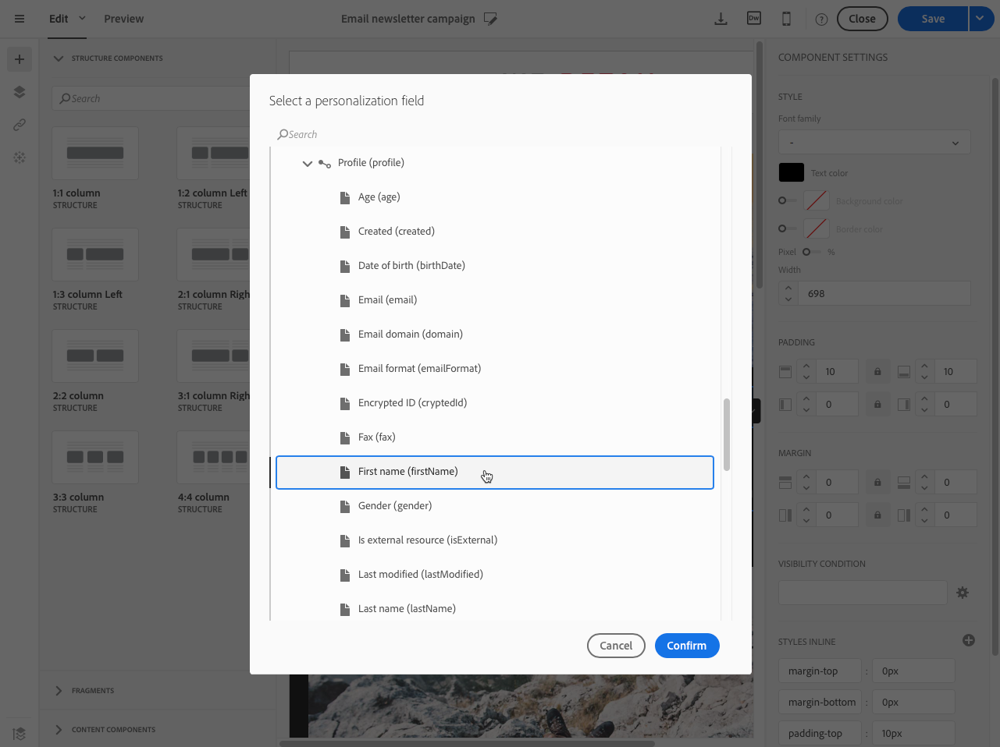

# Inserting a personalization field{#inserting-a-personalization-field}

Adobe Campaign允许您将一个字段从数据库插入您的页面，例如配置文件的名字。

>[!NOTE]
>
>The images below show how to insert a personalization field using the [Email Designer](../../designing/using/about-email-content-design.md#about-the-email-designer) for an email.

要向内容添加个性化字段，请执行以下操作：

1. Click inside a text block, click the **[!UICONTROL Personalize]** icon from the contextual toolbar and select **[!UICONTROL Insert personalization field]**. For more on the Email Designer interface, see [this section](../../designing/using/about-email-content-design.md#email-designer-interface).

   

1. 选择要插入页面内容的字段。

   

1. Click **[!UICONTROL Confirm]**.

字段名称将显示在编辑器中，并突出显示。

生成个性化后(例如预览和准备电子邮件)，此字段将被替换为与目标配置文件对应的值。

>[!NOTE]
>
>如果通过工作流创建电子邮件，则在工作流中计算的其他数据也在个性化字段中可用。For more information about adding additional data from a workflow, refer to the [Enriching data](../../automating/using/targeting-data.md#enriching-data) section.

