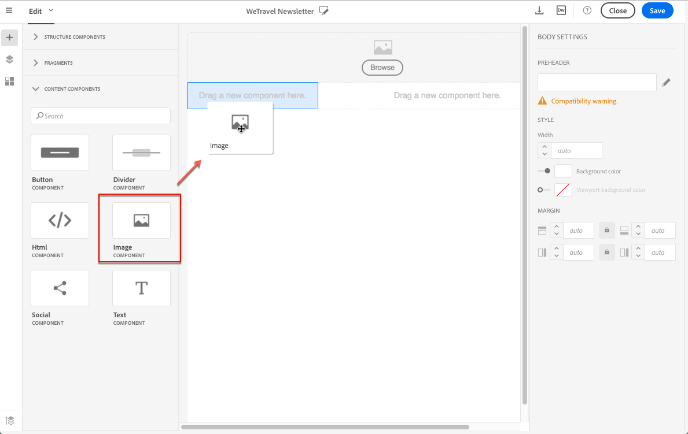

# Inserting images{#inserting-images}

您可以在电子邮件和登录页面中插入图像。

根据您的配置，可以使用以下类型的图像：

* 本地图像
* Images shared from Adobe Experience Cloud - refer to [Working with Campaign and Assets Core Service](../../integrating/using/working-with-campaign-and-assets-core-service.md) / Assets On Demand
* Dynamic images from Adobe Target - refer to [Working with Campaign and Target](../../integrating/using/about-campaign-target-integration.md)

如果启用此功能，您可以使用Adobe Creative SDK修改图像。See [Modifying images with the Adobe Creative SDK](../../designing/using/modifying-images-with-the-adobe-creative-sdk.md).

>[!CAUTION]
>
>If you choose to add an image directly by editing the HTML version of the email, you must not call up **external files in a &lt;script&gt; tag** of the HTML page. 这些文件将不会导入到Adobe Campaign服务器上。

## Inserting images in an email {#inserting-images-in-an-email}

1. 添加结构组件。For more on this, see [Editing the email structure](../../designing/using/defining-the-email-structure.md#editing-the-email-structure).
1. Inside this structure component, add an **[!UICONTROL Image]** content component.

   

1. Click **[!UICONTROL Browse]**. 拖放图像或单击可从计算机中选择文件。

   

1. 选择刚刚添加的内容组件。
1. 检查图像属性并根据需要调整图像属性。

   

## Inserting images in a landing page {#inserting-images-in-a-landing-page}

1. 在登陆页面内容中，选择包含图像的块。
1. Select the **[!UICONTROL Insert]** button.

   

1. Choose **[!UICONTROL Local image]** from the contextual toolbar.

   

1. 选择一个文件。

   

1. 根据需要调整图像属性。

   

