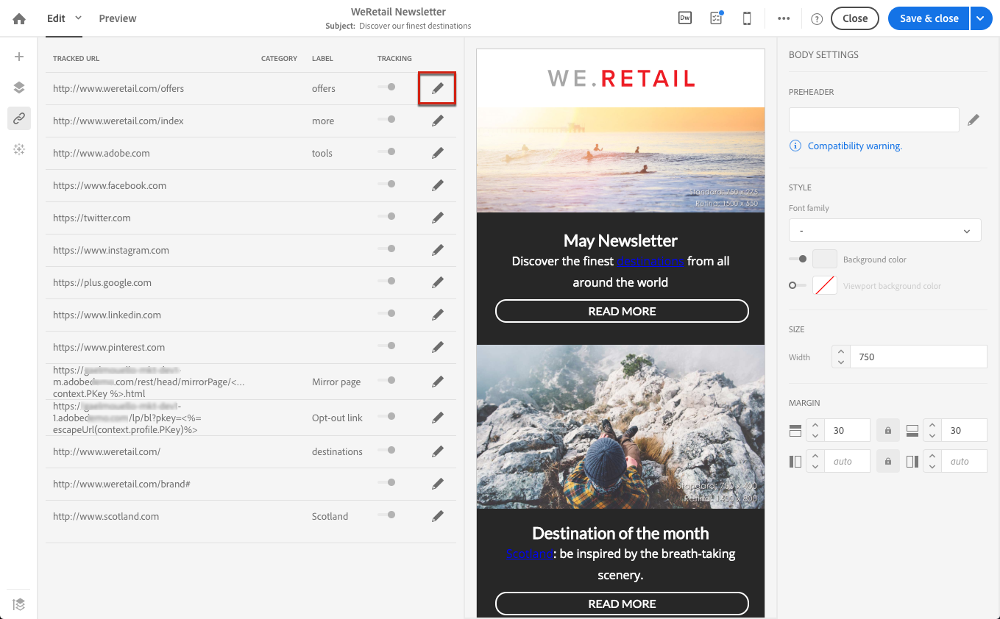

# 添加链接 {#links}

## 插入链接 {#inserting-a-link}

该编辑器允许您通过在HTML内容元素中插入链接来个性化电子邮件或登陆页面。

您可以将链接插入到任意页面元素中：图像、单词、单词组、文本块等。

>[!NOTE]
>
>下图显示了如何在电子邮件中使用[电子邮件Designer](../../designing/using/designing-content-in-adobe-campaign.md)插入链接。

1. 选择一个元素，然后单击上下文工具栏中的&#x200B;**[!UICONTROL Insert link]**。

   

1. 选择要创建的链接类型：

   * **外部链接**：插入指向外部URL的链接。

     您可以为URL定义个性化。 请参阅[个性化URL](personalization.md#personalizing-urls)。

   * **登陆页面**：授予对Adobe Campaign登陆页面的访问权限。
   * **订阅链接**：插入链接以订阅Adobe Campaign服务。
   * **退订链接**：插入退订Adobe Campaign服务的链接。
   * 定义操作的&#x200B;**链接**：在点击登陆页面中的元素时定义操作。

     >[!NOTE]
     >
     >此类链接仅适用于登陆页面。

1. 您可以修改向收件人显示的文本。
1. 您可以设置用户单击链接（例如，打开新窗口）时的浏览器行为。

   >[!NOTE]
   >
   >定义浏览器行为仅适用于登陆页面。

1. 保存您的更改。

创建链接后，您仍然可以从设置窗格对其进行修改。 单击铅笔图标以编辑其参数。

使用[电子邮件Designer](../../designing/using/designing-content-in-adobe-campaign.md)编辑电子邮件时，您可以轻松地访问和修改您从表中创建的链接，该表列出了电子邮件中包含的所有URL。 通过此列表，您可以集中查看并找到电子邮件内容中的每个URL。 要访问它，请参阅[关于跟踪的URL](#about-tracked-urls)。

>[!NOTE]
>
>无法从此列表中修改个性化URL，如&#x200B;**镜像页面URL**&#x200B;或&#x200B;**取消订阅**&#x200B;链接。 所有其他链接均可编辑。

**相关主题**：

* [插入个性化字段](../../designing/using/personalization.md#inserting-a-personalization-field)
* [添加内容块](../../designing/using/personalization.md#adding-a-content-block)
* [定义动态内容](../../designing/using/personalization.md#defining-dynamic-content-in-an-email)

## 关于跟踪的URL {#about-tracked-urls}

通过Adobe Campaign，您可以跟踪收件人单击电子邮件中包含的URL时的行为。 有关跟踪的更多信息，请参阅[此部分](../../sending/using/tracking-messages.md#about-tracking)。

操作栏中的&#x200B;**[!UICONTROL Links]**&#x200B;图标会自动显示要跟踪的内容的所有URL列表。

>[!NOTE]
>
>默认情况下会激活跟踪。 此功能仅适用于在Adobe Campaign中激活跟踪的电子邮件。 有关跟踪参数的详细信息，请参阅[此部分](../../administration/using/configuring-email-channel.md#tracking-parameters)。

可以从此列表中修改每个链接的URL、类别、标签和跟踪类型。 要编辑链接，请单击相应的铅笔图标。

对于每个跟踪的URL，您可以将跟踪模式设置为以下值之一：

* **已跟踪**：激活此URL上的跟踪。
* **镜像页面**：认为此URL是镜像页面URL。
* **从不**：从不激活此URL的跟踪。 此信息已保存：如果URL再次出现在将来的消息中，则会自动停用其跟踪。
* **选择退出**：将此URL视为选择退出或退订URL。

您还可以停用或激活每个URL的跟踪。

>[!NOTE]
>
>默认情况下，在Adobe Campaign中，除&#x200B;**镜像页面URL**&#x200B;和&#x200B;**退订**&#x200B;链接之外的所有内容URL都将被跟踪。

您可以通过编辑&#x200B;**[!UICONTROL Category]**&#x200B;字段来重新分组您的URL，具体取决于消息中使用的URL。 这些类别可以显示报表，例如在[URL和点击流](../../reporting/using/urls-and-click-streams.md)中。

在构建报告时，从&#x200B;**[!UICONTROL Components]**&#x200B;选项卡中选择&#x200B;**[!UICONTROL Dimension]**&#x200B;并向下滚动列表以访问跟踪组件。 例如，将&#x200B;**[!UICONTROL Tracking URL Category]**&#x200B;拖放到工作区中，以根据每个点击的URL的跟踪类别显示结果。

有关生成自定义报告的详细信息，请参阅[此部分](../../reporting/using/about-dynamic-reports.md)。
