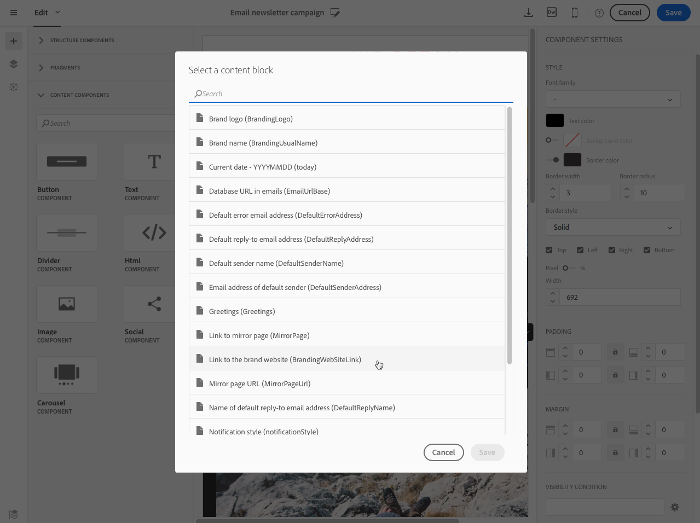
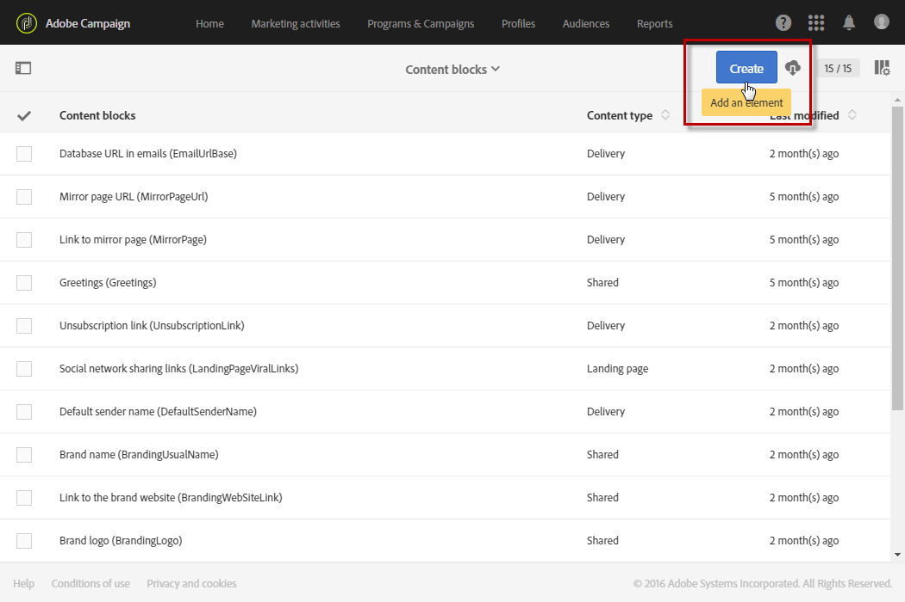
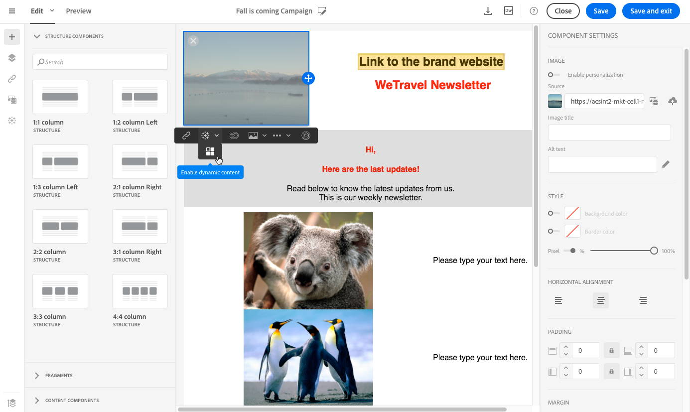
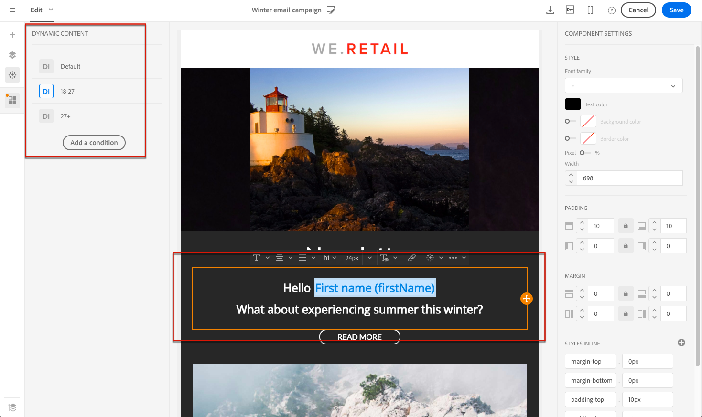
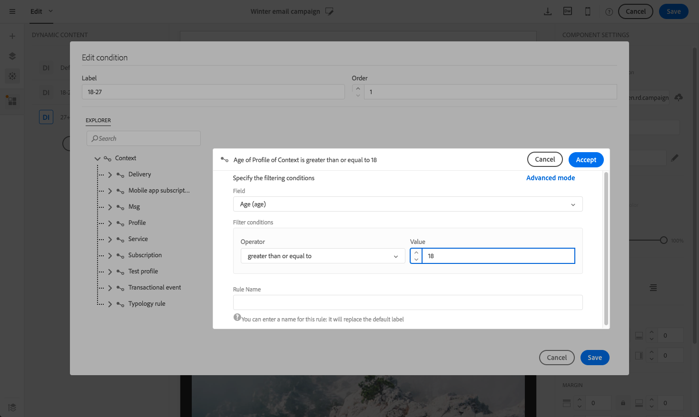

# 个性化电子邮件内容 {#personalization}

Adobe Campaign传递的信息的内容和显示可以通过多种不同的方式进行个性化。 这些方式可以根据条件根据用户档案组合。 一般而言，Adobe Campaign 允许您：

* 插入动态的个性化字段。请参阅[插入个性化字段](#inserting-a-personalization-field)。
* 插入预定义的个性化块. 请参阅[添加内容块](#adding-a-content-block)。
* 个性化电子邮件的发送者。 请参阅[个性化发件人](#personalizing-the-sender)。
* 个性化电子邮件主题。 请参阅[个性化电子邮件的主题行](../../designing/using/subject-line.md#subject-line)。
* 创建条件性内容。请参阅[在电子邮件](#defining-dynamic-content-in-an-email)中定义动态内容。

## 个性化发件人{#personalizing-the-sender}

要定义将显示在所发送邮件标头中的发件人姓名，请转至“电子邮件设计器”主页的&#x200B;**[!UICONTROL Properties]**&#x200B;选项卡（可通过主页图标访问）。 有关详细信息，请参阅[定义电子邮件发件人](../../designing/using/subject-line.md#email-sender)。

单击&#x200B;**发件人名称**&#x200B;块可以更改发件人名称。 然后，该字段将变为可编辑字段，您可以输入要使用的名称。

这个领域可以个性化。 为此，您可以单击发件人姓名下方的图标，添加个性化字段、内容块和动态内容。

>[!NOTE]
>
>标题参数不得为空。 发送者的地址是允许发送电子邮件的必填地址（RFC标准）。 Adobe Campaign检查输入的电子邮件地址的语法。

## 个性化URL{#personalizing-urls}

Adobe Campaign允许您通过向消息中添加个性化字段、内容块或动态内容，对消息中的一个或多个URL进行个性化。 操作步骤：

1. 插入外部URL并指定其参数。 请参阅[插入链接](../../designing/using/links.md#inserting-a-link)。
1. 如果未显示，请单击“设置”窗格中选定URL旁边的铅笔以访问个性化选项。
1. 添加要使用的个性化字段、内容块和动态内容。

   

1. 保存更改。

>[!NOTE]
>
>个性化URL不能应用于域名或URL扩展。 如果个性化不正确，则在消息分析期间将显示错误消息。 选择内容块时，不允许选择&#x200B;**链接到镜像页面**&#x200B;等元素。 链接内禁止此类块。

## 插入个性化字段{#inserting-a-personalization-field}

Adobe Campaign允许您将用户档案库中的字段插入页面，如的名字。

>[!NOTE]
>
>下图显示了如何使用[电子邮件设计器](../../designing/using/designing-content-in-adobe-campaign.md)为电子邮件插入个性化字段。

要向内容添加个性化字段，请执行以下操作：

1. 在文本块内单击，单击上下文工具栏中的&#x200B;**[!UICONTROL Personalize]**&#x200B;图标，然后选择&#x200B;**[!UICONTROL Insert personalization field]**。 有关电子邮件设计器界面的详细信息，请参阅[此部分](../../designing/using/designing-content-in-adobe-campaign.md#email-designer-interface)。

   

1. 选择要插入页面内容的字段。

   

1. 单击 **[!UICONTROL Confirm]**.

该字段名称将显示在编辑器中，并突出显示。

生成个性化后（例如，在预览和准备电子邮件时），此字段将替换为与目标用户档案对应的值。

>[!NOTE]
>
>如果电子邮件是通过工作流创建的，则工作流中计算的其他数据也会在个性化字段中可用。 有关从工作流添加其他数据的详细信息，请参阅[丰富数据](../../automating/using/about-targeting-activities.md#enriching-data)一节。

## 添加内容块{#adding-a-content-block}

Adobe Campaign优惠预配置内容块的列表。 这些内容块是动态的、个性化的，并具有特定的呈现。 例如，可以添加问候语或指向镜像页面的链接。

>[!NOTE]
>
>下图显示了如何使用[电子邮件设计器](../../designing/using/designing-content-in-adobe-campaign.md)为电子邮件插入内容块。

要添加内容块，请执行以下操作：

1. 在文本块内单击，单击上下文工具栏中的&#x200B;**[!UICONTROL Personalize]**&#x200B;图标，然后选择&#x200B;**[!UICONTROL Insert content block]**。 有关电子邮件设计器界面的详细信息，请参阅[此部分](../../designing/using/designing-content-in-adobe-campaign.md#email-designer-interface)。

   

1. 选择要插入的内容块。 可用区块因上下文(电子邮件或登陆页)而异。

   

1. 单击 **[!UICONTROL Save]**.

内容块的名称显示在编辑器中，并以黄色突出显示。 在生成个性化时，它将自动适应用户档案。

现成的内容块包括：

* **[!UICONTROL Database URL in emails (EmailUrlBase)]**:此内容块只能用于 **投放**。
* **[!UICONTROL Mirror page URL (MirrorPageUrl)]**:此内容块只能用于 **投放**。
* **[!UICONTROL Link to mirror page (MirrorPage)]**:此内容块只能用于 **投放**。
* **[!UICONTROL Greetings (Greetings)]**
* **[!UICONTROL Unsubscription link (UnsubscriptionLink)]**:此内容块只能用于 **投放**。
* **[!UICONTROL Social network sharing links (LandingPageViralLinks)]**:此内容块只能用于 **登陆页**。
* **[!UICONTROL Default sender name (DefaultSenderName)]**:此内容块只能用于 **投放**。
* **[!UICONTROL Name of default reply-to email address (DefaultReplyName)]**:此内容块只能用于 **投放**。
* **[!UICONTROL Email address of default sender (DefaultSenderAddress)]**:此内容块只能用于 **投放**。
* **[!UICONTROL Default error email address (DefaultErrorAddress)]**:此内容块只能用于 **投放**。
* **[!UICONTROL Default reply-to email address (DefaultReplyAddress)]**:此内容块只能用于 **投放**。
* **[!UICONTROL Brand name (BrandingUsualName)]**
* **[!UICONTROL Link to the brand website (BrandingWebSiteLink)]**
* **[!UICONTROL Brand logo (BrandingLogo)]**
* **[!UICONTROL Notification style (notificationStyle)]**

### 创建自定义内容块{#creating-custom-content-blocks}

您可以定义将插入消息或登陆页的新内容块。

要创建内容块，请执行以下步骤：

1. 单击高级菜单中的&#x200B;**[!UICONTROL Resources > Content blocks]**&#x200B;以访问内容块的列表。
1. 单击&#x200B;**[!UICONTROL Create]**&#x200B;按钮或重复预先存在的内容块。

   

1. 输入标签。
1. 选择块的&#x200B;**[!UICONTROL Content type]**。 提供了三个选项：

   * **[!UICONTROL Shared]**:内容块可以用于投放或登陆页。
   * **[!UICONTROL Delivery]**:内容块只能用于投放。
   * **[!UICONTROL Landing page]**:内容块只能用于登陆页。

   

1. 可以选择&#x200B;**[!UICONTROL Targeting dimension]**。 有关此内容的详细信息，请参阅[关于定位维度](#about-targeting-dimension)。

   

1. 您可以选择&#x200B;**[!UICONTROL Depends on format]**&#x200B;选项来定义两个不同的块：一个用于HTML电子邮件，另一个用于文本格式的电子邮件。 编辑器中随后将显示两个选项卡（HTML和文本）以定义相应的内容。

   

1. 输入内容块的内容，然后单击&#x200B;**[!UICONTROL Create]**&#x200B;按钮。

您的内容块现在可用于消息或登陆页的内容编辑器中。

>[!CAUTION]
>
>编辑块的内容时，确保在&#x200B;*if*&#x200B;语句的开头和结尾之间没有额外的空格。 在HTML中，空白显示在屏幕上，因此它们将影响您的内容布局。

### 关于定位维度{#about-targeting-dimension}

该定位维度允许您定义可以使用内容块的消息类型。 这是为了防止在消息中使用不当的块，这可能会导致错误。

事实上，在编辑消息时，您只能选择具有与消息的定位维度兼容的定位维度的内容块。

例如，**[!UICONTROL Unsubscription link]**&#x200B;块的定位维度符为&#x200B;**[!UICONTROL Profiles]**，因为它包含特定于&#x200B;**[!UICONTROL Profiles]**&#x200B;资源的个性化字段。 因此，不能在[事件事务性消息](../../channels/using/event-transactional-messages.md)中使用&#x200B;**[!UICONTROL Unsubscription link]**&#x200B;块，因为该类型消息的定位维度为&#x200B;**[!UICONTROL Real-time events]**。 但是，您可以在[退订事务性消息](../../channels/using/profile-transactional-messages.md)中使用&#x200B;**用户档案链接**&#x200B;块，因为此类消息的定位维度是&#x200B;**用户档案**。 最后，**[!UICONTROL Link to mirror page]**&#x200B;块没有定位维度，因此您可以在任何消息中使用它。

如果将此字段留空，则无论定位维度是什么，内容块都将与所有消息兼容。 如果设置定位维度，该块将仅与具有相同定位维度的消息兼容。

有关更多信息，请参阅[定向维度和资源](../../automating/using/query.md#targeting-dimensions-and-resources)。

**相关主题：**

* [插入个性化字段](#inserting-a-personalization-field)
* [添加内容块](#adding-a-content-block)
* [在电子邮件中定义动态内容](#defining-dynamic-content-in-an-email)

## 个性化图像源{#personalizing-an-image-source}

Adobe Campaign允许您根据特定标准或使用跟踪来个性化消息中的一个或多个图像。 这是通过将个性化字段、内容块或动态内容插入图像源来实现的。 操作步骤：

1. 将图像插入消息内容，或选择已存在的图像。
1. 在图像属性调色板中，检查&#x200B;**[!UICONTROL Enable personalization]**&#x200B;选项。

   

   将显示&#x200B;**[!UICONTROL Source]**&#x200B;字段，并在编辑器中将所选图像显示为&#x200B;**个性化**。

1. 单击&#x200B;**[!UICONTROL Source]**&#x200B;字段按钮旁边的铅笔以访问个性化选项。
1. 添加图像源后，添加您喜欢的个性化字段、内容块和动态内容。

   

   >[!NOTE]
   >
   >域名(http://mydomain.com)无法个性化，必须手动输入。 URL的其余部分可以进行个性化。 例如：http://mydomain.com/ `[Gender]`

1. 确认更改。

## 条件内容 {#conditional-content}

### 定义可见性条件{#defining-a-visibility-condition}

可以对任何元素指定可见性条件。 只有在符合条件时，才会显示它。

要添加可见性条件，请选择一个块，并在其设置的&#x200B;**[!UICONTROL Visibility condition]**&#x200B;字段中输入要考虑的条件。

此选项仅对以下元素可用：地址、块报价、中心、目录、DIV、DL、FIELDSET、FORM、H1、H2、H3、H4、H5、H6、NOSCRIPT、OL、P、PRE、UL、TR、TD。

表达式编辑器显示在[高级表达式编辑](../../automating/using/editing-queries.md#about-query-editor)部分。

这些条件采用XTK表达式语法(例如，**context.用户档案.email !=&quot;**&#x200B;或&#x200B;**context.用户档案.status=&#39;0&#39;**)。 默认情况下，所有字段都可见。

>[!NOTE]
>
>不能为已包含具有动态内容的子元素的块或已构成动态内容的块定义条件。 无法编辑下拉列表等不可见的动态块。

### 在电子邮件中定义动态内容{#defining-dynamic-content-in-an-email}

>[!CONTEXTUALHELP]
>id="ac_dynamic_content"
>title="定义动态内容"
>abstract="定义将仅根据您将定义的条件显示给某些用户档案的不同内容。"

在电子邮件中，您可以定义不同的内容，这些内容将根据通过收件人编辑器定义的条件动态显示给表达式。 例如，从同一封电子邮件中，您可以确保每位用户档案根据其年龄范围收到不同的邮件。

定义动态内容与定义可见性条件[不同。](#defining-a-visibility-condition)

1. 选择片段、组件或元素。 在此示例中，选择一个图像。
1. 单击上下文工具栏中的&#x200B;**[!UICONTROL Dynamic content]**&#x200B;图标。

   

   **[!UICONTROL Dynamic content]**&#x200B;部分显示在左侧的调色板中。

   

   默认情况下，此部分包含两个元素：默认变体和新变体。

   >[!NOTE]
   >
   >内容必须始终具有默认变体。 无法删除它。

1. 单击&#x200B;**[!UICONTROL Edit]**&#x200B;按钮以定义第一个替代变体的显示条件。

   

1. 指定标签并选择要设置为条件的字段。 例如，从&#x200B;**[!UICONTROL General]**&#x200B;节点中，选择&#x200B;**[!UICONTROL Age]**&#x200B;字段

   

1. 设置过滤条件。 例如，您希望向18岁到25岁之间的人显示不同的内容。

   

1. 设置所有条件后，定义将应用该条件的优先级顺序并保存更改。

   

   内容将按优先级从上到下在调色板中显示。 有关优先级的详细信息，请参阅[本节](#defining-dynamic-content-in-an-email)。

1. 为您刚刚定义的变体上传新图像。

   

   18至25岁的收件人将看到新的形象。

   

1. 单击&#x200B;**[!UICONTROL Add a condition]**&#x200B;以添加新内容及其链接的规则。

   

   例如，您可以添加一个不同的图像以显示给26岁到35岁之间的人。

1. 以同样方式继续处理您要动态显示的电子邮件中的任何其他元素。 它可以是文本、按钮、片段等。 保存更改。

>[!CAUTION]
>
>准备好消息后，在发送消息之前，请使用验证测试消息。 如果不这样做，则可能未检测到某些错误，并且可能未发送电子邮件。

**相关主题：**

* [发送校样](../../sending/using/sending-proofs.md)
* [高级表达式编辑](../../automating/using/editing-queries.md#about-query-editor)

### 优先级{#order-of-priority}

在表达式编辑器中，定义动态内容时，优先级顺序如下。

1. 使用&#x200B;**两个不同的条件**&#x200B;定义两个不同的动态内容，例如：

   **条件1:** 用户档案的性别是男性，

   **条件2:** 用户档案年龄在20岁到30岁之间。

   

   数据库中的某些用户档案符与这两种情况相对应，但只能发送一封包含一个动态内容的电子邮件。

1. 因此，您必须为动态内容定义优先级。 即使该用户档案也满足优先级顺序为&#x200B;**2**&#x200B;或&#x200B;**3**&#x200B;的另一条件，优先级顺序为&#x200B;**1**&#x200B;的条件（以及相应的动态内容）也会被发送到用户档案。

   

每个动态内容只能定义一个优先级顺序。

## 示例：电子邮件个性化{#example-email-personalization}

在此示例中，营销服务团队的成员创建了一封电子邮件，通知其某些客户他们只有一个特殊优惠。 该团队成员决定根据客户各自的年龄个性化电子邮件。 年龄在18至27岁之间的客户将收到一封电子邮件，其中包含不同的图像和标语，这些图像和标语将发送给27岁以上的客户。

电子邮件的创建方式如下：

* 动态内容被应用到图像，并且这些动态内容根据年龄范围被配置。

   

   在[定义电子邮件](#defining-dynamic-content-in-an-email)部分中，添加和配置动态内容有详细说明。

* 个性化字段和动态内容将应用于文本。 根据用户档案的年龄范围，电子邮件开始会显示用户档案的名字或用户档案的标题和姓氏。

   

   有关添加和配置个性化字段的详细信息，请参阅[插入个性化字段](#inserting-a-personalization-field)一节。

### 配置映像{#configuring-images}

>[!CONTEXTUALHELP]
>id="ac_dynamic_image"
>title="管理动态图像"
>abstract="根据您将定义的条件，使用动态图像个性化电子邮件。"

在此示例中，应用于图像的动态内容配置如下：

**目标18-27岁：**

1. 在&#x200B;**[!UICONTROL Properties]**&#x200B;调色板中选择动态内容，然后单击&#x200B;**[!UICONTROL Edit]**&#x200B;按钮。

   

1. 编辑标签，然后从&#x200B;**[!UICONTROL Profile]**&#x200B;节点中选择&#x200B;**[!UICONTROL Age]**&#x200B;字段。

   

1. 选择&#x200B;**大于或等于**&#x200B;运算符，然后输入&#x200B;**18**&#x200B;以创建早于18 **的**&#x200B;表达式。

   

1. 添加新的&#x200B;**[!UICONTROL Age]**&#x200B;条件。

   在值字段中选择&#x200B;**小于或等于**&#x200B;运算符后跟27以创建小于27 **的**&#x200B;表达式。

   

1. 确认更改。

**向目标27岁及以上用户档案:**

1. 从调色板中选择动态内容并进行编辑。
1. 编辑标签，然后从&#x200B;**[!UICONTROL Profile]**&#x200B;节点中选择&#x200B;**[!UICONTROL Age]**&#x200B;字段。
1. 在值字段中添加&#x200B;**大于**&#x200B;运算符后跟27，以创建早于27 **表达式。**

   

1. 确认更改。

您的动态内容已正确配置。

### 配置文本{#configuring-text}

在此示例中，应用于文本的动态内容配置如下：

**目标用户档案18-27岁：**

1. 选择所需的结构组件并添加动态内容。
1. 编辑动态内容并配置定位表达式。 请参阅[配置图像](#configuring-images)。
1. 在结构组件中，在所需位置，单击上下文工具栏中的&#x200B;**[!UICONTROL Personalize]**&#x200B;图标，然后选择&#x200B;**[!UICONTROL Insert personalization field]**。

   

1. 在显示的列表中，选择&#x200B;**[!UICONTROL First name]**&#x200B;字段并进行确认。

   

1. 然后，您的个性化字段会完美地插入到选定的动态内容中。

**向目标27岁及以上用户档案:**

1. 选择所需的结构组件并添加动态内容。
1. 编辑动态内容并配置定位表达式。 请参阅[配置图像](#configuring-images)。
1. 在结构组件中，在所需位置，单击上下文工具栏中的&#x200B;**[!UICONTROL Personalize]**&#x200B;图标，然后选择&#x200B;**[!UICONTROL Insert personalization field]**。
1. 从下拉列表中选择&#x200B;**[!UICONTROL Title]**。
1. 以类似方式继续添加&#x200B;**[!UICONTROL Last name]**&#x200B;字段。

   

您的个性化字段现在应该完美地插入到所选的动态内容中。

### 预览电子邮件{#previewing-emails}

通过预览，可以在发送&#x200B;**[!UICONTROL Proofs]**&#x200B;之前检查个性化字段和动态内容是否配置正确。 在预览中，您可以选择与电子邮件用户档案对应的不同测试目标。

如果没有测试用户档案，默认显示的电子邮件为：

该电子邮件的标语中没有个性化字段，并且使用默认图像。

第一测试用户档案对应于年龄在18到27之间的客户端。 选择此用户档案后，将显示以下电子邮件：

与18-27岁的表达式对应的个性化字段，特别是用户档案的名字，已正确配置，并且图像也已根据用户档案进行更改。

第二个用户档案对应于年龄在27岁以上的客户，并生成以下电子邮件：

图像因动态内容而发生了改变，所出现的口号是为这个目标公众定义的更正式的口号。

**相关主题：**

* [创建受众](../../audiences/using/creating-audiences.md)
* [准备发送](../../sending/using/preparing-the-send.md)

