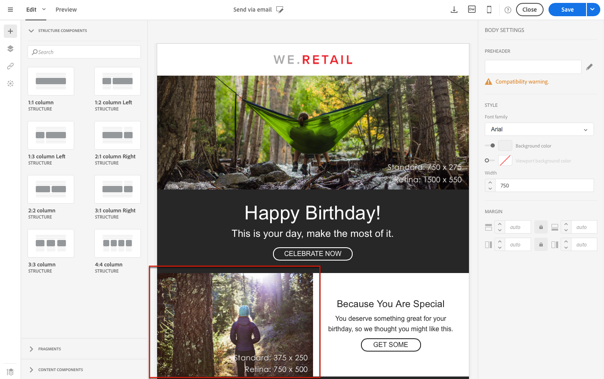

# 编辑纯文本、HTML和移动电子邮件格式{#plain-text-and-html-modes}

电子邮件设计器使您能够编辑电子邮件的多种呈现。 您可以生成电子邮件的文本版本、编辑电子邮件的HTML源以及为移动视图设计电子邮件。

## 生成电子邮件{#generating-a-text-version-of-the-email}的文本版本

默认情况下，会自动生成电子邮件的&#x200B;**[!UICONTROL Plain text]**&#x200B;版本并与&#x200B;**[!UICONTROL Edit]**&#x200B;版本同步。

添加到HTML版本的个性化字段和内容块也与纯文本版本同步。

>[!NOTE]
>
>要在纯文本版本中使用内容块，请确保它们不包含HTML代码。

要使纯文本版本与HTML版本不同，可以通过单击电子邮件&#x200B;**[!UICONTROL Plain text]**&#x200B;视图中的&#x200B;**[!UICONTROL Sync with HTML]**&#x200B;开关来禁用此同步。

然后，您可以根据需要编辑纯文本版本。

>[!NOTE]
>
>如果在禁用同步时编辑&#x200B;**[!UICONTROL Plain text]**&#x200B;版本，则下次启用&#x200B;**[!UICONTROL Sync with HTML]**&#x200B;选项时，在纯文本版本中所做的所有更改将替换为HTML版本。 在&#x200B;**[!UICONTROL Plain text]**&#x200B;视图中所做的更改无法反映在&#x200B;**[!UICONTROL HTML]**&#x200B;视图中。

## 在HTML {#editing-an-email-content-source-in-html}中编辑电子邮件内容源

对于最高级的用户和调试，您可以直接以HTML视图和编辑电子邮件内容。

有两种方法可编辑HTML版本的电子邮件：

* 选择&#x200B;**[!UICONTROL Edit]** > **[!UICONTROL HTML]**&#x200B;以打开整个电子邮件的HTML版本。

   

* 从WYSIWYG界面中，选择一个元素，然后单击&#x200B;**[!UICONTROL Source code]**&#x200B;图标。

   只显示所选元素的源。 如果所选元素是&#x200B;**[!UICONTROL HTML]**&#x200B;内容组件，则可以编辑源代码。 其他组件处于只读模式，但仍可以在电子邮件的完整HTML版本中编辑。

   

如果修改HTML代码，则可能会破坏电子邮件的响应。 确保使用&#x200B;**[!UICONTROL Preview]**&#x200B;按钮测试它。 请参阅[预览消息](../../sending/using/previewing-messages.md)。

## 为移动渲染设计电子邮件{#switching-to-mobile-view}

您可以通过单独编辑移动显示的所有样式选项来微调电子邮件的响应式设计。 例如，您可以调整边距和填充、使用较小或较大的字体大小、更改按钮或应用特定于移动版本的电子邮件的不同背景颜色。

所有样式选项均在移动视图中可用。 “电子邮件设计器”样式设置以前会显示在此页面上。

1. 创建电子邮件和开始，编辑内容。 有关详细信息，请参阅[从头开始设计电子邮件内容](../../designing/using/designing-from-scratch.md#designing-an-email-content-from-scratch)。
1. 要访问专用移动视图，请选择&#x200B;**[!UICONTROL Switch to mobile view]**&#x200B;按钮。

   

   将显示电子邮件的移动版本。 它包含在桌面视图中定义的所有组件和样式。

1. 独立编辑所有样式设置，如背景颜色、对齐方式、填充、边距、字体系列、文本颜色等。

   

1. 在移动视图中编辑任何样式设置时，修改仅应用于移动显示。

   例如，减小图像大小，添加绿色背景并更改移动视图中的填充。

   

1. 当在移动设备上显示组件时，您可以隐藏组件。 为此，请从&#x200B;**[!UICONTROL Display options]**&#x200B;中选择&#x200B;**[!UICONTROL Show only on desktop devices]**。

   您还可以选择在桌面设备上隐藏此组件，这意味着它将仅显示在移动设备上。 要执行此操作，请选择&#x200B;**[!UICONTROL Show only on mobile devices]**。

   例如，此选项允许您在移动设备上显示特定图像，在桌面设备上显示另一个图像。

   您可以从移动设备或桌面视图设置此选项。

   

1. 再次单击&#x200B;**[!UICONTROL Switch to mobile view]**&#x200B;按钮，返回标准桌面视图。 您刚才所做的样式更改不会反映出来。

   

   >[!NOTE]
   >
   >唯一的例外是&#x200B;**[!UICONTROL Style inline]**&#x200B;设置。 任何样式内联设置更改也会应用于标准桌面视图。

1. 对电子邮件结构或内容的任何其他更改，如文本编辑、上传新图像、添加新组件等。 。

   例如，切换回移动视图，编辑一些文本并替换图像。

   

1. 再次单击&#x200B;**[!UICONTROL Switch to mobile view]**&#x200B;按钮，返回标准桌面视图。 将反映更改。

   

1. 在移动视图中删除样式将返回在桌面模式下应用的样式。

   例如，在移动视图中，将绿色背景颜色应用于按钮。

   

1. 切换到桌面视图，并将灰色背景应用到同一按钮。

   

1. 再次切换到移动视图，现在禁用&#x200B;**[!UICONTROL Background color]**&#x200B;设置。

   

   桌面视图中定义的背景颜色现已应用：它会变灰（不是空白）。

   唯一的例外是&#x200B;**[!UICONTROL Border color]**&#x200B;设置。 在移动视图中禁用时，即使在桌面视图中定义了边框颜色，也不再应用边框。

>[!NOTE]
>
>移动视图在[fragments](../../designing/using/using-reusable-content.md#about-fragments)中不可用。
