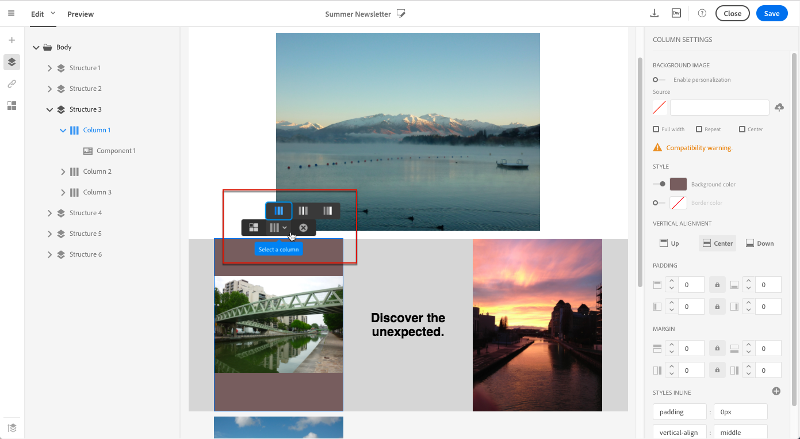
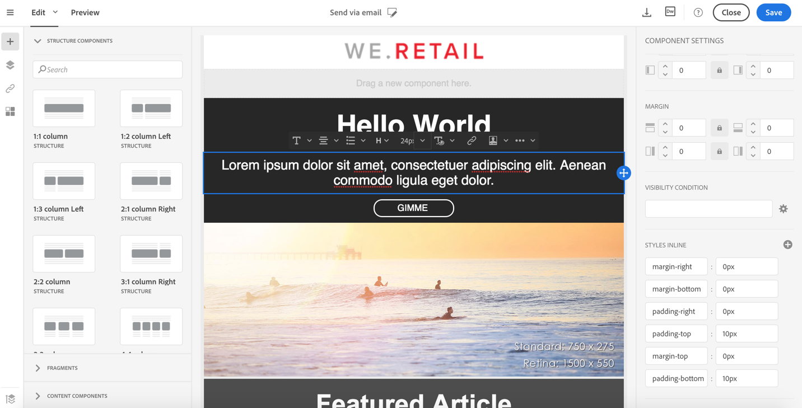

# 管理电子邮件样式 {#managing-styles}

在电子邮件设计器中，选择元素时，**[!UICONTROL Settings]**&#x200B;窗格中将显示特定于所选内容类型的多个选项。 您可以使用这些选项轻松更改电子邮件的样式。

## 选择元素{#selecting-an-element}

要在“电子邮件设计器”界面中选择元素，您可以：

* 直接在电子邮件中单击，
* 或浏览左侧&#x200B;**调板**&#x200B;中的选项中提供的结构树。

通过浏览结构树，可以进行更准确的选择。 您可以选择：

* 整个结构，
* 组成结构组件的列之一，
* 或仅列内的组件。

要选择列，还可以执行以下操作：

1. 选择一个结构组件（直接在电子邮件中或使用左侧&#x200B;**Palette**&#x200B;中提供的结构树）。
1. 在&#x200B;**上下文工具栏**&#x200B;中，单击&#x200B;**[!UICONTROL Select a column]**&#x200B;以选择所需的列。

请参见[此部分](#example--adjusting-vertical-alignment-and-padding)中的示例。

## 调整样式设置{#adjusting-style-settings}

1. 在电子邮件中选择元素。 有关详细信息，请参阅[选择元素](#selecting-an-element)。
1. 根据您的需要调整设置。 每个选定的元素优惠一组不同的设置。

   您可以插入背景、更改大小、修改水平或垂直对齐方式、管理颜色、添加[填充或边距](#selecting-an-element)等。

   为此，请使用&#x200B;**[!UICONTROL Settings]**&#x200B;窗格或[中显示的选项添加内联样式属性](#adding-inline-styling-attributes)。

   

1. 保存您的内容。

## 调整边距和边距{#about-padding-and-margin}

通过电子邮件设计器界面，您可以快速调整边距和边距设置。

**[!UICONTROL Padding]**:此设置允许您管理位于元素边框内的空间。

例如：

* 使用边距在图像的左侧和右侧设置边距。
* 使用顶部和底部填充为&#x200B;**[!UICONTROL Text]**&#x200B;或&#x200B;**[!UICONTROL Divider]**&#x200B;组件添加更多间距。
* 要设置结构元素内各列之间的边框，请为每列定义填充。

**[!UICONTROL Margin]**:此设置允许您管理元素边框与下一个元素之间的空间。

>[!NOTE]
>
>根据您的选择（结构组件、列或内容组件），结果将不相同。 Adobe建议在列级别设置&#x200B;**[!UICONTROL Padding]**&#x200B;和&#x200B;**[!UICONTROL Margin]**&#x200B;参数。

对于&#x200B;**[!UICONTROL Padding]**&#x200B;和&#x200B;**[!UICONTROL Margin]**，单击锁图标以中断顶部和底部或左右参数之间的同步。 这使您能够单独调整每个参数。

## 样式对齐{#about-alignment}

* **文本对齐**:将鼠标光标放在某些文本上，然后使用上下文工具栏对齐它。

   

* **水平** 对齐可以应用于文本、图像和按钮——当前不能应用于 **[!UICONTROL Divider]** 和 **[!UICONTROL Social]** 组件。

   

* 要设置&#x200B;**垂直对齐**，请选择结构组件中的列，然后从“设置”窗格中选择一个选项。

   

## 设置背景{#about-backgrounds}

>[!CONTEXTUALHELP]
>id="ac_edition_backgroundimage"
>title="背景设置"
>abstract="通过电子邮件设计器，您可以个性化内容的背景颜色或背景图像。请注意，并非所有电子邮件客户都支持背景图像。"
>additional-url="https://docs.google.com/spreadsheets/d/1TLo62YKm3tThUWDOIliCQFWs3dpNjpDfw6DdTr1oGOw/edit#gid=0" text="其他信息"

在设置电子邮件设计器的背景时，Adobe建议：

1. 根据您的设计需要，将背景色应用于电子邮件正文。
1. 在大多数情况下，在列级别设置背景颜色。
1. 由于图像或文本组件难以管理，请尽量不要在它们上使用背景颜色。

下面是您可以使用的可用背景设置。

* 为整个电子邮件设置&#x200B;**[!UICONTROL Background color]**。 确保在可从左侧面板访问的导航树中选择正文设置。

   

* 通过选择&#x200B;**[!UICONTROL Viewport background color]**&#x200B;为所有结构组件设置相同的背景颜色。 此选项允许您从背景颜色中选择其他设置。

   

* 为每个结构组件设置不同的背景颜色。 在可从左侧调色板访问的导航树中选择一个结构，以仅将特定背景颜色应用于该结构。

   

   请确保未设置视区背景颜色，因为它可能隐藏结构背景颜色。

* 为结构组件的内容设置&#x200B;**[!UICONTROL Background image]**。

   

   >[!NOTE]
   >
   >某些电子邮件项目不支持背景图像。 不支持时，将改用行背景颜色。 确保在无法显示图像时选择适当的回退背景颜色。

* 在列级设置背景颜色。

   

   >[!NOTE]
   >
   >这是最常见的用例。 Adobe建议在列级设置背景颜色，因为这样在编辑整个电子邮件内容时可以更灵活。

   您还可以在列级别设置背景图像，但很少使用此图像。

### 示例：调整垂直对齐和填充{#example--adjusting-vertical-alignment-and-padding}

要调整由三列组成的结构组件中的填充和垂直对齐方式。 为此请执行以下操作步骤：

1. 直接在电子邮件中或使用左侧&#x200B;**Palette**&#x200B;中提供的结构树选择结构组件。
1. 在&#x200B;**上下文工具栏**&#x200B;中，单击&#x200B;**[!UICONTROL Select a column]**&#x200B;并选择要编辑的工具栏。 也可以从结构树中选择它。

   

   该列的可编辑参数显示在右侧的&#x200B;**[!UICONTROL Settings]**&#x200B;窗格中。

1. 在&#x200B;**[!UICONTROL Vertical alignment]**&#x200B;下，选择&#x200B;**[!UICONTROL Up]**。

   

   内容组件显示在列的顶部。

1. 在&#x200B;**[!UICONTROL Padding]**&#x200B;下，定义列内的顶部边距。 单击锁图标以中断与底部边距的同步。

   定义该列的左边距和右边距。

   

1. 以类似方式继续调整其他列的对齐和填充。

   

1. 保存更改。

## 样式链接{#about-styling-links}

您可以为链接添加下划线，并在电子邮件设计器中选择其颜色和目标。

1. 在插入链接的组件中，选择链接的标签文本。

1. 在组件设置中，选中&#x200B;**[!UICONTROL Underline link]**，为链接的标签文本添加下划线。

   

1. 要选择在哪个浏览上下文时打开链接，请选择&#x200B;**[!UICONTROL Target]**。

   

1. 要更改链接的颜色，请单击&#x200B;**[!UICONTROL Link color]**。

   

1. 选择所需颜色。

   

1. 保存更改。

## 添加内联样式属性{#adding-inline-styling-attributes}

在“电子邮件设计器”界面中，选择某个元素并在侧面板中显示其设置时，您可以自定义该特定元素的内联属性及其值。

1. 在内容中选择元素。
1. 在侧面板上，查找&#x200B;**[!UICONTROL Styles Inline]**&#x200B;设置。

   

1. 修改现有属性的值，或使用&#x200B;**+**&#x200B;按钮添加新属性。 您可以添加任何符合CSS的属性和值。

样式随后将应用于所选元素。 如果子元素未定义特定样式属性，则继承父元素的样式。
