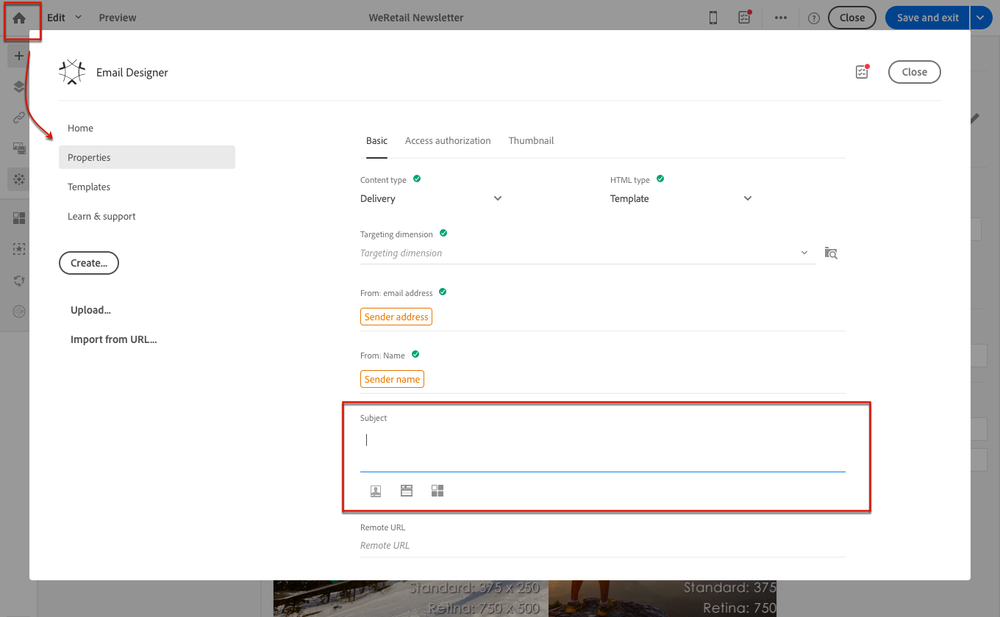

# 定义电子邮件的主题行和发件人{#defining-the-subject-line-of-an-email}

## 定义电子邮件的主题行 {#subject-line}

必须填写消息主题才能准备和发送消息。

>[!NOTE]
>
>如果主题行为空，则消息仪表板和电子邮件Designer中会显示警告。

1. 创建电子邮件。
1. 转到Email Designer主页的&#x200B;**[!UICONTROL Properties]**&#x200B;选项卡（可通过主页图标访问）。
1. 填写&#x200B;**[!UICONTROL Subject]**&#x200B;部分。

   

1. 您还可以通过单击相应的图标，将个性化字段、内容块和动态内容添加到主题行。 有关此内容的更多信息，请参阅[Personalization](../../designing/using/personalization.md)。

## 定义电子邮件的电子邮件发件人 {#email-sender}

要定义将显示在已发送邮件标题中的发件人名称，请转到Designer主页的&#x200B;**[!UICONTROL Properties]**&#x200B;选项卡（可通过主页图标访问）。

* **[!UICONTROL From: name]**&#x200B;字段允许您输入发件人名称。 默认情况下，会在字段中自动输入默认的&#x200B;**发件人姓名**&#x200B;块。 默认发件人电子邮件地址和发件人名称在&#x200B;**[!UICONTROL Brands]**&#x200B;中定义，可通过高级菜单&#x200B;**[!UICONTROL Administration > Instance settings > Brand configuration]**&#x200B;下的Adobe Campaign徽标进行访问。

  您可以通过单击&#x200B;**发件人姓名**&#x200B;块来更改发件人姓名。 该字段随后将变为可编辑，您可以输入要使用的名称。

  此字段可个性化。 为此，您可以通过单击发件人名称下方的图标，添加个性化字段、内容块和动态内容。 有关此内容的更多信息，请参阅[Personalization](../../designing/using/personalization.md)。

* 无法从此分区编辑&#x200B;**[!UICONTROL From: email address]**&#x200B;字段。 您可以通过编辑电子邮件仪表板中电子邮件的属性来更改它。 有关详细信息，请参阅[电子邮件高级参数列表](../../administration/using/configuring-email-channel.md#advanced-parameters)。

>[!NOTE]
>
>标头参数不能为空。 发件人的地址是允许发送电子邮件的必备项（RFC标准）。 Adobe Campaign检查所输入电子邮件地址的语法。

**相关主题：**

* [插入个性化字段](../../designing/using/personalization.md#inserting-a-personalization-field)
* [添加内容块](../../designing/using/personalization.md#adding-a-content-block)
* [定义电子邮件中的动态内容](../../designing/using/personalization.md#defining-dynamic-content-in-an-email)
