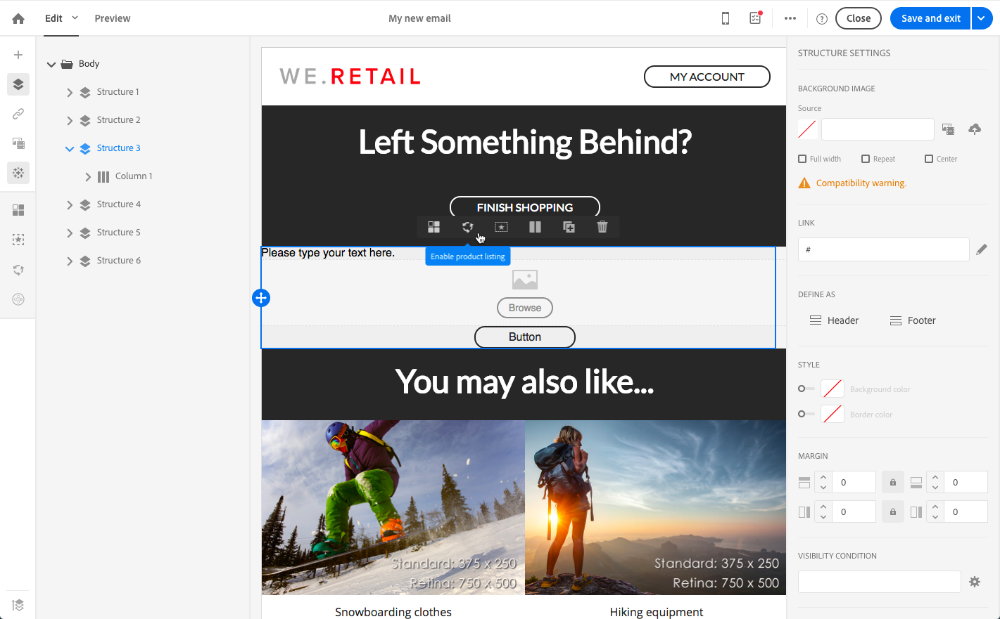

# 在事务型消息中使用产品清单 {#using-product-listings}

>[!IMPORTANT]
>
>產品清單僅適用於 **異動電子郵件訊息** 透過 [電子郵件設計工具](../../designing/using/designing-content-in-adobe-campaign.md#email-designer-interface) 介面。

編輯交易式電子郵件的內容時，您可以建立參考一或多個資料集合的產品清單。 例如，在購物車放棄電子郵件中，您可以包含使用者離開網站時購物車中的所有產品清單，以及每個產品的影像、價格和連結。

要在事务型消息中添加已放弃产品的清单，请执行以下步骤。

您也可以觀看 [這組影片](https://experienceleague.adobe.com/docs/campaign-standard-learn/tutorials/designing-content/product-listings-in-transactional-email.html#configure-product-listings-in-transactional-emails) 說明在交易式電子郵件中設定產品清單所需的步驟。

>[!NOTE]
>
>Adobe Campaign 不支持嵌套产品清单，这意味着您不能将一个产品清单包含在另一个产品清单中。

## 定义产品清单 {#defining-a-product-listing}

在事务型消息中使用产品清单之前，您需要在事件层级定义产品清单以及要显示的清单中各个产品的字段。有关更多信息，请参阅[定义数据集合](../../channels/using/configuring-transactional-event.md#defining-data-collections)。

1. 在事务型消息中，单击 **[!UICONTROL Content]** 块以修改电子邮件的内容。
1. 将结构组件拖放到工作区。如需詳細資訊，請參閱 [定義電子郵件結構](../../designing/using/designing-from-scratch.md#defining-the-email-structure).

   例如，选择一列结构组件并添加文本组件、图像组件和按钮组件。如需詳細資訊，請參閱 [使用內容元件](../../designing/using/designing-from-scratch.md#about-content-components).

1. 选择之前创建的结构组件，然后单击上下文工具栏中的 **[!UICONTROL Enable product listing]** 图标。

   

   结构组件以橙色框突出显示，且 **[!UICONTROL Product listing]** 设置显示在左侧面板中。

   

1. 选择集合元素的显示方式：

   * **[!UICONTROL Row]**：水平，表示每行显示一个元素，逐行排列。
   * **[!UICONTROL Column]**: 垂直，表示使用同一行将各个元素邻近放置。

   >[!NOTE]
   >
   >仅当使用多列结构组件（**[!UICONTROL 2:2 column]**、**[!UICONTROL 3:3 column]** 和 **[!UICONTROL 4:4 column]**）时，才可使用 **[!UICONTROL Column]** 选项。编辑产品清单时，仅填写第一列：不考虑其他列。如需選取結構元件的詳細資訊，請參閱 [定義電子郵件結構](../../designing/using/designing-from-scratch.md#defining-the-email-structure).

1. 选择配置与事务型消息相关的事件时创建的数据集合。您可以通过 **[!UICONTROL Context]** > **[!UICONTROL Real-time event]** > **[!UICONTROL Event context]** 节点找到该数据集合。

   

   有关配置事件的更多信息，请参阅[定义数据集合](../../channels/using/configuring-transactional-event.md#defining-data-collections)。

1. 使用 **[!UICONTROL First item]** 下拉列表选择电子邮件中显示清单的开头元素。

   例如，如果您选择“2”，则集合的第一个项将不会显示在电子邮件中。产品清单将从第二项开始。

1. 选择要在清单中显示的最大项数。

   >[!NOTE]
   >
   >如果希望垂直显示清单中的元素 (**[!UICONTROL Column]**)，则最大项数将根据选则的结构组件（2 列、3 列或 4 列）而有所限制。有关选择结构组件的更多信息，请参阅[编辑电子邮件结构](../../designing/using/designing-from-scratch.md#defining-the-email-structure)。

## 填充产品清单 {#populating-the-product-listing}

要显示来自事务型电子邮件所链接事件的产品清单，请执行以下步骤。

有关在配置事件时创建集合和相关字段的更多信息，请参阅[定义数据集合](../../channels/using/configuring-transactional-event.md#defining-data-collections)。

1. 选择要插入的图像组件，选择 **[!UICONTROL Enable personalization]** 并单击 Settings 窗格中的铅笔。

   

1. 在打开的 **[!UICONTROL Image source URL]** 窗口中选择 **[!UICONTROL Add personalization field]**。

   前往 **[!UICONTROL Context]** > **[!UICONTROL Real-time event]** > **[!UICONTROL Event context]** 节点，打开与您创建的集合对应的节点（此处为 **[!UICONTROL Product list]**），然后选择之前定义的图像字段（此处为 **[!UICONTROL Product image]**）。单击 **[!UICONTROL Save]**。

   

   现在，您选择的个性化字段即已显示在设置窗格中。

1. 在所需位置，从上下文工具栏中选择&#x200B;**[!UICONTROL Insert personalization field]** 

   

1. 前往 **[!UICONTROL Context]** > **[!UICONTROL Real-time event]** > **[!UICONTROL Event context]** 节点，打开与您创建的集合对应的节点（此处为 **[!UICONTROL Product list]**），然后选择之前创建的字段（此处为 **[!UICONTROL Product name]**）。单击 **[!UICONTROL Confirm]**。

   

   现在，您选择的个性化字段即已显示在电子邮件内容中所需的位置。

1. 接下来以类似方式插入价格。
1. 选择一些文本，然后从上下文工具栏中选择&#x200B;**[!UICONTROL Insert link]** 

   

1. 在打开的 **[!UICONTROL Insert link]** 窗口中选择 **[!UICONTROL Add personalization field]**。

   前往 **[!UICONTROL Context]** > **[!UICONTROL Real-time event]** > **[!UICONTROL Event context]** 节点，打开与您创建的集合对应的节点（此处为 **[!UICONTROL Product list]**），然后选择之前创建的 URL 字段（此处为 **[!UICONTROL Product URL]**）。单击 **[!UICONTROL Save]**。

   >[!IMPORTANT]
   >
   >出于安全原因，请确保将个性化字段插入以适当静态域名开头的链接中。

   

   现在，您选择的个性化字段即已显示在设置窗格中。

1. 选择应用产品清单的结构组件，然后选择 **[!UICONTROL Show fallback]** 以定义默认内容。

   

1. 拖动一个或多个内容组件并根据需要对其进行编辑。

   

   如果集合在觸發事件時為空白（例如，如果客戶的購物車中沒有任何專案），則會顯示備援內容。

1. 在“设置”窗格中，编辑产品清单的样式。如需詳細資訊，請參閱 [管理電子郵件樣式](../../designing/using/styles.md).
1. 使用链接了相关事务型事件并为其定义了集合数据的测试用户档案，预览电子邮件。例如，在要使用的测试用户档案的 **[!UICONTROL Event data]** 部分中添加以下信息：

   

   有关定义事务型消息中的测试用户档案的更多信息，请参阅[本章节](../../channels/using/testing-transactional-message.md#defining-specific-test-profile)。
