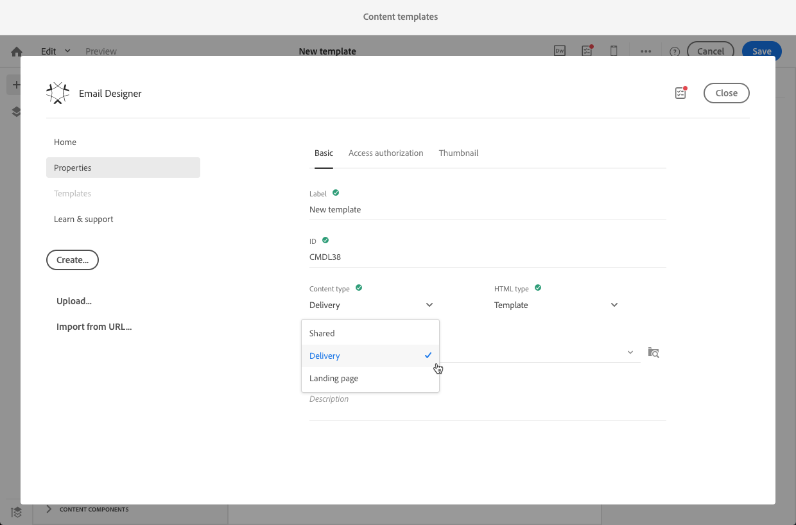
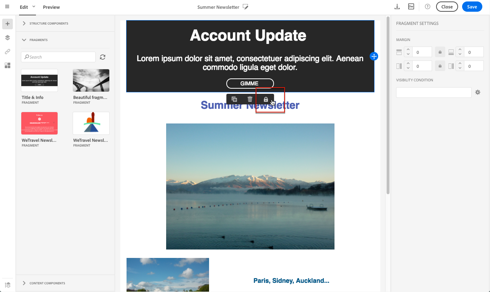

# 创建和使用可重用内容 {#using-reusable-content}

了解如何主控电子邮件内容版本。 通过电子邮件设计器，您可以使用自己的预定义内容创建模板和片段，并将这些模板和片段重复用于以下投放。

## 使用模板设计电子邮件 {#designing-templates}

>[!NOTE]
>
> 在Adobe Campaign Standard，您可以创建不同类型的模板，这些模板可从“资源”>“ **模板** ”菜单 **访问** 。 电子邮件设计器中使用的模板是内容模板。 有关详细信息，请参阅 [关于模板](../../start/using/marketing-activity-templates.md)。

### 关于内容模板 {#content-templates}

您可以管理电子邮件设计器主页 **[!UICONTROL Templates]** 选项卡中提 [供的HTML内容](../../designing/using/designing-content-in-adobe-campaign.md) 。

现成的电子邮件内容模板包括十八种针对移动设备优化的布局和由Behance艺术家设计的四个一流的响应式模板。 它们与最新的使用方式（如客户欢迎邮件、新闻稿和重新参与电子邮件等）相对应。 您可以根据品牌内容轻松自定义这些内容，从而简化从头开始设计电子邮件的过程。

HTML内容模板可从“高级”菜 **[!UICONTROL Resources]** 单的 **[!UICONTROL Content templates & fragments]** >屏幕 [访问](../../start/using/interface-description.md#advanced-menu)。 您可以从此处管理登陆页内容模板、电子邮件内容模板以及片段。

现成内容模板是只读的。 要编辑其中一个模板，您必须先重复所需的模板。

您可以创建新模板或片段，并定义您自己的内容。 有关此方面的详细信息， [请参阅创建内容模板](#creating-a-content-template)[和创建内容片段](#creating-a-content-fragment)。

在使用电子邮件设计器编辑内容时，您还可以通过将内容另存为片段或模板来创建内容模板。 有关此内容的详细信息，请 [参阅将内容另存为模板](#saving-content-as-template)[和将内容另存为片段](../../designing/using/using-reusable-content.md#saving-content-as-a-fragment)。

**相关主题：**

* 了解如何在此视频中个性化 [内容模板](https://docs.adobe.com/content/help/en/campaign-learn/campaign-standard-tutorials/designing-content/email-designer/email-content-templates.html)。
* 有关编辑内容的更多信息，请参 [阅关于电子邮件内容设计](../../designing/using/designing-content-in-adobe-campaign.md)。

### Creating a content template {#creating-a-content-template}

您可以创建自己的内容模板，以根据需要多次使用它们。

以下示例演示如何创建电子邮件内容模板。

1. 转到> **[!UICONTROL Resources]** 并 **[!UICONTROL Content templates & fragments]** 单击 **[!UICONTROL Create]**。
1. 单击电子邮件标签以访问电 **[!UICONTROL Properties]** 子邮件设计器的选项卡。
1. 指定可识别的标签，并选择以下参数以便能够在电子邮件中使用此模板：

   * 从 **[!UICONTROL Shared]** 下 **[!UICONTROL Delivery]** 拉式列表 **[!UICONTROL Content type]** 中选择或。
   * 从 **[!UICONTROL Template]** 下拉 **[!UICONTROL HTML type]** 列表中选择。

   

1. 如果需要，您可以设置一幅将用作模板缩略图的图像。 从模板属性 **[!UICONTROL Thumbnail]** 的选项卡中选择它。

   

   此缩略图将显示在“电子邮 **[!UICONTROL Templates]** 件设计器”主页 [卡中](../../designing/using/designing-content-in-adobe-campaign.md) 。

1. 关闭选 **[!UICONTROL Properties]** 项卡以返回到主工作区。
1. 添加可根据需要自定义的结构组件和内容组件。
   >[!NOTE]
   >
   > 不能在内容模板中插入个性化字段或条件内容。
1. 编辑后，保存模板。

此模板现在可用于使用电子邮件设计器构建的任何电子邮件。 从“电子邮件设计 **[!UICONTROL Templates]** 器”主页的 [选项卡中选择](../../designing/using/designing-content-in-adobe-campaign.md) 。

### 将内容另存为模板 {#saving-content-as-template}

使用电子邮件设计器编辑电子邮件时，您可以直接将该电子邮件的内容另存为模板。

<!--[!CAUTION]
>
>You cannot save as template a structure containing personalization fields or dynamic content.-->

1. 从“电 **[!UICONTROL Save as template]** 子邮件设计器”主工具栏中进行选择。

   

1. 根据需要添加标签和说明，然后单击 **[!UICONTROL Save]**。

   

1. 要查找刚刚创建的模板，请转到 **[!UICONTROL Resources]** > **[!UICONTROL Content templates & fragments]**。

1. 要使用新模板，请从“电子邮件设计器” **[!UICONTROL Templates]** 主页的选 [项卡中选择](../../designing/using/designing-content-in-adobe-campaign.md) 。

   

### 使用片段和组件创建模板 {#template-fragments-components}

您现在可以使用电子邮件设计器创建电子邮件模板。 使用内容组件反映电子邮件的不同部分，并调整设置，使其尽可能接近原始新闻稿。 最后，插入您刚刚创建的片段。

1. 使用电子邮件设计器创建模板。 有关此方面的详细信息，请参 [阅内容模板](#content-templates)。
1. 在模板中插入多个结构组件——与电子邮件的页眉、页脚和正文相对应。 有关添加结构组件的详细信息，请 [参阅使用电子邮件设计器编辑电子邮件结构](../../designing/using/designing-from-scratch.md#defining-the-email-structure)。
1. 插入所需数量的内容组件以创建新闻稿正文。 这将是每月更新的电子邮件的可编辑内容。

   

   如果您熟悉HTML代码，Adobe建议利用 **[!UICONTROL Html]** 组件来复制粘贴原始电子邮件中更复杂的元素。 将其他组件 **[!UICONTROL Button]**( **[!UICONTROL Image]** 如 **[!UICONTROL Text]** ，或用于其余内容。 有关此内容的详细信息，请参 [阅关于内容组件](../../designing/using/designing-from-scratch.md#about-content-components)。

   >[!NOTE]
   >
   >使用组 **[!UICONTROL Html]** 件可创建可通过受限选项编辑的组件。 在选择此组件之前，请确保您知道如何处理HTML代码。

1. 尽可能调整内容组件以匹配原始电子邮件。

   

   有关管理样式设置和内联属性的更多信息，请参阅 [编辑电子邮件样式](../../designing/using/styles.md)。

1. 将之前创建的两个片段（页眉和页脚）插入到所需的结构组件中。

   

1. 保存模板。

您现在可以在电子邮件设计器中完全管理此模板，以创建和更新每月将发送给收件人的新闻稿。

要使用它，请创建电子邮件，然后选择您刚刚创建的内容模板。

**相关主题**：

* [创建电子邮件](../../channels/using/creating-an-email.md)
* [电子邮件设计人员简介视频](https://video.tv.adobe.com/v/22771/?autoplay=true&hidetitle=true&captions=chi_hans)
* [从头开始设计电子邮件内容](../../designing/using/designing-from-scratch.md#designing-an-email-content-from-scratch)

## 关于片段 {#about-fragments}

>[!CONTEXTUALHELP]
>id="ac_fragments"
>title="关于片段"
>abstract="片段是可重复使用的内容块，可在一个或多个电子邮件中引用。"

片段是可重用的组件，可在一个或多个电子邮件中引用。
可以在“资源”>“内容片段和模板” **下的界** 面 **中找到这些片段和模板**。

要在电子邮件设计器中充分利用片段：

* 创建您自己的片段。 请参 [阅创建内容片段](#creating-a-content-fragment)[和将内容另存为片段](#saving-content-as-a-fragment)。
* 在电子邮件中根据需要多次使用它们。 请参 [阅在电子邮件中插入元素](#inserting-elements-into-an-email)。
* 编辑片段时，将同步更改：它们会自动传播到包含该片段的所有电子邮件（前提是它们尚未准备或发送）。

添加到电子邮件时，片段默认处于锁定状态。 如果要修改特定电子邮件的片段，您可以在使用该片段的电子邮件中解锁该片段，从而中断与原始片段的同步。 更改将不再同步。

要解锁电子邮件中的片段，请选择该片段，然后单击上下文工具栏中的锁定图标。

该片段将成为不再链接到原始片段的独立组件。 然后，可以将其编辑为任何其他内容组件。 请参 [阅关于内容组件](../../designing/using/designing-from-scratch.md#about-content-components)。

### 在电子邮件中插入片段 {#inserting-elements-into-an-email}

要定义电子邮件的内容，您可以在预先放置的结构组件中添加内容元素。 请参 [阅编辑电子邮件结构](../../designing/using/designing-from-scratch.md#defining-the-email-structure)。

1. 通过选择左侧的+ **图标** ，访问内容元素。 选择 [片段](#about-fragments) 或 [内容组件](../../designing/using/designing-from-scratch.md#about-content-components)。
1. 如果您已经知道要添加的片段的标签或部分标签，则可以搜索它。

   

1. 将片段或内容组件从调色板拖放到电子邮件的结构组件。

   

   将元素添加到电子邮件后，即可将其移动到结构组件中或电子邮件中的其他结构组件中。

   

1. 编辑元素，使其与此电子邮件的确切需求相符。 您可以添加文本、链接、图像等。

   >[!NOTE]
   >
   >在添加到电子邮件时，片段默认处于锁定状态。 如果要修改特定电子邮件的片段，则可以中断与原始片段的同步，或者直接在片段中进行更改。 请参 [阅关于片段](#about-fragments)。

1. 对您需要添加到电子邮件的所有元素重复此过程。
1. 保存电子邮件。

填充电子邮件结构后，您可以编辑每个内容元素的样式。 请参 [阅编辑元素](../../designing/using/styles.md)。

>[!NOTE]
>
>如果修改了片段，则更改会自动传播到使用该片段的电子邮件中。 有关此方面的详细信息，请参 [阅关于片段](#about-fragments)。

### Creating a content fragment {#creating-a-content-fragment}

您可以创建您自己的内容片段，以便在一个或多个电子邮件中根据需要使用它们。

1. 转到> **[!UICONTROL Resources]** 并 **[!UICONTROL Content templates & fragments]** 单击 **[!UICONTROL Create]**。
1. 单击电子邮件标签以访问电 **[!UICONTROL Properties]** 子邮件设计器的选项卡。
1. 指定可识别的标签，并选择以下参数以在编辑电子邮件内容时查找片段：

   * 由于片段仅与电子邮件兼容， **[!UICONTROL Delivery]** 请从下 **[!UICONTROL Content type]** 拉列表中进行选择。
   * 从下 **[!UICONTROL Fragment]** 拉列表 **[!UICONTROL HTML type]** 中进行选择，以便能够将此内容用作片段。

   

1. 如果需要，您可以设置一幅将用作片段缩略图的图像。 从模板属性 **[!UICONTROL Thumbnail]** 的选项卡中选择它。

   

   编辑电子邮件时，此缩略图将显示在片段标签的旁边。

1. 关闭选 **[!UICONTROL Properties]** 项卡以返回到主工作区。
1. 添加可根据需要自定义的结构组件和内容组件。

   >[!CAUTION]
   >
   >片段不能包括个性化字段、动态内容或其他片段。
   >
   >避免另存为具有空结构组件的片段内容。 插入>fragment后，它们将不可编辑。
   >
   >移 [动视图](../../designing/using/plain-text-html-modes.md#switching-to-mobile-view) 在片段中不可用。

1. 编辑后，保存您的片段。

此片段现在可用于使用电子邮件设计器构建的任何电子邮件。 它显示在 **[!UICONTROL Fragments]** 调色板的部分下。

>[!NOTE]
>
>除非在电子邮件中使用且已解锁，否则您无法在片段中插入个性化字段。 请参 [阅关于片段](#about-fragments)。

### 将内容另存为片段 {#saving-content-as-a-fragment}

使用电子邮件设计器编辑电子邮件时，您可以直接将该电子邮件的一部分另存为片段。

* 不能将包含个性化字段、动态内容或其他片段的结构另存为片段。
* 只能选择彼此相邻的结构。
<!-- - You cannot select an empty structure.-->

1. 在电子邮件设计器中编辑电子邮件时，从主 **[!UICONTROL Save as fragment]** 工具栏中进行选择。

   

1. 在工作区中，选择将构成片段的结构。

   

   >[!NOTE]
   >
   >请确保选择彼此相邻且不包含个性化字段、动态内容或其他片段的结构。
   <!--You cannot select an empty structure.-->

1. 单击 **[!UICONTROL Create]**.

1. 根据需要添加标签和说明，然后单击 **[!UICONTROL Save]**。

   

1. 要查找刚刚创建的片段，请转到 **[!UICONTROL Resources]** > **[!UICONTROL Content templates & fragments]**。

   

1. 要使用新片段，请打开任何电子邮件内容并从片段列表中选择它。

>[!NOTE]
>移 [动视图](../../designing/using/plain-text-html-modes.md#switching-to-mobile-view) 在片段中不可用。 如果要编辑电子邮件移动视图，请先编辑，然后再将内容另存为片段。

<!--You need to copy-paste the HTML corresponding to the section that you want to save into a new fragment.

>[!NOTE]
>
>To do this, you need to be familiar with HTML code.

To save as a fragment some email content that you created, follow the steps below.

1. When editing an email in the Email Designer, select **[!UICONTROL Edit]** > **[!UICONTROL HTML]** to open the HTML version of that email.
1. Select and copy the HTML corresponding to the part that you want to save.
1. Go to **[!UICONTROL Resources]** > **[!UICONTROL Content templates & fragments]** and click **[!UICONTROL Create]**.
1. Click the email label to access the **[!UICONTROL Properties]** tab of the Email Designer and select **[!UICONTROL Fragment]** from the **[!UICONTROL HTML type]** drop-down list.
1. Select **[!UICONTROL Edit]** > **[!UICONTROL HTML]** to open the HTML version of the fragment.
1. Paste the HTML that you copied where appropriate.
1. Switch back to the **[!UICONTROL Edit]** view to check the result and save the new fragment.-->

## 使用片段创建可重复使用的页眉和页脚 {#header-footer-fragments}

使用电子邮件设计器，为每个可重用的部分创建一个片段。 在此示例中，您将创建两个片段：一个用于页眉，一个用于页脚。 然后，您可以将现有内容中的相关部分复制到这些片段中。

为此请执行以下操作步骤：

1. 在Adobe Campaign中，转 **[!UICONTROL Resources]** 到> **[!UICONTROL Content templates & fragments]** 并为标题创建片段。 有关此方面的详细信息，请 [参阅创建内容片段](#creating-a-content-fragment)。
1. 向片段添加所需数量的结构组件。

   

1. 将图像和文本组件插入结构中。

   

1. 上传相应的图像，输入文本并调整设置。

   

1. 保存片段。
1. 以同样的方式继续创建页脚并保存它。

   

您的片段现已准备好在模板中使用。
