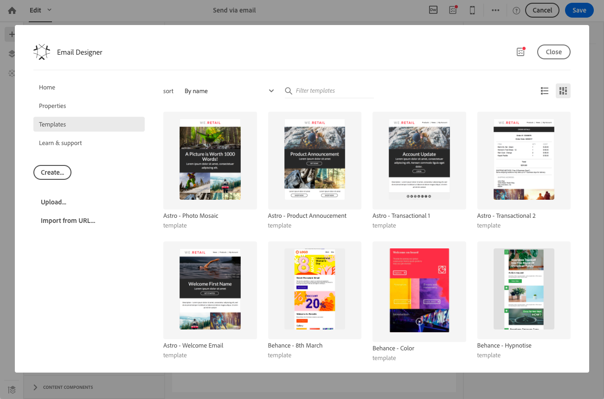
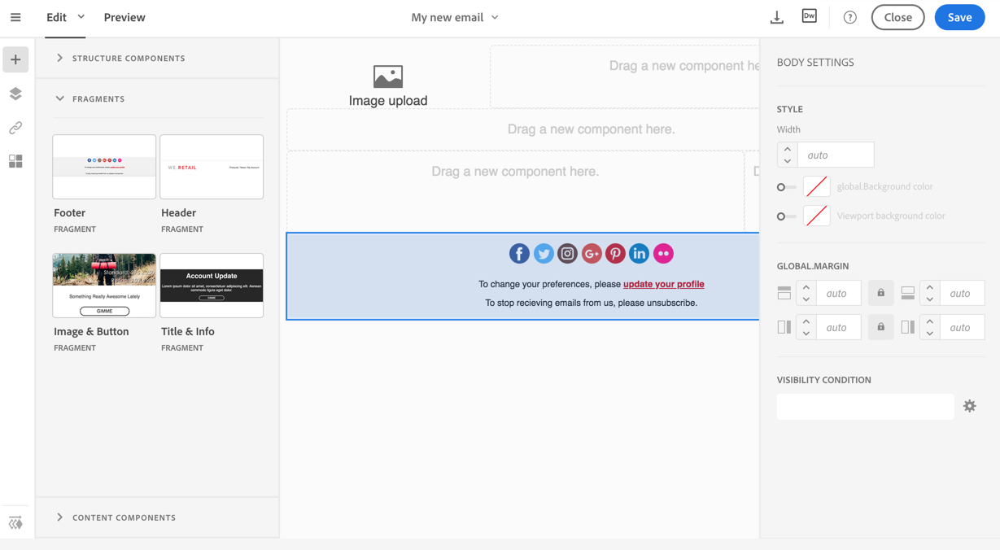

# 创建和使用可重用内容 {#using-reusable-content}

了解如何掌握电子邮件内容版本。 借助Email Designer，您可以使用自己的预定义内容创建模板和片段，并在后续投放中重复使用它们。

## 使用模板设计电子邮件 {#designing-templates}

>[!NOTE]
>
> 在Adobe Campaign Standard中，您可以创建不同类型的模板，这些模板可从 **资源** > **模板** 菜单。 Email Designer中使用的模板是内容模板。 有关更多信息，请参阅 [关于模板](../../start/using/marketing-activity-templates.md).

 [在视频中了解如何创建模板](#video)

### 关于内容模板 {#content-templates}

您可以管理中提供的HTML内容 **[!UICONTROL Templates]** 选项卡 [电子邮件设计工具](../../designing/using/designing-content-in-adobe-campaign.md) 主页。

现成的电子邮件内容模板包括由Behance艺人设计的18个移动设备优化布局和四个同类最佳的响应模板。 它们对应于客户欢迎消息、快讯和重新参与电子邮件等最新使用情况。 它们可以轻松地根据品牌内容进行自定义，以简化从头开始设计电子邮件的过程。

HTML内容模板可从 **[!UICONTROL Resources]** > **[!UICONTROL Content templates & fragments]** 屏幕 [高级菜单](../../start/using/interface-description.md#advanced-menu). 从该位置，您可以管理登陆页面内容模板、电子邮件内容模板以及片段。

现成的内容模板是只读的。 要编辑其中一个模板，必须首先复制所需的模板。

您可以创建新模板或片段，并定义您自己的内容。 有关此内容的更多信息，请参阅 [创建内容模板](#creating-a-content-template) 和 [创建内容片段](#creating-a-content-fragment).

使用Email Designer编辑内容时，您还可以通过将内容另存为片段或模板来创建内容模板。 有关此内容的更多信息，请参阅 [将内容另存为模板](#saving-content-as-template) 和 [将内容另存为片段](../../designing/using/using-reusable-content.md#saving-content-as-a-fragment).

**相关主题：**

* 有关编辑内容的更多信息，请参阅 [关于电子邮件内容设计](../../designing/using/designing-content-in-adobe-campaign.md).

### 创建内容模板 {#creating-a-content-template}

您可以创建自己的内容模板，以根据需要多次使用。

以下示例显示如何创建电子邮件内容模板。

1. 转到 **[!UICONTROL Resources]** > **[!UICONTROL Content templates & fragments]** 并单击 **[!UICONTROL Create]**.
1. 单击电子邮件标签以访问 **[!UICONTROL Properties]** 选项卡。
1. 指定可识别的标签并选择以下参数以便能够在电子邮件中使用此模板：

   * 选择 **[!UICONTROL Shared]** 或 **[!UICONTROL Delivery]** 从 **[!UICONTROL Content type]** 下拉列表。
   * 选择 **[!UICONTROL Template]** 从 **[!UICONTROL HTML type]** 下拉列表。

   

1. 如果需要，您可以设置用作模板缩略图的图像。 从中选择 **[!UICONTROL Thumbnail]** 模板属性的选项卡。

   

   此缩略图将显示在 **[!UICONTROL Templates]** 选项卡 [电子邮件设计工具](../../designing/using/designing-content-in-adobe-campaign.md) 主页。

1. 关闭 **[!UICONTROL Properties]** 选项卡以返回到主工作区。
1. 添加可以根据需要自定义的结构组件和内容组件。
   >[!NOTE]
   >
   > 无法在内容模板中插入个性化字段或条件内容。
1. 编辑后，保存您的模板。

此模板现在可用于使用Email Designer构建的任何电子邮件。 从中选择 **[!UICONTROL Templates]** 选项卡 [电子邮件设计工具](../../designing/using/designing-content-in-adobe-campaign.md) 主页。

### 将内容另存为模板 {#saving-content-as-template}

使用Email Designer编辑电子邮件时，您可以直接将该电子邮件的内容另存为模板。

<!--[!CAUTION]
>
>You cannot save as template a structure containing personalization fields or dynamic content.-->

1. 选择 **[!UICONTROL Save as template]** 从Email Designer主工具栏。

   

1. 根据需要添加标签和说明，然后单击 **[!UICONTROL Save]**.

   

1. 要查找您刚刚创建的模板，请转到 **[!UICONTROL Resources]** > **[!UICONTROL Content templates & fragments]**.

1. 要使用新模板，请从 **[!UICONTROL Templates]** 选项卡 [电子邮件设计工具](../../designing/using/designing-content-in-adobe-campaign.md) 主页。

   

### 创建包含片段和组件的模板 {#template-fragments-components}

您现在可以使用Email Designer创建电子邮件模板。 使用内容组件来反映电子邮件的不同部分，并调整设置以使它们尽可能接近您的原始新闻稿。 最后，插入您刚刚创建的片段。

1. 使用Email Designer创建模板。 有关此内容的更多信息，请参阅 [内容模板](#content-templates).
1. 在模板中插入多个结构组件 — 对应于电子邮件的页眉、页脚和正文。 有关添加结构组件的更多信息，请参阅 [使用Email Designer编辑电子邮件结构](../../designing/using/designing-from-scratch.md#defining-the-email-structure).
1. 根据需要插入任意数量的内容组件以创建新闻稿正文。 这将是您每月更新的电子邮件的可编辑内容。

   

   如果您熟悉HTML代码，Adobe建议利用 **[!UICONTROL Html]** 组件，您可以在此处复制并粘贴原始电子邮件中较为复杂的元素。 使用其他组件，例如 **[!UICONTROL Button]**， **[!UICONTROL Image]** 或 **[!UICONTROL Text]** 其余内容。 有关此内容的更多信息，请参阅 [关于内容组件](../../designing/using/designing-from-scratch.md#about-content-components).

   >[!NOTE]
   >
   >使用 **[!UICONTROL Html]** 组件导致创建可使用有限选项编辑的组件。 在选择此组件之前，请确保您知道如何处理HTML代码。

1. 尽可能调整内容组件以匹配原始电子邮件。

   

   有关管理样式设置和内联属性的详细信息，请参阅 [编辑电子邮件样式](../../designing/using/styles.md).

1. 将之前创建的两个片段（页眉和页脚）插入所需的结构组件中。

   

1. 保存模板。

您现在可以在Email Designer中完全管理此模板，以创建并更新您每月发送给收件人的新闻稿。

要使用它，请创建电子邮件并选择您刚刚创建的内容模板。

**相关主题**：

* [创建电子邮件](../../channels/using/creating-an-email.md)
* [Email Designer简介视频](../../designing/using/designing-content-in-adobe-campaign.md#video)
* [从头开始设计电子邮件内容](../../designing/using/designing-from-scratch.md#designing-an-email-content-from-scratch)

### 教程视频 {#video}

本视频说明如何创建自己的模板。

>[!VIDEO](https://video.tv.adobe.com/v/23106?quality=12)

提供了其他Campaign Standard操作方法视频 [此处](https://experienceleague.adobe.com/docs/campaign-standard-learn/tutorials/overview.html?lang=zh-Hans).

## 关于片段 {#about-fragments}

>[!CONTEXTUALHELP]
>id="ac_fragments"
>title="关于片段"
>abstract="片段是可在一封或多封电子邮件中引用的可重用内容块。"

片段是可在一封或多封电子邮件中引用的可重用组件。
它们可以在下的界面中找到 **资源** > **内容片段和模板**.

要在Email Designer中充分利用片段，请执行以下操作：

* 创建您自己的片段。 请参阅 [创建内容片段](#creating-a-content-fragment) 和 [将内容另存为片段](#saving-content-as-a-fragment).
* 在电子邮件中根据需要多次使用它们。 请参阅 [在电子邮件中插入元素](#inserting-elements-into-an-email).
* 编辑片段时，将同步更改：更改会自动传播到包含该片段的所有电子邮件（前提是这些更改尚未准备或发送）。

添加到电子邮件时，片段默认处于锁定状态。 如果要修改特定电子邮件的片段，可以在使用原始片段的电子邮件中将其解锁，从而中断与原始片段的同步。 更改将不再同步。

要解锁电子邮件中的片段，请选择该片段并单击上下文工具栏中的锁定图标。

该片段将成为不再链接到原始片段的独立组件。 然后，可以像任何其他内容组件一样对其进行编辑。 请参阅 [关于内容组件](../../designing/using/designing-from-scratch.md#about-content-components).

### 在电子邮件中插入片段 {#inserting-elements-into-an-email}

要定义电子邮件的内容，可在预先放置的结构组件中添加内容元素。 请参阅 [编辑电子邮件结构](../../designing/using/designing-from-scratch.md#defining-the-email-structure).

1. 通过选择 **+** 图标。 选择 [片段](#about-fragments) 或 [内容组件](../../designing/using/designing-from-scratch.md#about-content-components).
1. 如果您已经知道要添加的片段的标签或部分标签，则可以搜索它。

   

1. 将片段或内容组件从面板拖放到电子邮件的结构组件中。

   

   将元素添加到电子邮件后，便可以将其移动到结构组件内或电子邮件中的其他结构组件中。

   

1. 编辑元素以匹配此电子邮件的确切需求。 您可以添加文本、链接、图像等。

   >[!NOTE]
   >
   >添加到电子邮件时，片段默认处于锁定状态。 如果要修改特定电子邮件的片段，或者直接在片段中进行更改，可以中断与原始片段的同步。 请参阅 [关于片段](#about-fragments).

1. 对需要添加到电子邮件中的所有元素重复此过程。
1. 保存您的电子邮件。

现在您的电子邮件结构已填充，您可以编辑每个内容元素的样式。 请参阅 [编辑元素](../../designing/using/styles.md).

>[!NOTE]
>
>如果修改了片段，更改将自动传播到使用该片段的电子邮件中。 有关此内容的更多信息，请参阅 [关于片段](#about-fragments).

### 创建内容片段 {#creating-a-content-fragment}

您可以创建自己的内容片段，以根据需要在一封或多封电子邮件中使用它们。

1. 转到 **[!UICONTROL Resources]** > **[!UICONTROL Content templates & fragments]** 并单击 **[!UICONTROL Create]**.
1. 单击电子邮件标签以访问 **[!UICONTROL Properties]** 选项卡。
1. 指定可识别的标签，然后选择以下参数以在编辑电子邮件内容时查找片段：

   * 由于片段仅与电子邮件兼容，请选择 **[!UICONTROL Delivery]** 从 **[!UICONTROL Content type]** 下拉列表。
   * 选择 **[!UICONTROL Fragment]** 从 **[!UICONTROL HTML type]** 下拉列表，以便能够将此内容用作片段。

   

1. 如果需要，您可以设置将用作片段缩略图的图像。 从中选择 **[!UICONTROL Thumbnail]** 模板属性的选项卡。

   

   编辑电子邮件时，此缩略图将显示在片段的标签旁边。

1. 关闭 **[!UICONTROL Properties]** 选项卡以返回到主工作区。
1. 添加可以根据需要自定义的结构组件和内容组件。

   >[!CAUTION]
   >
   >片段不得包括个性化字段、动态内容或另一片段.
   >
   >避免保存为结构组件为空的片段内容。 插入片段后，将无法对其进行编辑。
   >
   >此 [移动视图](../../designing/using/plain-text-html-modes.md#switching-to-mobile-view) 在片段中不可用。

1. 编辑后，保存您的片段。

此片段现在可用于使用Email Designer构建的任何电子邮件。 它显示在 **[!UICONTROL Fragments]** 面板的部分。

>[!NOTE]
>
>除非在电子邮件中使用个性化字段并将其解锁，否则无法在片段中插入个性化字段。 请参阅 [关于片段](#about-fragments).

### 将内容另存为片段 {#saving-content-as-a-fragment}

使用Email Designer编辑电子邮件时，您可以直接将电子邮件的一部分另存为片段。

* 您不能将包含个性化字段、动态内容或其他片段的结构另存为片段。
* 只能选取彼此相邻的结构。
  <!-- - You cannot select an empty structure.-->

1. 在Email Designer中编辑电子邮件时，选择 **[!UICONTROL Save as fragment]** 从主工具栏删除。

   

1. 从工作区中，选择将构成片段的结构。

   

   >[!NOTE]
   >
   >确保选择彼此相邻并且不包含个性化字段、动态内容或其他片段的结构。
   <!--You cannot select an empty structure.-->

1. 单击 **[!UICONTROL Create]**。

1. 根据需要添加标签和说明，然后单击 **[!UICONTROL Save]**.

   

1. 要查找您刚刚创建的片段，请转到 **[!UICONTROL Resources]** > **[!UICONTROL Content templates & fragments]**.

   

1. 要使用新片段，请打开任何电子邮件内容并从片段列表中选择它。

>[!NOTE]
>此 [移动视图](../../designing/using/plain-text-html-modes.md#switching-to-mobile-view) 在片段中不可用。 如果要编辑电子邮件移动视图，请先进行编辑，然后再将内容另存为片段。

<!--You need to copy-paste the HTML corresponding to the section that you want to save into a new fragment.

>[!NOTE]
>
>To do this, you need to be familiar with HTML code.

To save as a fragment some email content that you created, follow the steps below.

1. When editing an email in the Email Designer, select **[!UICONTROL Edit]** > **[!UICONTROL HTML]** to open the HTML version of that email.
1. Select and copy the HTML corresponding to the part that you want to save.
1. Go to **[!UICONTROL Resources]** > **[!UICONTROL Content templates & fragments]** and click **[!UICONTROL Create]**.
1. Click the email label to access the **[!UICONTROL Properties]** tab of the Email Designer and select **[!UICONTROL Fragment]** from the **[!UICONTROL HTML type]** drop-down list.
1. Select **[!UICONTROL Edit]** > **[!UICONTROL HTML]** to open the HTML version of the fragment.
1. Paste the HTML that you copied where appropriate.
1. Switch back to the **[!UICONTROL Edit]** view to check the result and save the new fragment.-->

## 使用片段创建可重复使用的页眉和页脚 {#header-footer-fragments}

使用Email Designer，为每个可重用部分创建一个片段。 在此示例中，您将创建两个片段：一个用于标题，一个用于页脚。 然后，您可以将现有内容中的相关部分复制到这些片段中。

为此请执行以下操作步骤：

1. 在Adobe Campaign中，转到 **[!UICONTROL Resources]** > **[!UICONTROL Content templates & fragments]** 并为标题创建片段。 有关此内容的更多信息，请参阅 [创建内容片段](#creating-a-content-fragment).
1. 根据需要向片段添加任意数量的结构组件。

   

1. 将图像和文本组件插入结构。

   

1. 上传相应的图像，输入文本并调整设置。

   

1. 保存您的片段。
1. 以类似方式继续创建并保存您的页脚。

   

您的片段现在已准备好在模板中使用。
