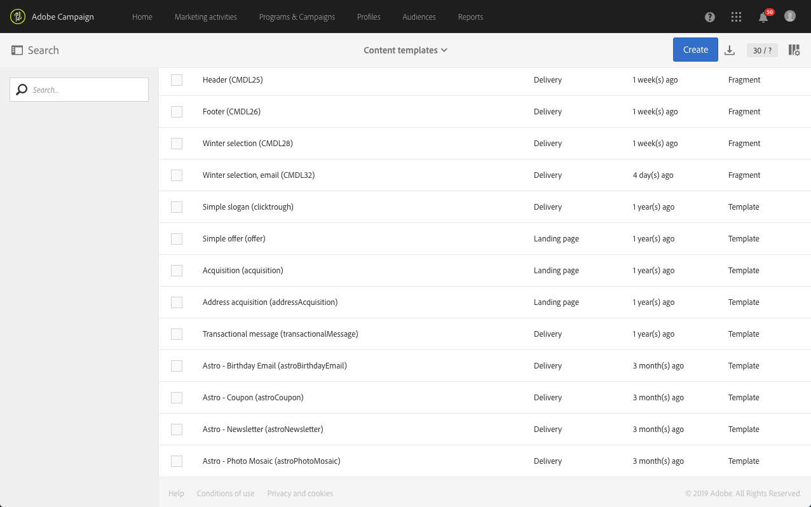

# 创建和使用可重用内容 {#using-reusable-content}

了解如何主控编辑电子邮件内容。 借助Email Designer，您可以使用您自己的预定义内容创建模板和片段，并重复使用这些模板和片段，以便进行后续投放。

## 使用模板设计电子邮件 {#designing-templates}

>[!NOTE]
>
> 在Adobe Campaign Standard中，您可以创建可从&#x200B;**Resources** > **Templates**&#x200B;菜单访问的不同类型的模板。 Email Designer中使用的模板是内容模板。 有关更多信息，请参阅[关于模板](../../start/using/marketing-activity-templates.md)。

 [了解如何在视频中创建模板](#video)

### 关于内容模板 {#content-templates}

您可以管理[Email Designer](../../designing/using/designing-content-in-adobe-campaign.md)主页的&#x200B;**[!UICONTROL Templates]**&#x200B;选项卡中提供的HTML内容。

现成电子邮件内容模板包括18个针对移动设备优化的布局和4个由Behance艺术家设计的一流响应模板。 它们对应于最新的用法，例如客户欢迎邮件、新闻稿和重新参与电子邮件等。 您可以根据品牌的内容轻松自定义这些电子邮件，以简化从头开始设计电子邮件的过程。

可从[高级菜单](../../start/using/interface-description.md#advanced-menu)的&#x200B;**[!UICONTROL Resources]** > **[!UICONTROL Content templates & fragments]**&#x200B;屏幕访问HTML内容模板。 从此处，您可以管理登陆页面内容模板、电子邮件内容模板以及片段。

现成内容模板为只读模板。 要编辑其中一个模板，必须先复制所需的模板。

您可以创建新模板或片段，并定义自己的内容。 有关更多信息，请参阅[创建内容模板](#creating-a-content-template)和[创建内容片段](#creating-a-content-fragment)。

使用Email Designer编辑内容时，您还可以通过将内容另存为片段或模板来创建内容模板。 有关更多信息，请参阅[将内容另存为模板](#saving-content-as-template)和[将内容另存为片段](../../designing/using/using-reusable-content.md#saving-content-as-a-fragment)。

**相关主题：**

* 有关编辑内容的更多信息，请参阅[关于电子邮件内容设计](../../designing/using/designing-content-in-adobe-campaign.md)。

### 创建内容模板 {#creating-a-content-template}

您可以创建自己的内容模板，以根据需要多次使用它们。

以下示例显示如何创建电子邮件内容模板。

1. 转到&#x200B;**[!UICONTROL Resources]** > **[!UICONTROL Content templates & fragments]**&#x200B;并单击&#x200B;**[!UICONTROL Create]**。
1. 单击电子邮件标签以访问Email Designer的&#x200B;**[!UICONTROL Properties]**&#x200B;选项卡。
1. 指定可识别的标签，并选择以下参数，以便能够在电子邮件中使用此模板：

   * 从&#x200B;**[!UICONTROL Content type]**&#x200B;下拉列表中选择&#x200B;**[!UICONTROL Shared]**&#x200B;或&#x200B;**[!UICONTROL Delivery]**。
   * 从&#x200B;**[!UICONTROL HTML type]**&#x200B;下拉列表中选择&#x200B;**[!UICONTROL Template]**。

   

1. 如果需要，您可以设置将用作模板缩略图的图像。 从模板属性的&#x200B;**[!UICONTROL Thumbnail]**&#x200B;选项卡中选择该模板。

   

   此缩略图将显示在[Email Designer](../../designing/using/designing-content-in-adobe-campaign.md)主页的&#x200B;**[!UICONTROL Templates]**&#x200B;选项卡中。

1. 关闭&#x200B;**[!UICONTROL Properties]**&#x200B;选项卡以返回主工作区。
1. 添加可根据需要自定义的结构组件和内容组件。
   >[!NOTE]
   >
   > 无法在内容模板中插入个性化字段或条件内容。
1. 编辑后，保存模板。

现在，此模板可用于使用Email Designer构建的任何电子邮件。 从[Email Designer](../../designing/using/designing-content-in-adobe-campaign.md)主页的&#x200B;**[!UICONTROL Templates]**&#x200B;选项卡中选择它。

### 将内容另存为模板 {#saving-content-as-template}

使用Email Designer编辑电子邮件时，您可以直接将该电子邮件的内容另存为模板。

<!--[!CAUTION]
>
>You cannot save as template a structure containing personalization fields or dynamic content.-->

1. 从Email Designer主工具栏中选择&#x200B;**[!UICONTROL Save as template]**。

   

1. 根据需要添加标签和描述，然后单击&#x200B;**[!UICONTROL Save]**。

   

1. 要查找之前创建的模板，请转到&#x200B;**[!UICONTROL Resources]** > **[!UICONTROL Content templates & fragments]**。

1. 要使用新模板，请从[Email Designer](../../designing/using/designing-content-in-adobe-campaign.md)主页的&#x200B;**[!UICONTROL Templates]**&#x200B;选项卡中选择该模板。

   

### 使用片段和组件创建模板 {#template-fragments-components}

您现在可以使用Email Designer创建电子邮件模板。 使用内容组件可反映电子邮件的不同部分，并调整设置以使其尽可能接近原始新闻稿。 最后，插入您刚刚创建的片段。

1. 使用Email Designer创建模板。 有关更多信息，请参阅[内容模板](#content-templates)。
1. 在模板中插入多个结构组件 — 对应于电子邮件的页眉、页脚和正文。 有关添加结构组件的更多信息，请参阅[使用Email Designer](../../designing/using/designing-from-scratch.md#defining-the-email-structure)编辑电子邮件结构。
1. 根据需要插入任意数量的内容组件以创建新闻稿的正文。 这将是您每月要更新的电子邮件的可编辑内容。

   

   如果您熟悉HTML代码，Adobe建议您利用&#x200B;**[!UICONTROL Html]**&#x200B;组件，以便复制并粘贴原始电子邮件中更为复杂的元素。 对其余内容使用其他组件，如&#x200B;**[!UICONTROL Button]**、**[!UICONTROL Image]**&#x200B;或&#x200B;**[!UICONTROL Text]**。 有关更多信息，请参阅[关于内容组件](../../designing/using/designing-from-scratch.md#about-content-components)。

   >[!NOTE]
   >
   >使用&#x200B;**[!UICONTROL Html]**&#x200B;组件会创建可编辑且选项有限的组件。 在选择此组件之前，请确保您知道如何处理HTML代码。

1. 尽可能调整内容组件以匹配原始电子邮件。

   

   有关管理样式设置和内联属性的更多信息，请参阅[编辑电子邮件样式](../../designing/using/styles.md)。

1. 将之前创建的两个片段（页眉和页脚）插入所需的结构组件中。

   

1. 保存模板。

现在，您可以在Email Designer中完全管理此模板，以创建和更新您每月发送给收件人的新闻稿。

要使用该模板，请创建一封电子邮件，然后选择之前创建的内容模板。

**相关主题**：

* [创建电子邮件](../../channels/using/creating-an-email.md)
* [Email Designer简介视频](../../designing/using/designing-content-in-adobe-campaign.md#video)
* [从头开始设计电子邮件内容](../../designing/using/designing-from-scratch.md#designing-an-email-content-from-scratch)

### 教程视频 {#video}

以下视频演示了如何创建自己的模板。

>[!VIDEO](https://video.tv.adobe.com/v/23106?quality=12)

其他Campaign Standard操作方法视频可在[此处](https://experienceleague.adobe.com/docs/campaign-standard-learn/tutorials/overview.html?lang=zh-Hans)获取。

## 关于片段 {#about-fragments}

>[!CONTEXTUALHELP]
>id="ac_fragments"
>title="关于片段"
>abstract="片段是可在一封或多封电子邮件中引用的可重用内容块。"

片段是可在一封或多封电子邮件中引用的可重用组件。
它们位于**资源** > **内容片段和模板**&#x200B;下的界面中。

要在Email Designer中最好地使用片段，请执行以下操作：

* 创建您自己的片段。 请参阅[创建内容片段](#creating-a-content-fragment)和[将内容另存为片段](#saving-content-as-a-fragment)。
* 在电子邮件中根据需要多次使用它们。 请参阅[将元素插入电子邮件](#inserting-elements-into-an-email)。
* 编辑片段时，会同步更改：它们会自动传播到包含该片段的所有电子邮件（前提是尚未准备或发送它们）。

添加到电子邮件后，片段默认处于锁定状态。 如果要修改特定电子邮件的片段，可以通过在使用该片段的电子邮件中解锁该片段来中断与原始片段的同步。 将不再同步更改。

要解锁电子邮件中的片段，请选择它并单击上下文工具栏中的锁定图标。

该片段将成为不再链接到原始片段的独立组件。 然后，可以将其编辑为任何其他内容组件。 请参阅[关于内容组件](../../designing/using/designing-from-scratch.md#about-content-components)。

### 在电子邮件中插入片段 {#inserting-elements-into-an-email}

要定义电子邮件的内容，您可以在之前放置的结构组件中添加内容元素。 请参阅[编辑电子邮件结构](../../designing/using/designing-from-scratch.md#defining-the-email-structure)。

1. 选择左侧的&#x200B;**+**&#x200B;图标以访问内容元素。 选择[片段](#about-fragments)或[内容组件](../../designing/using/designing-from-scratch.md#about-content-components)。
1. 如果您已经知道要添加的片段的标签或标签的一部分，则可以搜索它。

   

1. 将片段或内容组件从面板拖放到电子邮件的结构组件。

   

   将元素添加到电子邮件后，可将其移动到结构组件中或电子邮件中的其他结构组件中。

   

1. 编辑元素以满足此电子邮件的确切需求。 您可以添加文本、链接、图像等。

   >[!NOTE]
   >
   >片段在添加到电子邮件时默认处于锁定状态。 如果要修改特定电子邮件的片段，或直接在片段中进行更改，则可以中断与原始片段的同步。 请参阅[关于片段](#about-fragments)。

1. 对您需要添加到电子邮件中的所有元素重复此步骤。
1. 保存您的电子邮件。

填充了电子邮件结构后，您便可以编辑每个内容元素的样式。 请参阅[编辑元素](../../designing/using/styles.md)。

>[!NOTE]
>
>如果修改了片段，则所做的更改会自动传播到使用该片段的电子邮件中。 有关更多信息，请参阅[关于片段](#about-fragments)。

### 创建内容片段 {#creating-a-content-fragment}

您可以创建自己的内容片段，以根据需要在一封或多封电子邮件中使用它们。

1. 转到&#x200B;**[!UICONTROL Resources]** > **[!UICONTROL Content templates & fragments]**&#x200B;并单击&#x200B;**[!UICONTROL Create]**。
1. 单击电子邮件标签以访问Email Designer的&#x200B;**[!UICONTROL Properties]**&#x200B;选项卡。
1. 指定可识别的标签，并选择以下参数以在编辑电子邮件内容时查找片段：

   * 由于片段仅与电子邮件兼容，因此请从&#x200B;**[!UICONTROL Content type]**&#x200B;下拉列表中选择&#x200B;**[!UICONTROL Delivery]**。
   * 从&#x200B;**[!UICONTROL HTML type]**&#x200B;下拉列表中选择&#x200B;**[!UICONTROL Fragment]**，以便能够将此内容用作片段。

   

1. 如果需要，您可以设置将用作片段缩略图的图像。 从模板属性的&#x200B;**[!UICONTROL Thumbnail]**&#x200B;选项卡中选择该模板。

   

   编辑电子邮件时，此缩略图将显示在片段标签旁边。

1. 关闭&#x200B;**[!UICONTROL Properties]**&#x200B;选项卡以返回主工作区。
1. 添加可根据需要自定义的结构组件和内容组件。

   >[!CAUTION]
   >
   >片段不能包含个性化字段、动态内容或其他片段。
   >
   >避免另存为具有空结构组件的片段内容。 插入片段后，它们将不可编辑。
   >
   >[移动设备视图](../../designing/using/plain-text-html-modes.md#switching-to-mobile-view)在片段中不可用。

1. 编辑后，保存片段。

现在，此片段可用于使用Email Designer构建的任何电子邮件。 它显示在调色板的&#x200B;**[!UICONTROL Fragments]**&#x200B;部分下。

>[!NOTE]
>
>不能在片段中插入个性化字段，除非在电子邮件中使用且未解锁。 请参阅[关于片段](#about-fragments)。

### 将内容另存为片段 {#saving-content-as-a-fragment}

使用Email Designer编辑电子邮件时，您可以直接将该电子邮件的一部分另存为片段。

* 不能将包含个性化字段、动态内容或其他片段的结构另存为片段。
* 只能选择彼此相邻的结构。
<!-- - You cannot select an empty structure.-->

1. 在Email Designer中编辑电子邮件时，从主工具栏中选择&#x200B;**[!UICONTROL Save as fragment]**。

   

1. 在工作区中，选择要构成片段的结构。

   

   >[!NOTE]
   >
   >确保选择彼此相邻且不包含个性化字段、动态内容或其他片段的结构。
   <!--You cannot select an empty structure.-->

1. 单击 **[!UICONTROL Create]**。

1. 根据需要添加标签和描述，然后单击&#x200B;**[!UICONTROL Save]**。

   

1. 要查找之前创建的片段，请转到&#x200B;**[!UICONTROL Resources]** > **[!UICONTROL Content templates & fragments]**。

   

1. 要使用新片段，请打开任何电子邮件内容，然后从片段列表中选择它。

>[!NOTE]
>[移动设备视图](../../designing/using/plain-text-html-modes.md#switching-to-mobile-view)在片段中不可用。 如果要编辑电子邮件移动视图，请先执行该操作，然后再将内容另存为片段。

<!--You need to copy-paste the HTML corresponding to the section that you want to save into a new fragment.

>[!NOTE]
>
>To do this, you need to be familiar with HTML code.

To save as a fragment some email content that you created, follow the steps below.

1. When editing an email in the Email Designer, select **[!UICONTROL Edit]** > **[!UICONTROL HTML]** to open the HTML version of that email.
1. Select and copy the HTML corresponding to the part that you want to save.
1. Go to **[!UICONTROL Resources]** > **[!UICONTROL Content templates & fragments]** and click **[!UICONTROL Create]**.
1. Click the email label to access the **[!UICONTROL Properties]** tab of the Email Designer and select **[!UICONTROL Fragment]** from the **[!UICONTROL HTML type]** drop-down list.
1. Select **[!UICONTROL Edit]** > **[!UICONTROL HTML]** to open the HTML version of the fragment.
1. Paste the HTML that you copied where appropriate.
1. Switch back to the **[!UICONTROL Edit]** view to check the result and save the new fragment.-->

## 使用片段创建可重用页眉和页脚 {#header-footer-fragments}

使用Email Designer，为每个可重用部分创建一个片段。 在此示例中，您将创建两个片段：一个用于页眉，一个用于页脚。 然后，您可以将现有内容中的相关部分复制到这些片段中。

为此请执行以下操作步骤：

1. 在Adobe Campaign中，转到&#x200B;**[!UICONTROL Resources]** > **[!UICONTROL Content templates & fragments]**&#x200B;并为标头创建片段。 有关更多信息，请参阅[创建内容片段](#creating-a-content-fragment)。
1. 向片段中添加所需数量的结构组件。

   

1. 在结构中插入图像和文本组件。

   

1. 上传相应的图像，输入文本并调整设置。

   

1. 保存片段。
1. 以类似方式继续创建页脚并保存页脚。

   

您的片段现已准备就绪，可在模板中使用。
