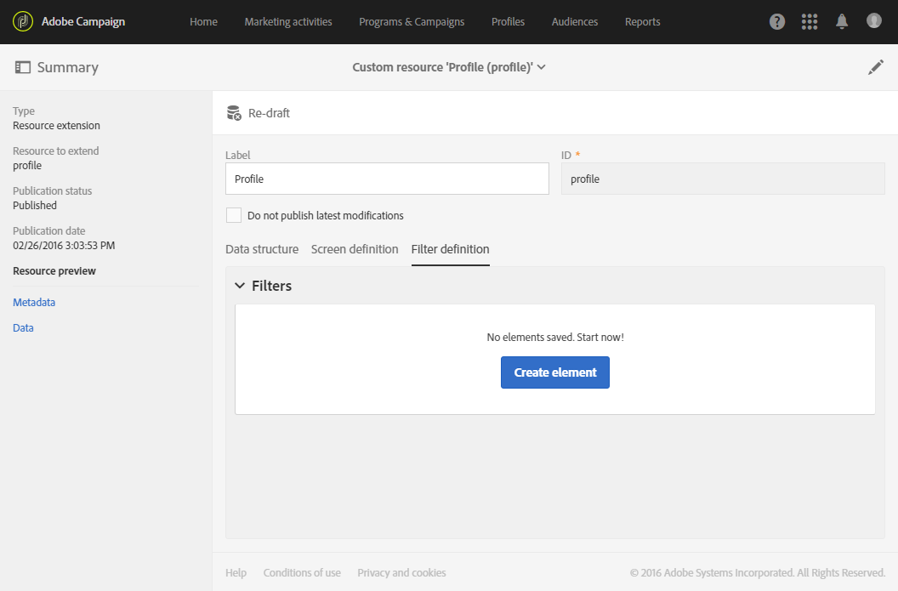
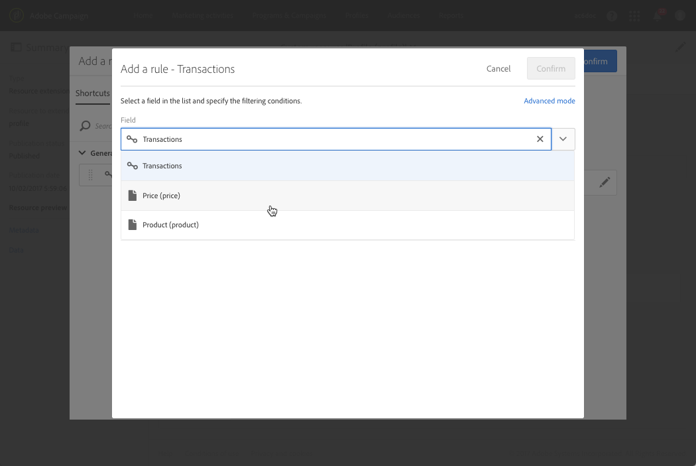
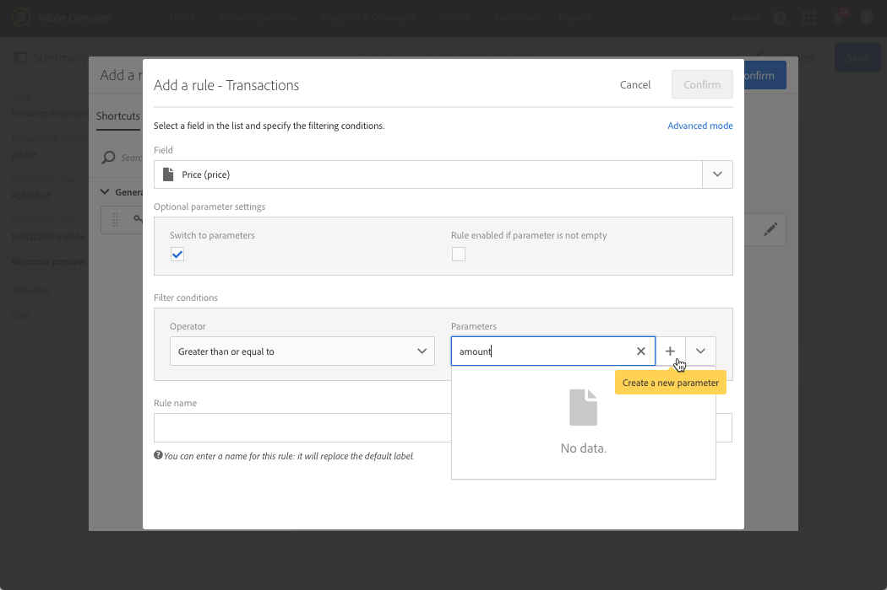
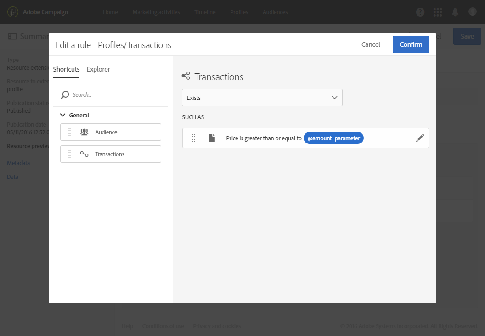

# 配置过滤器定义{#configuring-filter-definition}

在 **[!UICONTROL Filter definition]** 选项卡中，您可以创建高级过滤器，以便用户在创建复杂查询（如定义受众）时直接访问。

此步骤并非强制性的，因为您仍然能够通过工作流、受众和 REST API 填充资源并访问其数据。

这些过滤器以预配置规则的形式用在查询编辑器中。利用过滤器可限制获得所需配置的必要步骤数，特别适用于重复分段。

例如，您可以创建一个过滤器，以便选出过去三个月内超过特定金额的所有事务。

要完成此操作，您需要扩展 **[!UICONTROL Profiles]** 资源并定义一个过滤器链接到（您之前创建的）事务表，该过滤器应具有一条规则，规定事务价格必须大于或等于给定参数，并且事务日期必须在对应于最近三个月的日期范围内。

1. 确保创建和发布事务表。请参阅[创建或扩展资源](../../developing/using/creating-or-extending-the-resource.md)。

   >[!NOTE]
   >
   >此过程使用了自定义事务表作为示例。具体请根据您的业务需求进行调整。

1. 在 **[!UICONTROL Profiles]** 资源中定义与事务表相关的过滤器之前，请确保定义指向此表的链接并发布更改。请参阅[定义其他资源的链接](../../developing/using/configuring-the-resource-s-data-structure.md#defining-links-with-other-resources)和[更新数据库结构](../../developing/using/updating-the-database-structure.md)。
1. 在新建过滤器的定义屏幕中，打开 **[!UICONTROL Definition]** 选项卡中，选择事务表。

   

1. 在 **[!UICONTROL Add a rule - Profiles/Transactions]** 窗口中，将事务表拖放到工作区中。在显示的下一个窗口中，选择要使用的字段。

   

1. 在 **[!UICONTROL Add a rule - Transactions]** 窗口的 **[!UICONTROL Optional parameter settings]** 中，勾选 **[!UICONTROL Switch to parameters]** 框。

   在 **[!UICONTROL Filter conditions]** 中，选择 **[!UICONTROL Greater than or equal to]** 运算符。在 **[!UICONTROL Parameters]** 字段中，输入名称，然后单击加号以创建新参数。

   

1. 确认更改。此定义对应于用户以后必须填写才能执行查询的可配置字段。

   

1. 将此规则与指定事务处理日期必须在最近三个月对应日期范围内的另一个规则组合在一起。

   

1. 选择显示过滤器的类别。

   

1. 在过滤器定义屏幕的 **[!UICONTROL Parameters]** 选项卡中，修改说明和标签以向用户明确展示过滤器的主题。此信息将显示在查询编辑器中。

   

   如果定义多个可配置字段，则可以修改它们在界面中的显示顺序。

1. 保存更改并发布资源。有关更多信息，请参阅[更新数据库结构](../../developing/using/updating-the-database-structure.md)。

发布 **[!UICONTROL Profiles]** 资源扩展后，此过滤器将显示在[查询编辑器](../../automating/using/editing-queries.md)界面的快捷方式选项卡中。

利用此功能，用户可在创建电子邮件时轻松定义其受众，以将邮件发送给过去三个月中花费超过一定金额的所有客户。

无需自行配置，只需在显示的对话框中输入所需的数字即可。

配置过滤器后，您可以按照以下语法从Campaign StandardAPI中使用它：

`GET https://mc.adobe.io/<ORGANIZATION>/campaign/profileAndServicesExt/<resourceName>/by<customFilterName>?<customFilterparam>=<customFilterValue>`

有关详情，请参阅 [Campaign StandardAPI文档](../../api/using/filtering.md#custom-filters).
