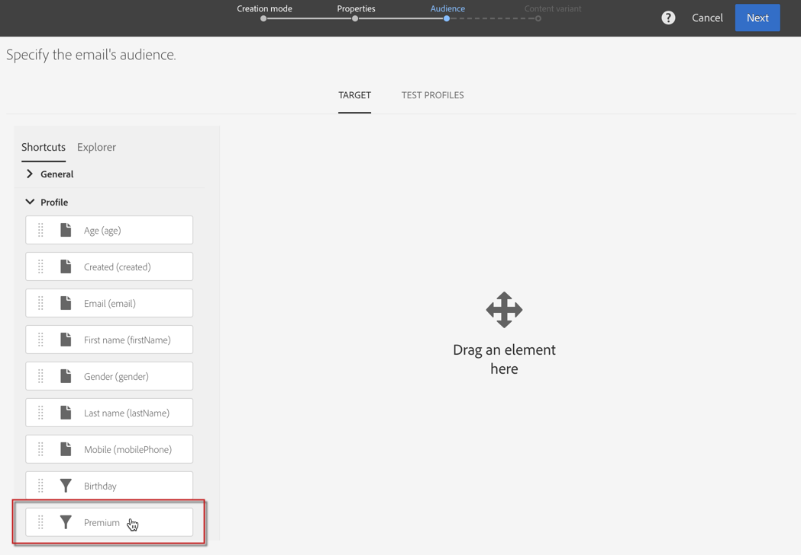

# 配置筛选条件定义{#configuring-filter-definition}

在选项卡 **[!UICONTROL Filter definition]** 中，您可以创建高级过滤器，用户在创建复杂查询时（如定义受众）可以直接访问这些过滤器。

此步骤不是强制性的，因为您仍然能够通过工作流、受众和REST API填充资源并访问其数据。

这些过滤器以预配置规则的形式在查询编辑器中使用。 它们允许您限制获得所需配置所需的步骤数，这对重复分段特别有用。

例如，您可以创建一个筛选器，以便选择过去三个月内超过特定金额的所有事务。

为此，您需要扩展资源并定义一个链接到事务处理表（您之前已创建）的筛选器，该筛选器具有一个规则，该规则指示事务处理价格必须大于或等于给定参数，并且事务处理日期必须位于与过去三个月相对应的范围内。 **[!UICONTROL Profiles]**

1. 确保创建和发布事务表。 See [Creating or extending the resource](../../developing/using/creating-or-extending-the-resource.md).

   >[!NOTE]
   >
   >此过程使用自定义事务表的示例。 针对您的案例，根据您的业务需求进行调整。

1. 在定义与资源中的事务处理表相关的筛选器之 **[!UICONTROL Profiles]** 前，请确保定义指向此表的链接并发布您所做的更改。 请参 [阅定义与其他资源的链接](../../developing/using/configuring-the-resource-s-data-structure.md#defining-links-with-other-resources) , [以及更新数据库结构](../../developing/using/updating-the-database-structure.md)。
1. 在新筛 **[!UICONTROL Definition]** 选器定义屏幕的选项卡中，选择事务表。

   

1. 在窗 **[!UICONTROL Add a rule - Profiles/Transactions]** 口中，将事务表拖放到工作区中。 在显示的下一个窗口中，选择要使用的字段。

   

1. 在窗 **[!UICONTROL Optional parameter settings]** 口中 **[!UICONTROL Add a rule - Transactions]** 选中该 **[!UICONTROL Switch to parameters]** 框。

   在中， **[!UICONTROL Filter conditions]**&#x200B;选择运 **[!UICONTROL Greater than or equal to]** 算符。 在字 **[!UICONTROL Parameters]** 段中，输入名称，然后单击加号以创建新参数。

   

1. 确认更改。 此定义与用户以后必须填写的可配置字段相对应，才能执行查询。

   

1. 将此规则与另一规则合并，以指定事务处理日期必须在与最近三个月相对应的范围内。

   

1. 选择要显示过滤器的类别。

   

1. 在过滤器 **[!UICONTROL Parameters]** 定义屏幕的选项卡中，修改说明和标签以向用户清楚地指示过滤器的主题。 此信息将显示在查询编辑器中。

   

   如果您定义了多个可配置字段，则可以修改它们在界面中的显示顺序。

1. 保存更改并发布资源。 有关详细信息，请参阅更新数 [据库结构一节](../../developing/using/updating-the-database-structure.md) 。

发布资 **[!UICONTROL Profiles]** 源扩展后，用户将在查询编辑器界面的快捷方式选项卡下看到 [此过滤器](../../automating/using/editing-queries.md) 。

这样，用户在创建电子邮件时可以轻松定义其受众，以便向过去三个月中花费超过特定金额的所有客户发送电子邮件。

他们只需在显示的对话框中输入所需数量，而不是自己配置。

