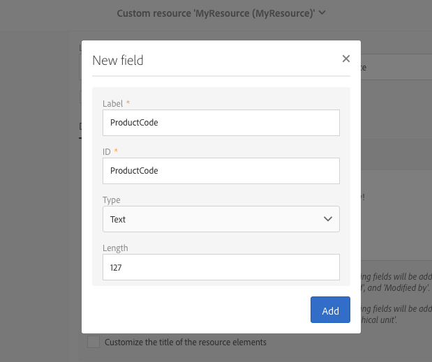
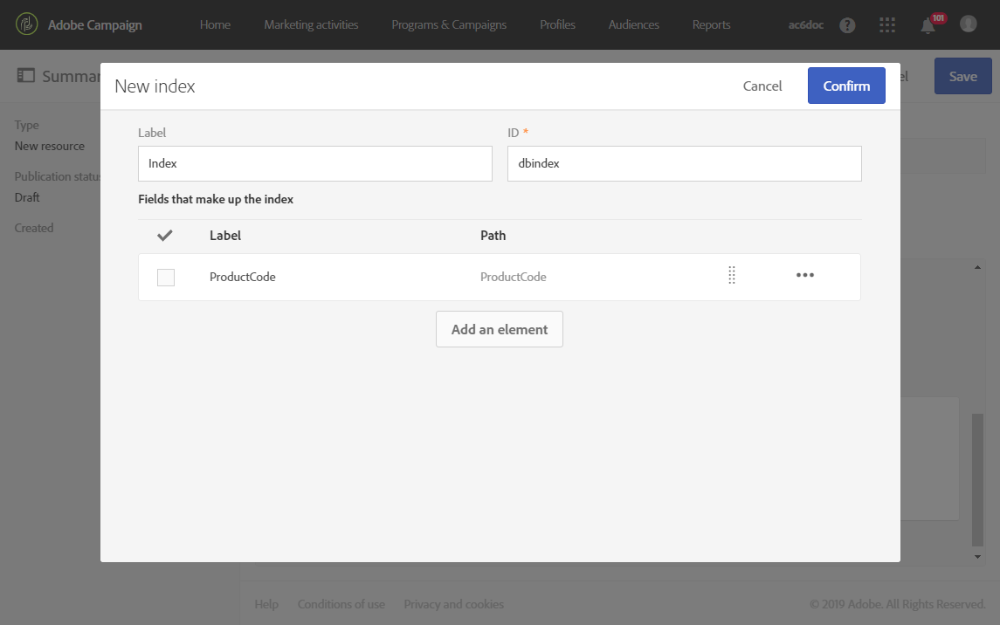
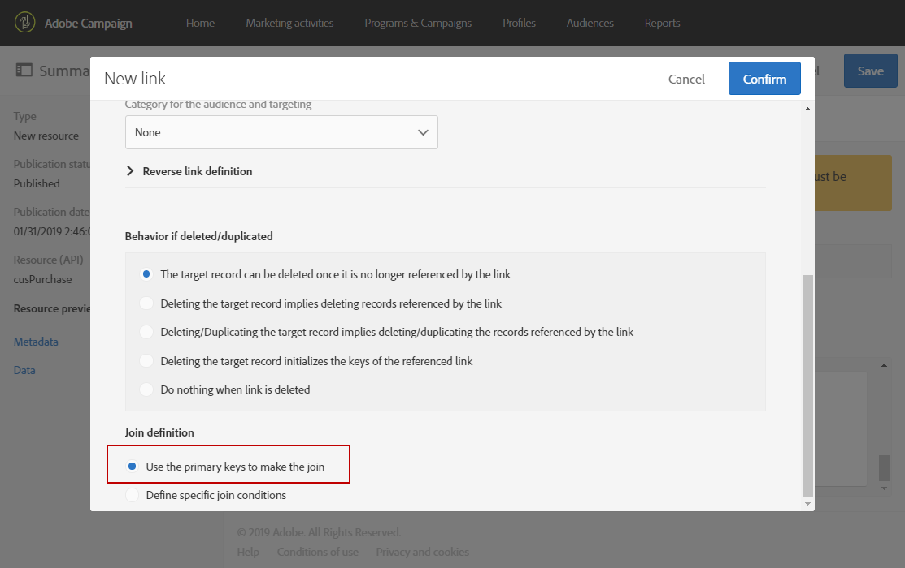

# 配置资源的数据结构{#configuring-the-resource-s-data-structure}

创建新的自定义资源后，必须配置数据结构。

编辑资源时，您可以在 **[!UICONTROL Data structure]** 选项卡中添加：

* [字段](#adding-fields-to-a-resource)
* [标识键](#defining-identification-keys)
* [索引](#defining-indexes)
* [链接](#defining-links-with-other-resources)
* [发送日志](#defining-sending-logs-extension)

## 向资源添加字段{#adding-fields-to-a-resource}

您可以向资源添加新字段，以存储不属于现成数据模型的数据。

1. 使用 **[!UICONTROL Create element]** 按钮可创建字段。
1. 指定标签、ID、字段类型，并定义为此字段授权的最大长度。

   **[!UICONTROL ID]** 字段是必填字段，并且对于添加的每个字段都必须是唯一的。

   >[!NOTE]
   >
   >最多使用 30 个字符。

   

1. 要修改其中一个字段，请使用 **[!UICONTROL Edit Properties]** 按钮。

   

1. 在 **[!UICONTROL Field definition]** 屏幕中，您可以定义用于受众和定向的类别，甚至可以添加描述。

   

1. 如果需要定义提供给用户的值（枚举值），请选中 **[!UICONTROL Specify a list of authorized values]** 选项。

   然后，单击 **[!UICONTROL Create element]** 并指定 **[!UICONTROL Label]** 和 **[!UICONTROL Value]**。根据需要，添加相应数量的之。

1. 添加字段后，勾选 **[!UICONTROL Add audit fields]** 方框可加入多个字段，用于详细说明创建日期、创建资源的用户、日期和上次修改的作者。
1. 选中 **[!UICONTROL Add access authorization management fields]** 方框，可加入声明哪些人有权访问该特定资源的字段。

   这些字段显示在数据和元数据中，执行数据库更新后即可显示。有关更多信息，请参阅[更新数据库结构](../../developing/using/updating-the-database-structure.md)。

1. 选中 **[!UICONTROL Add automatic ID]** 字段可自动生成 ID。请注意，现有实体仍保持为空。有关更多信息，请参阅[为用户档案和自定义资源生成唯一 ID](../../developing/using/configuring-the-resource-s-data-structure.md#generating-a-unique-id-for-profiles-and-custom-resources)。
1. 要修改资源元素名称在列表和创建步骤中的显示方式，请选中 **[!UICONTROL Customize the title of the resource elements]** 方框。从为此资源创建的字段中选择一个字段。

   

   >[!NOTE]
   >
   >如果不选中此选项，则在从此表格列出所有实体时，将使用自动主键值（每次将实体添加到表格时都会自动创建）。

资源的字段现已定义完成。

## 定义标识键{#defining-identification-keys}

每个资源都必须至少拥有一个唯一键。例如，您可以指定一个键，使购买表中两个产品不能具有相同的 ID。

1. 如果希望自动生成技术键并以增量方式生成，请在 **[!UICONTROL Automatic primary key]** 部分中指定存储的大小。

   

1. 使用 **[!UICONTROL Create element]** 按钮创建一个键。

   **[!UICONTROL Label]** 和 **[!UICONTROL ID]** 字段默认已填写，但您可以编辑它们。

   >[!NOTE]
   >
   >最多使用 30 个字符。

1. 要定义构成此键的元素，请单击 **[!UICONTROL Create element]** 并选择为此资源创建的字段。

   

   创建的键都会显示在 **[!UICONTROL Custom keys]** 部分中。

资源的标识键现已创建完成。

>[!NOTE]
>
>要了解创建标识键时的最佳实践，请参阅此[章节](../../developing/using/data-model-best-practices.md#keys)。

## 定义索引{#defining-indexes}

索引可以引用一个或多个资源字段。利用索引，数据库可对记录进行排序，以便更轻松地取回记录。索引可优化 SQL 查询的性能。

建议定义索引，但并不强制。

1. 使用 **[!UICONTROL Create element]** 按钮可创建索引。

   

1. **[!UICONTROL Label]** 和 **[!UICONTROL ID]** 字段默认已填写，但您可以编辑它们。

   >[!NOTE]
   >
   >最多使用 30 个字符。

1. 要定义构成此索引的元素，请选择为此资源创建的字段。

   

1. 单击 **[!UICONTROL Confirm]**。

创建的索引将显示在 **[!UICONTROL Index]** 部分的列表中。

>[!NOTE]
>
>要了解创建索引时的最佳实践，请参阅此[章节](../../developing/using/data-model-best-practices.md#indexes)。

## 定义与其他资源的链接{#defining-links-with-other-resources}

链接详细列出了一个表格与其他表格的关联。

1. 使用 **[!UICONTROL Create element]** 按钮可创建指向目标资源的链接。
1. 单击 **[!UICONTROL Select a target resource]**。

   

1. 资源按字母顺序显示，并可按名称筛选。其技术名称显示在括号中。

   从列表中选择元素，然后单击 **[!UICONTROL Confirm]**。

   

1. 根据基数选择 **[!UICONTROL Link type]**。根据所选基数类型，可能会选择删除或复制记录的不同行为。

   各种链接类型如下所示：

   * **[!UICONTROL 1 cardinality simple link]**：源表格的一个存在最多可以拥有目标表格的一个对应存在。
   * **[!UICONTROL N cardinality collection link]**：源表格的一个存在可以拥有目标表格的多个对应存在，但目标表格的一个存在最多可以具有源表格的一个对应存在。
   * **[!UICONTROL 0 or 1 cardinality simple link]**：源表格的一个存在最多可以拥有目标表格的一个或零个对应存在。请注意，这种类型的 **[!UICONTROL Link type]** 可能导致性能问题。

   

1. 在 **[!UICONTROL New link]** 屏幕中，**[!UICONTROL Label]** 和 **[!UICONTROL ID]** 字段默认已填写，但您可以编辑它们。

   >[!NOTE]
   >
   >最多使用 30 个字符。
   >
   >创建后无法重命名链接。要重命名链接，必须删除该链接并重新创建链接。

1. 利用 **[!UICONTROL Category for the audience and targeting]** 列表，可将此链接分配给类别，使其在查询编辑器工具中更加显眼。
1. 如果需要，可利用 **[!UICONTROL Reverse link definition]** 部分在定向资源中显示资源的标签和 ID。
1. 在 **[!UICONTROL Behavior if deleted/duplicated]** 部分中定义链接所引用记录的行为。

   默认情况下，一旦链接不再引用目标记录，该记录将被删除。

   

1. 在 **[!UICONTROL Join definition]** 部分中，默认选项 **[!UICONTROL Use the primary keys to make the join]** 处于选中状态，但您可以选择以下两个选项：

   * **[!UICONTROL Use the primary key to make the join]**：利用此连接定义，可使用用户档案主键与购买的主键进行协调。
   * **[!UICONTROL Define specific join conditions]**：利用此连接定义，可手动选择将连接两个资源的字段。请注意，如果数据配置不正确，则不会显示&#x200B;**购买**&#x200B;记录。

   

创建的链接将显示在 **[!UICONTROL Links]** 部分的列表中。

>[!NOTE]
>
>要了解创建索引时的最佳实践，请参阅此[章节](../../developing/using/data-model-best-practices.md#links)。

**示例：将创建的资源与“Profiles”资源链接到一起**

在本例中，我们要将新资源 **Purchase** 与 **Profiles** 自定义资源链接到一起：

1. 创建新的 **Purchase** 资源。
1. 要将其与 **Profiles** 自定义资源链接到一起，请展开 **[!UICONTROL Data structure]** 选项卡中的 **[!UICONTROL Links]** 部分，然后单击 **[!UICONTROL Create element]**。
1. 选择目标资源，在本例中为 **[!UICONTROL Profiles (profile)]**。
1. 在本例中，将默认 **[!UICONTROL 1 cardinality simple link]** 链接类型保持选中状态。

   

1. 选择连接定义，本例中保留默认 **[!UICONTROL Use the primary key to make the join]** 即可。

   

1. 如果需要，您可以定义详细信息屏幕，以便能够编辑 **Purchase** 并将其链接到用户档案。

   展开 **[!UICONTROL Detail screen configuration]** 部分并勾选 **[!UICONTROL Define a detail screen]** 以配置对应于资源各个元素的屏幕。如果不勾选此框，将无法访问此资源元素的详细视图。

1. 单击 **[!UICONTROL Create element]**。
1. 选择您链接的资源，然后单击 **[!UICONTROL Add]**。

   然后，即可选择 **[!UICONTROL Client data]** > **[!UICONTROL Purchase]**，通过高级菜单访问新的资源。

   

1. 完成配置后，单击 **[!UICONTROL Confirm]**。

   您现在可以发布新资源。

通过添加此链接，**Purchase** 选项卡会从 **[!UICONTROL Profiles & audiences]** > **[!UICONTROL Profiles]** 菜单添加到用户档案详细信息屏幕中。请注意，这是特定于 **[!UICONTROL Profile]** 资源的。

## 定义发送日志扩展{#defining-sending-logs-extension}

利用发送日志扩展，您可以：

* 通过&#x200B;**添加用户档案自定义字段**&#x200B;扩展动态报告功能
* 用&#x200B;**段代码和用户档案数据**&#x200B;扩展发送日志数据

**通过段代码扩展**

用户可以使用来自工作流引擎的段代码扩展日志。

段代码必须定义到工作流中

要激活此扩展，请选中选项 **[!UICONTROL Add segment code]**。

有关段代码的更多信息，请参阅[分段](../../automating/using/segmentation.md)一节。

**使用用户档案字段扩展**

>[!NOTE]
>
>管理员之前应该已经使用了自定义字段扩展用户档案资源。

单击 **[!UICONTROL Add field]** 并从用户档案资源中选择任意自定义字段。

要生成链接到用户档案维度的新子维度，请选中 **[!UICONTROL Add this field in Dynamic reporting as a new dimension]** 选项。

您可以将自定义字段维度从动态报告拖放到自由形式表格中。

有关动态报告的详细信息，请参阅[组件列表](../../reporting/using/list-of-components-.md)。

>[!IMPORTANT]
>
>发送到动态报告的字段数不得超过 20。

## 编辑资源属性{#editing-resource-properties}

在自定义资源屏幕中，**[!UICONTROL Summary]** 窗格可指示新创建资源的状态。您可以管理其访问权限及其常规属性。

1. 单击 **[!UICONTROL Edit properties]** 按钮可添加说明。

   

1. 如果需要，请修改资源的标签和 ID。

   >[!NOTE]
   >
   >最多使用 30 个字符。

1. 如果需要将此资源的访问权限限制为特定组织单位，请在此处指定这些单位。只有授权单位的用户才能在应用程序中使用此资源。
1. 保存修改。

您的修改已保存。您需要再次发布资源以应用它们。

## 为用户档案和自定义资源生成唯一 ID{#generating-a-unique-id-for-profiles-and-custom-resources}

默认情况下，用户档案和自定义资源在创建时没有业务 ID。您可以启用一个选项，以在创建元素时自动生成唯一 ID。该 ID 可用于：

* 轻松识别外部工具中的导出记录。
* 在其他应用程序中处理导入更新数据时，协调记录。

只能为用户档案和自定义资源启用此功能。

1. 创建用户档案资源的扩展或创建新资源。
1. 在数据结构定义中，选中 **[!UICONTROL Fields]** 部分下的 **[!UICONTROL Add automatic ID field]** 选项。

   

   >[!NOTE]
   >
   >只有新记录拥有 ACS ID。激活此选项之前创建的用户档案或元素，**[!UICONTROL ACS ID]** 字段将保留为空。

1. 保存并发布对资源所作的修改。如果希望将此机制应用于通过 API 创建的元素，请勾选相应的选项以扩展 API。

**[!UICONTROL ACS ID]** 字段现已可用，手动从 API 创建新元素时或从导入工作流中插入新元素时，会自动填充该字段。ACS ID 字段是 UUID 字段，且已编制索引。

现在，在导出用户档案或自定义资源时，如果已为该资源启用了 **[!UICONTROL ACS ID]** 列，则可以添加该列。您可以在外部工具中重新利用此 ID，以标识记录。

重新导入已在其他应用程序（例如 CRM）中处理/更新的数据时，您可以轻松将其与此唯一 ID 协调。

>[!NOTE]
>
>在启用该选项之前，不会为创建的用户档案或元素更新 **[!UICONTROL ACS ID]** 字段。只有新记录拥有 ACS ID。
>
>此字段处于只读模式。您无法对其进行修改。
