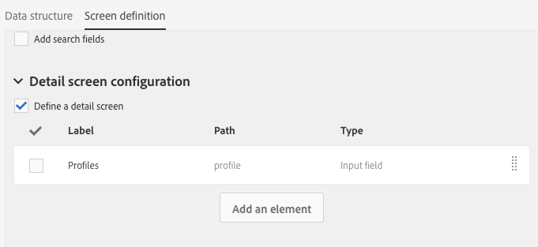

# 配置屏幕定义{#configuring-the-screen-definition}

在创建资源或向现有资源添加新字段时，您可以定义这些字段在界面中的显示方式。

此步骤并非强制性的，因为您仍然能够通过工作流、受众和 REST API 填充资源并访问其数据。

在 **[!UICONTROL Screen definition]** 选项卡中，您可以：

* 在导航窗格中添加对自定义资源的访问权限
* 将构成资源之元素列表的显示方式个性化
* 定义资源每个元素之详情视图的显示方式

## 允许从导航菜单访问 {#enabling-access-from-the-navigation-menu}

如果您希望资源具有专用屏幕，则可以将其添加到导航菜单中。

1. 从资源的 **[!UICONTROL Screen definition]** 选项卡中，展开 **[!UICONTROL Navigation]** 部分。
1. 选中 **[!UICONTROL Add an entry in the 'Client data' section]** 方框，以允许从导航窗格访问此资源。

   

该资源将作为子条目显示在 **[!UICONTROL Client data]** 部分中。

## 定义默认列表配置 {#defining-the-default-list-configuration}

利用屏幕定义的 **[!UICONTROL List configuration]** 部分，可定义默认情况下将在资源概览中显示的列和信息。

1. 选中 **[!UICONTROL Customize the list configuration]** 方框，可定义资源列的显示方式。
1. 使用 **[!UICONTROL Create element]** 按钮选择一个之前创建的字段。
1. 之前创建的字段将显示在列表中。您可以编辑其标签和宽度。

   

1. 在 **[!UICONTROL Simple search]** 部分中，选中 **[!UICONTROL Specify the fields to be taken into account in the search]** 以定义将包含在搜索中的字段。

   >[!IMPORTANT]
   >
   >此配置将替换默认搜索中使用的字段。

1. 在 **[!UICONTROL Advanced filtering]** 部分中，选中 **[!UICONTROL Add search fields]** 方框可添加简单搜索字段以外的其他字段。例如，如果您从之前创建的字段中选择“date”字段，则用户将能够执行仅引用该日期的搜索。
1. 您可以修改这两个搜索类型的字段顺序。
1. 对于高级搜索，您可以添加链接到链接资源的字段。这些筛选条件会显示在生成的屏幕的 **[!UICONTROL Search]** 菜单中。

现在可以定义资源的概览屏幕。

## 定义详细信息屏幕配置 {#defining-the-detail-screen-configuration}

利用屏幕定义的 **[!UICONTROL Detail screen configuration]** 部分，可定义将在资源各元素详细信息屏幕中显示的列和信息。

1. 展开 **[!UICONTROL Detail screen configuration]** 部分并勾选 **[!UICONTROL Define a detail screen]** 以配置对应于资源各个元素的屏幕。如果不勾选此框，将无法访问此资源元素的详细视图。
1. 只需单击一次，即可添加来自自定义资源的所有字段。为此，请单击  图标或使用 **[!UICONTROL Add an element]** 按钮。
1. 选择一个为此资源创建的元素，然后指定字段类型：

   * **[!UICONTROL Input field]**：可编辑的字段。
   * **[!UICONTROL Value]**：只读字段。
   * **[!UICONTROL List]**：表格。
   * **[!UICONTROL Separator]**：将元素拆分为类别。

   

1. 添加的元素将显示在列表中。您可以编辑其标签。

   

1. 根据需要添加任意数量的 **[!UICONTROL Separator]**，将元素拆分为不同的类别。

   这样可显示分隔符以更好地管理窗口。

   

资源的详细信息屏幕现在已配置完成。

## 数据部分的操作 {#actions-on-data-section}

利用这些设置，可在自定义资源屏幕中显示控件栏。提供了三个选项：

* **[!UICONTROL Authorize creating]**：利用此选项可激活创建资源元素。这样，用户就可以添加其他记录。

   >[!NOTE]
   >
   >必须首先激活链接到资源的详细信息屏幕，才能使此选项可用。

* **[!UICONTROL Authorize duplicating]**：利用此选项可激活复制链接到自定义资源的记录。
* **[!UICONTROL Authorize deleting]**：利用此选项可激活删除链接到自定义资源的记录。
