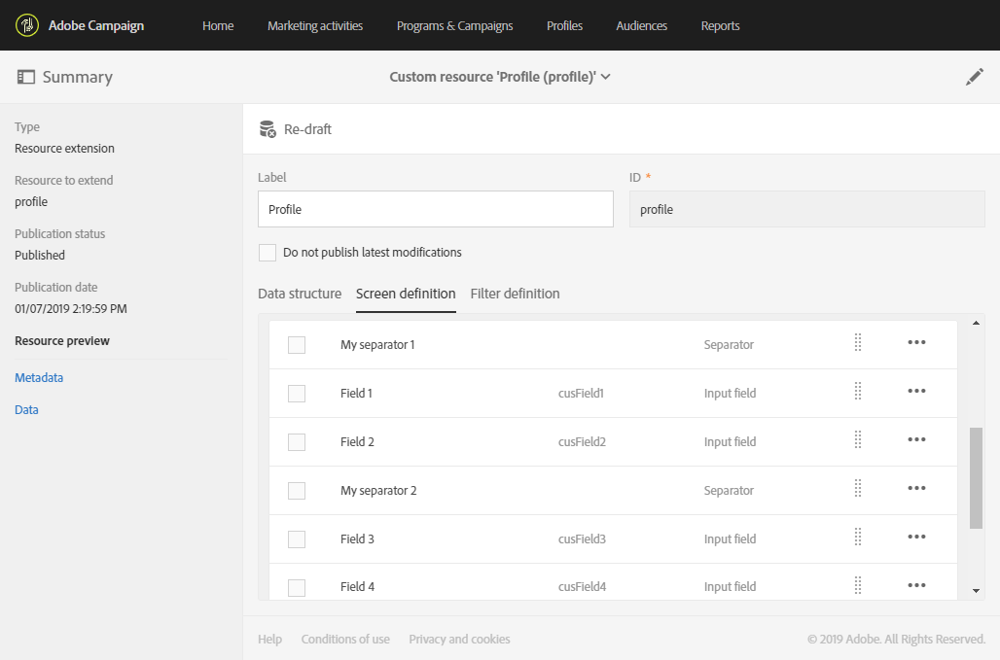

# Configuring the screen definition{#configuring-the-screen-definition}

创建资源或向现有资源添加新字段时，您可以定义希望它们在界面中显示的方式。

此步骤不是强制性的，因为您仍能够填充资源并通过工作流程、受众和REST API访问数据。

**[!UICONTROL Screen definition]** 在选项卡中，您可以：

* 在导航窗格中添加对自定义资源的访问权限
* 个性化构成资源的元素列表的个性化方式
* 定义显示资源每个元素的详细信息视图的方式

## Enabling access from the navigation menu {#enabling-access-from-the-navigation-menu}

如果您希望资源具有专用屏幕，可从导航菜单中使用该屏幕。

1. From the **[!UICONTROL Screen definition]** tab of the resource, unfold the **[!UICONTROL Navigation]** section.
1. Check the **[!UICONTROL Add an entry in the 'Client data' section]** box to allow access to this resource from the navigation pane.

   

The resource will appear as a sub-entry within the **[!UICONTROL Client data]** section.

## Defining the default list configuration {#defining-the-default-list-configuration}

The **[!UICONTROL List configuration]** section of the screen definition lets you define the columns and information that will be displayed by default in the overview of a resource.

1. Check the **[!UICONTROL Customize the list configuration]** box to define the way the columns of the resource are displayed.
1. Use the **[!UICONTROL Create element]** button to select a field from those that you have created.
1. 创建的字段将显示在列表中。您可以编辑其标签及其宽度。

   

1. In the **[!UICONTROL Simple search]** section, check the **[!UICONTROL Specify the fields to be taken into account in the search]** to define which fields will be included in the search.

   >[!CAUTION]
   >
   >此配置替换默认搜索中使用的字段。

1. In the **[!UICONTROL Advanced filtering]** section, check the **[!UICONTROL Add search fields]** box to add additional fields beyond the simple search field. 例如，如果您从已创建的字段中选择“date”字段，则用户将能够执行只引用该日期的搜索。
1. 您可以修改两个搜索类型的字段顺序。
1. 对于高级搜索，您可以添加链接到链接资源的字段。These filters appear in the **[!UICONTROL Search]** menu of the generated screen.

现在定义了资源的概述屏幕。

## Defining the detail screen configuration {#defining-the-detail-screen-configuration}

The **[!UICONTROL Detail screen configuration]** section of the screen definition lets you define the columns and information that will be displayed in the detail screen of each element of the resource.

1. Unfold the **[!UICONTROL Detail screen configuration]** section and check the **[!UICONTROL Define a detail screen]** to configure the screen that corresponds to each element of the resource. 如果不选中此框，则无法访问此资源元素的详细信息视图。
1. 只需单击一次，即可从自定义资源添加所有字段。To do this, click the  icon or use the **[!UICONTROL Add an element]** button.
1. 从为该资源创建的元素中选择一个元素并指定一个字段类型：

   * **[!UICONTROL Input field]**：是可编辑字段。
   * **[!UICONTROL Value]**：是只读字段。
   * **[!UICONTROL List]**：是一个表。
   * **[!UICONTROL Separator]**：将元素拆分为类别。
   

1. 添加的元素将显示在列表中。您可以编辑其标签。

   

1. Add as many **[!UICONTROL Separator]** as needed to split your elements into different categories.

   这允许您显示分隔符以更好地组织窗口。

   

此时将配置资源的详细信息屏幕。

## Actions on data section {#actions-on-data-section}

这些设置允许您在自定义资源屏幕中显示控制条。有三个可用选项：

* **[!UICONTROL Authorize creating]**：此选项允许您激活资源的元素。因此，用户可以添加其他记录。

   >[!NOTE]
   >
   >您必须首先激活链接到资源的详细信息屏幕，以使此选项可用。

* **[!UICONTROL Authorize duplicating]**：此选项允许您激活链接到自定义资源的记录。
* **[!UICONTROL Authorize deleting]**：此选项允许您激活链接到自定义资源的记录。

