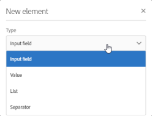

# 配置屏幕定义{#configuring-the-screen-definition}

在创建资源或向现有资源添加新字段时，您可以定义希望它们显示在界面中的方式。

此步骤不是必需的，因为您仍然能够通过工作流、受众和REST API填充资源并访问其数据。

在选项卡 **[!UICONTROL Screen definition]** 中，您可以：

* 在导航窗格中添加对自定义资源的访问权限
* 个性化呈现构成资源的元素列表的方式
* 定义资源每个元素的详细视图的显示方式

## 从导航菜单启用访问 {#enabling-access-from-the-navigation-menu}

如果您希望资源有一个专用屏幕，则可以从导航菜单中使其可用。

1. 从资源 **[!UICONTROL Screen definition]** 的选项卡中，展开该 **[!UICONTROL Navigation]** 部分。
1. 选中该 **[!UICONTROL Add an entry in the 'Client data' section]** 框可允许从导航窗格访问此资源。

   

该资源将作为子条目显示在部分 **[!UICONTROL Client data]** 中。

## 定义默认列表配置 {#defining-the-default-list-configuration}

通过 **[!UICONTROL List configuration]** 屏幕定义部分，您可以定义在资源概述中默认显示的列和信息。

1. 选中 **[!UICONTROL Customize the list configuration]** 该框可定义资源列的显示方式。
1. 使用按 **[!UICONTROL Create element]** 钮从您创建的字段中选择一个字段。
1. 创建的字段将显示在列表中。 您可以编辑其标签和宽度。

   

1. 在部 **[!UICONTROL Simple search]** 分中，选中 **[!UICONTROL Specify the fields to be taken into account in the search]** 以定义将包含在搜索中的字段。

   >[!IMPORTANT]
   >
   >此配置将替换默认搜索中使用的字段。

1. 在部分 **[!UICONTROL Advanced filtering]** 中，选中该框可在简 **[!UICONTROL Add search fields]** 单搜索字段之外添加其他字段。 例如，如果您从您创建的字段中选择“日期”字段，则用户将能够执行仅引用该日期的搜索。
1. 您可以修改两种搜索类型的字段顺序。
1. 对于高级搜索，您可以添加链接到链接资源的字段。 这些过滤器显示在 **[!UICONTROL Search]** 生成的屏幕的菜单中。

现在可以定义资源的概述屏幕。

## 定义详细屏幕配置 {#defining-the-detail-screen-configuration}

通过 **[!UICONTROL Detail screen configuration]** 屏幕定义部分，您可以定义将在资源每个元素的详细信息屏幕中显示的列和信息。

1. 展开 **[!UICONTROL Detail screen configuration]** 部分并检查以 **[!UICONTROL Define a detail screen]** 配置与资源的每个元素对应的屏幕。 如果不选中此框，则将无法访问此资源的元素的详细视图。
1. 只需单击一下，即可添加自定义资源中的所有字段。 要执行此操作，请单击图  标或使用按 **[!UICONTROL Add an element]** 钮。
1. 从为此资源创建的元素中选择一个元素，然后指定字段类型：

   * **[!UICONTROL Input field]**:是可编辑字段。
   * **[!UICONTROL Value]**:是只读字段。
   * **[!UICONTROL List]**:是一张桌子。
   * **[!UICONTROL Separator]**:将元素拆分为类别。
   

1. 添加的元素将显示在列表中。 您可以编辑其标签。

   

1. 根据需要添 **[!UICONTROL Separator]** 加任意数量的元素，以将元素拆分为不同的类别。

   这允许您显示分隔符以更好地组织窗口。

   

资源的详细信息屏幕现已配置。

## 对数据部分执行操作 {#actions-on-data-section}

这些设置允许您在自定义资源屏幕中显示控件栏。 有三个可用选项：

* **[!UICONTROL Authorize creating]**:此选项允许您激活创建资源的元素。 因此，用户可以添加其他记录。

   >[!NOTE]
   >
   >必须首先激活与资源链接的详细信息屏幕才能使此选项可用。

* **[!UICONTROL Authorize duplicating]**:此选项允许您激活链接到自定义资源的重复记录。
* **[!UICONTROL Authorize deleting]**:此选项允许您激活删除链接到自定义资源的记录。
