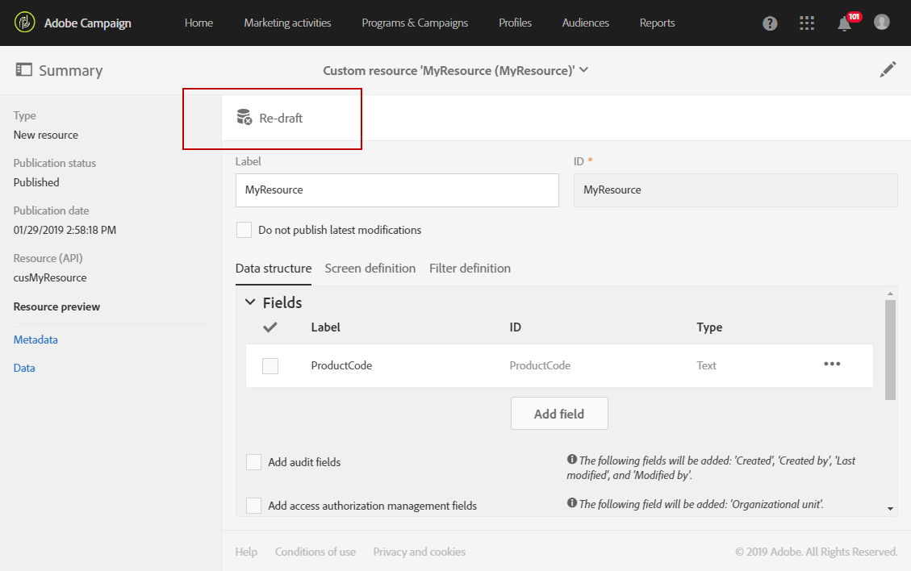
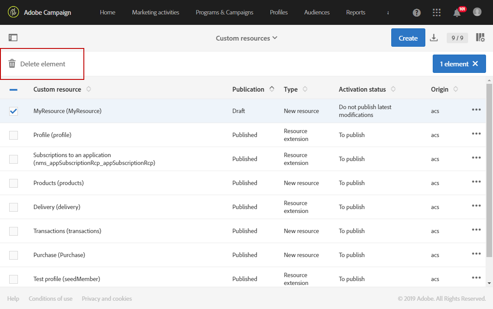

# 删除资源{#deleting-a-resource}

要删除资源，所涉资源必须是&#x200B;**[!UICONTROL Draft]**。 如果：**[!UICONTROL Draft]**

* 它刚刚创建，尚未发布。
* 如果已经发布，则必须重新起草资源。

>[!IMPORTANT]
>
>重新起草和删除自定义资源是可能影响其他资源的敏感操作。 这些操作只能由专家用户执行。

要重新草拟和删除已发布的资源，请执行以下操作：

1. 选择要重新草拟的资源。
1. 单击操作栏中的 **[!UICONTROL Re-draft]** 按钮。

   

1. 单击 **[!UICONTROL Ok]**.

   >[!IMPORTANT]
   >
   >这一行动是明确的：发布修改后，资源的数据库表或列及其数据将被永久删除，这可能导致来自其他自定义资源的链接断开。 只有资源定义仍可用。

   

   >[!NOTE]
   >
   >如果重新草拟现成&#x200B;**用户档案(用户档案)**&#x200B;资源的扩展，则还必须重新草拟任何&#x200B;**测试用户档案(seedMember)**&#x200B;扩展，您可能已定义扩展。 有关扩展用户档案资源的详细信息，请参阅[此部分](../../developing/using/extending-the-profile-resource-with-a-new-field.md)。

1. 发布资源。 有关更详细的步骤，请参阅[发布自定义资源](../../developing/using/updating-the-database-structure.md#publishing-a-custom-resource)。

   然后，资源将进入&#x200B;**草稿**&#x200B;模式，其激活状态为&#x200B;**[!UICONTROL Inactive]**。

1. 在&#x200B;**[!UICONTROL List]**&#x200B;模式下，检查要删除的资源，然后单击 **[!UICONTROL Delete element]**&#x200B;图标。

   

您的资源将从数据模型中删除。

>[!NOTE]
>
>如果修改或删除了用于事件的自定义资源字段，将自动取消发布对应的事件。请参阅[取消发布事务事件](../../channels/using/publishing-transactional-event.md#unpublishing-an-event)。
