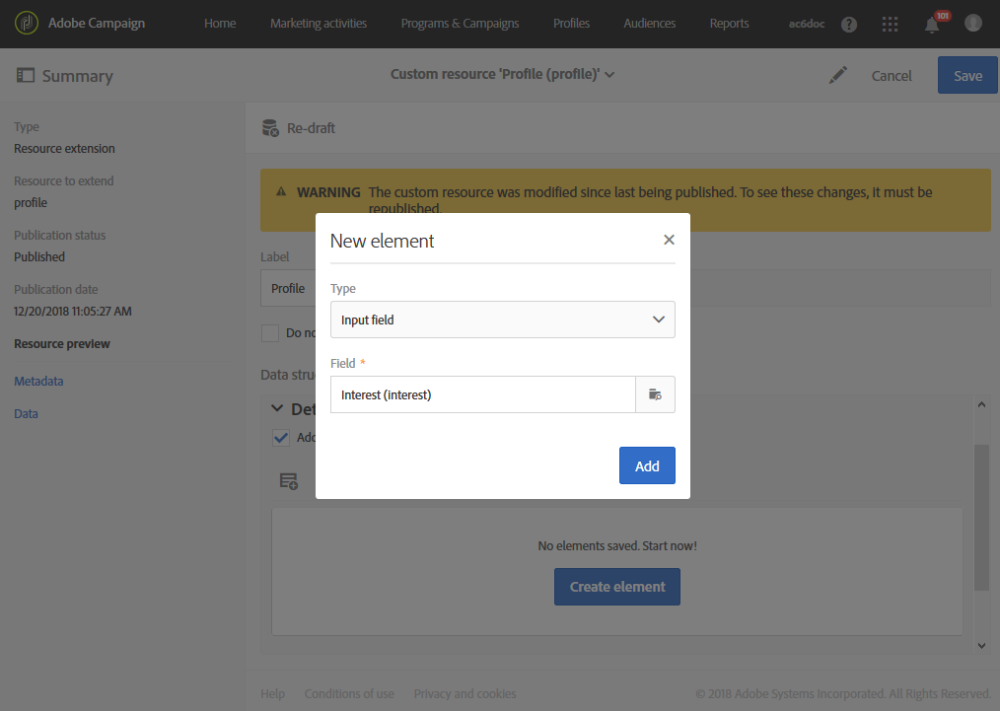
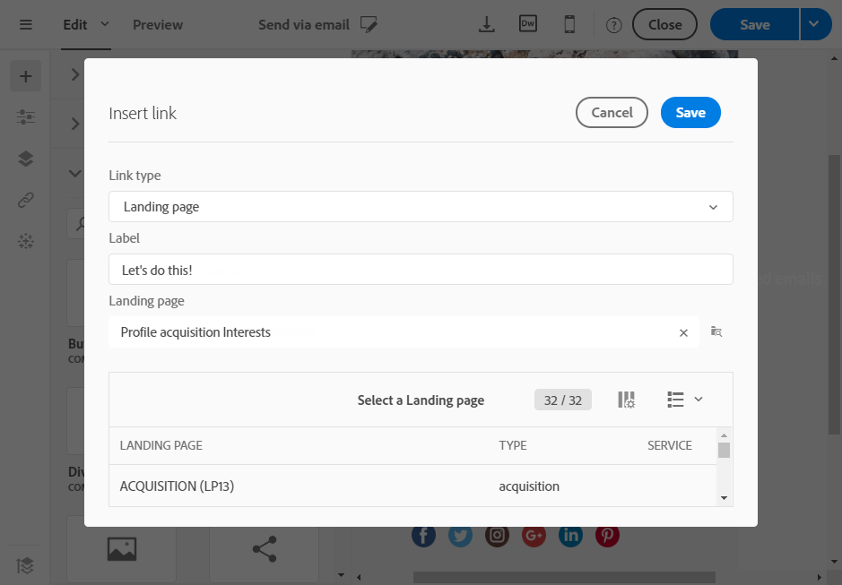

# 使用新字段扩展用户档案资源{#extending-the-profile-resource-with-a-new-field}

## 关于扩展用户档案 {#about-extending-profiles}

本使用案例详细说明了如何使用专用字段扩展用户档案和测试用户档案。

在本例中，我们希望通过登陆页面使用新字段更新用户档案，然后通过用户档案感兴趣的新闻通讯定向用户档案。

要实现此目的，请执行以下步骤：

* [第1步：扩展用户档案资源](#step-1--extend-the-profile-resource)
* [第2步：扩展测试用户档案](#step-2--extend-the-test-profile)
* [步骤3：发布自定义资源](#step-3--publish-your-custom-resource)
* [步骤4：使用工作流更新和定向用户档案](#step-4--update-and-target-profiles-with-a-workflow)

随后，以下字段将添加到我们的用户档案，并可在投放中定向：

相关主题：

* [关于自定义资源](../../developing/using/data-model-concepts.md)
* [管理用户档案](../../audiences/using/about-profiles.md)
* [管理测试用户档案](../../audiences/using/managing-test-profiles.md)

## 第1步：扩展用户档案资源 {#step-1--extend-the-profile-resource}

要为我们的用户档案创建新的 **Interest** 字段，您首先需要扩展现成的 **[!UICONTROL Profiles (profile)]** 资源。

1. 从高级菜单中，通过 Adobe Campaign 徽标，选择 **[!UICONTROL Administration]** > **[!UICONTROL Development]**，然后选择 **[!UICONTROL Custom resources]**。
1. 如果尚未扩展 **[!UICONTROL Profiles]** 资源，请单击 **[!UICONTROL Create]**。
1. 选择 **[!UICONTROL Extend an existing resource]** 选项。
1. 选择 **[!UICONTROL Profile (profile)]** 资源。
1. 单击 **[!UICONTROL Create]**。

   

1. 在 **[!UICONTROL Data structure]** 选项卡的 **[!UICONTROL Fields]** 类别下，单击 **[!UICONTROL Create element]**。

   >[!NOTE]
   >
   >请注意，如果您之前已经出于某种目的扩展了 **[!UICONTROL Profile]** 资源，则可以通过单击 **[!UICONTROL Add field]** 从此步骤开始。

   

1. 添加 **[!UICONTROL Label]** 和 **[!UICONTROL ID]**。选择 **[!UICONTROL Text]** 类型并单击 **[!UICONTROL Add]**。

   

1. 要配置字段，请在 **[!UICONTROL Fields]** 下拉菜单的 **[!UICONTROL Data structure]** 选项卡中，单击 ，然后单击之前所创建字段中的 。
1. 在本例中，我们想要添加特定值，要实现此目的，请单击 **[!UICONTROL Specify a list of authorized values]**。

   

1. 单击 **[!UICONTROL Add an element]**，然后根据需要添加任意数量的值，其方法为添加 **[!UICONTROL Label]** 和 **[!UICONTROL ID]** 并单击 **[!UICONTROL Add]**。

   在本例中，为用户档案创建Books、Exhibitions、Movies和N/A值以在这些选项之间进行选择。

   

1. 要在 **[!UICONTROL Profile]** 屏幕中添加此字段，请单击 **[!UICONTROL Screen definition]** 选项卡。
1. 在 **[!UICONTROL Detail screen configuration]** 下拉菜单中，单击 **[!UICONTROL Add a personalized fields section]**，然后单击 **[!UICONTROL Create element]**。

   

1. 选择 **[!UICONTROL Type]**。在这里，我们想要添加一个输入字段。然后，选择您之前创建的字段并单击 **[!UICONTROL Add]**。

   

1. 要添加分隔符以更好地管理用户档案窗口，请单击 **[!UICONTROL Create an element]**，并从 **[!UICONTROL Type]** 下拉菜单中选择 **[!UICONTROL Separator]**。

   

字段现已配置完成。现在，我们需要将其扩展到测试用户档案。

>[!NOTE]
>
>如果不需要扩展测试用户档案资源，可跳转到发布步骤。

## 第2步：扩展测试用户档案 {#step-2--extend-the-test-profile}

要测试新创建的字段是否正确配置，可通过向测试用户档案发送投放以进行测试。首先，也需要对测试用户档案应用新字段。

1. 从高级菜单中，通过 Adobe Campaign 徽标，选择 **[!UICONTROL Administration]** > **[!UICONTROL Development]**，然后选择 **[!UICONTROL Custom resources]**。
1. 如果尚未扩展 **[!UICONTROL Profiles]** 资源，请单击 **[!UICONTROL Create]**。
1. 选择 **[!UICONTROL Extend an existing resource]** 选项。
1. 选择 **[!UICONTROL Test profile (seedMember)]** 资源。
1. 单击 **[!UICONTROL Create]**。

   

1. 在 **[!UICONTROL Data structure]** 选项卡中，单击 **[!UICONTROL Create element]**。

   

1. 选择您之前创建的资源字段，然后单击 **[!UICONTROL Add]**。

   

1. 执行与上文中扩展用户档案过程中第 11 步至第 13 步的相同步骤，将此字段添加到 **[!UICONTROL Test profile]** 屏幕中。
1. 单击 **[!UICONTROL Save]**。

用户档案和测试用户档案现在都已拥有可用的新字段。要使其正确配置，您需要发布自定义资源。

## 步骤3：发布自定义资源 {#step-3--publish-your-custom-resource}

要应用对资源所作的更改并使用更改后的资源，必须执行数据库更新。

1. 从高级菜单中，选择 **Administration** > **Development**，然后选择 **Publishing**。
1. 默认勾选 **[!UICONTROL Determine modifications since the last publication]** 选项，这意味着仅应用自上次更新以来执行的更改。

   

1. 单击 **[!UICONTROL Prepare publication]** 以开始分析更新数据库的内容。
1. 执行发布后，单击 **Publish** 按钮以应用新配置。

   

1. 发布后，每个资源的 **Summary** 窗格此时都会显示 **Published** 状态，并标注上次发布的日期。

   

1. 选择 **[!UICONTROL Profiles]** 选项卡并单击 **[!UICONTROL New]**，以查看更改是否已正确实施。

   

例如，您的新资源字段现已准备就绪，可在投放中使用和定向。

## 步骤4：使用工作流更新和定向用户档案 {#step-4--update-and-target-profiles-with-a-workflow}

要使用新自定义字段更新用户档案的数据，您可以使用 **[!UICONTROL Profile acquisition]** 模板创建登陆页面。有关登陆页面的更多信息，请参阅[此页面](../../channels/using/getting-started-with-landing-pages.md)。

在这里，我们要在工作流中定向未填写此字段的用户档案。他们将收到一封电子邮件，要求他们更新用户档案，以接收个性化的新闻通讯和优惠信息。然后，每个用户档案都会收到基于其所选兴趣的个性化新闻通讯。

首先，我们需要创建一个登陆页面，以更新定向用户档案的 **Interest** 字段：

1. 在 **[!UICONTROL Marketing activities]** 中，单击 **[!UICONTROL Create]**，然后选择 **[!UICONTROL Landing page]**。
1. 选择登陆页面的类型。在这里，由于我们想要更新用户档案，请选择 **[!UICONTROL Profile acquisition]**。
1. 单击 **[!UICONTROL Create]**。
1. 单击 **[!UICONTROL Content]** 块以开始编辑登陆页面的内容。

   

1. 根据需要自定义登陆页面。
1. 单击为用户档案配置的字段，以选择 Interest 选项。在左窗格中，选择您之前创建的 **Interest** 自定义资源。

   

1. 保存登陆页面并进行测试，以检查字段是否正确配置。
1. 在登陆页面准备就绪后，单击 **[!UICONTROL Publish]**。

您的登陆页面现已准备就绪。要更新用户档案，您可以创建工作流，该工作流将根据所选的 Interest 发送优惠信息。

1. 在 **[!UICONTROL Marketing activities]** 选项卡中，单击 **[!UICONTROL Create]**，然后选择 **[!UICONTROL Workflow]**。
1. 拖放 **[!UICONTROL Query]** 活动以定向您需要的用户档案或受众。
1. 拖放 **[!UICONTROL Email delivery]** 活动以开始配置包含登陆页面链接的电子邮件。选择 **[!UICONTROL Add an outbound transition with the population]**。

   

1. 根据需要创建和设计电子邮件。有关电子邮件个性化的更多信息，请参阅[此页面](../../designing/using/quick-start.md)。
1. 在电子邮件中添加一个按钮，将用户档案重定向到您的登陆页面。
1. 选择要添加的按钮，然后单击左窗格 **[!UICONTROL Link]** 部分中的 。

   

1. 在 **[!UICONTROL Insert link]** 窗口中，从 **[!UICONTROL Link type]** 下拉菜单选择 **[!UICONTROL Landing page]**，然后选择之前创建的登陆页面。

   

1. 单击 **[!UICONTROL Save]**。您的电子邮件已准备就绪，现在可返回至工作流。
1. 添加 **[!UICONTROL Wait]** 活动，留出一段时间让用户档案填充登陆页面。
1. 添加 **[!UICONTROL Segmentation]** 活动以根据 **Interest** 划分叫客过渡。
1. 为每个 **Interest** 创建一个叫客分段。

   

1. 在每个过渡之后添加一个 **[!UICONTROL Email delivery]** 活动，并根据所选的 **Interest** 创建个性化电子邮件。
1. 配置完成后，启动工作流。

   

用户档案现在将收到一封电子邮件要求填写此 Interest 字段，随后将收到基于所选值的个性化电子邮件。
