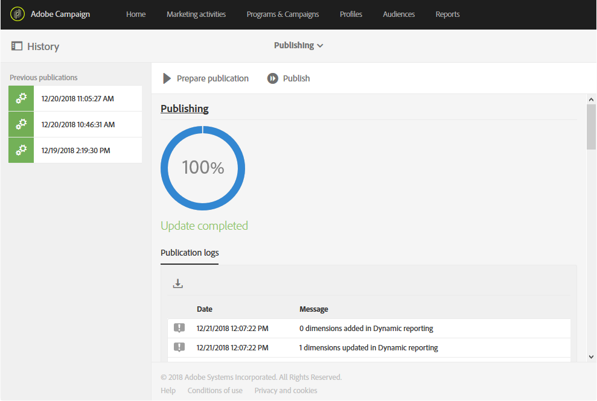
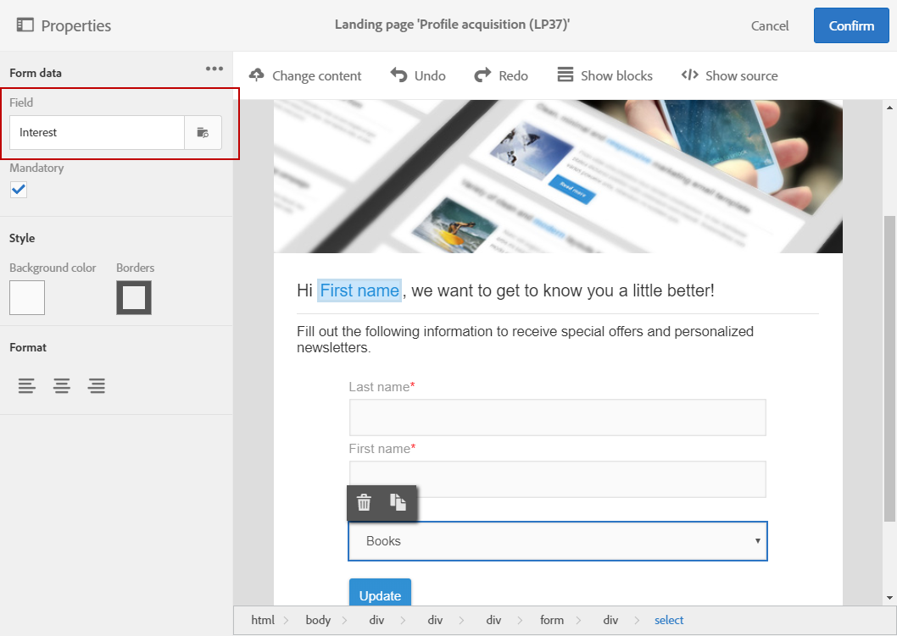

# Extending the profile resource with a new field{#extending-the-profile-resource-with-a-new-field}

## About extending profiles {#about-extending-profiles}

此用例详细介绍了如何使用专用字段扩展配置文件和测试配置文件。

这里，我们希望使用登陆页面更新我们的档案，然后使用特定客户感兴趣的新闻稿来定位档案。

为此，请按照以下步骤操作：

* [步骤1：扩展配置文件资源](../../developing/using/extending-the-profile-resource-with-a-new-field.md#step-1--extend-the-profile-resource)
* [步骤2：扩展测试配置文件](../../developing/using/extending-the-profile-resource-with-a-new-field.md#step-2--extend-the-test-profile)
* [步骤3：发布自定义资源](../../developing/using/extending-the-profile-resource-with-a-new-field.md#step-3--publish-your-custom-resource)
* [第步：使用工作流更新和定位配置文件](../../developing/using/extending-the-profile-resource-with-a-new-field.md#step-4--update-and-target-profiles-with-a-workflow)

以下字段随后将添加到我们的配置文件中，并可定位到分发中：

相关主题：

* [关于自定义资源](../../developing/using/data-model-concepts.md)
* [管理配置文件](../../audiences/using/about-profiles.md)
* [管理测试配置文件](../../sending/using/managing-test-profiles-and-sending-proofs.md#managing-test-profiles)

## Step 1: Extend the profile resource {#step-1--extend-the-profile-resource}

To create the new **Interest** field for our profiles, you first need to extend the out-of-the-box **[!UICONTROL Profiles (profile)]** resource.

1. From the advanced menu, via the Adobe Campaign logo, select **[!UICONTROL Administration]** &gt; **[!UICONTROL Development]**, then **[!UICONTROL Custom resources]**.
1. If you have not extended the **[!UICONTROL Profiles]** resource yet, click **[!UICONTROL Create]**.
1. Choose the **[!UICONTROL Extend an existing resource]** option.
1. Select the **[!UICONTROL Profile (profile)]** resource.
1. Click **[!UICONTROL Create]**.

   

1. In the **[!UICONTROL Fields]** category of the **[!UICONTROL Data structure]** tab, click **[!UICONTROL Create element]**.

   >[!NOTE]
   >
   >Note that if you already extended the **[!UICONTROL Profile]** resource for previous purposes, you can start at this step by clicking **[!UICONTROL Add field]**.

   

1. Add a **[!UICONTROL Label]** and an **[!UICONTROL ID]**. Select the **[!UICONTROL Text]** type and click **[!UICONTROL Add]**.

   

1. To configure your field, in the **[!UICONTROL Data structure]** tab under the **[!UICONTROL Fields]** drop-down, click  then  from your previously created field.
1. In this example we want to add specific values, to do so click **[!UICONTROL Specify a list of authorized values]**.

   

1. Click **[!UICONTROL Add an element]** then add as many value as needed by adding a **[!UICONTROL Label]** and an **[!UICONTROL ID]** and clicking **[!UICONTROL Add]**.

   这里，我们将创建“书籍”、“演示”、“电影”和“N/A值”，供配置文件在这些选项之间进行选择。

   

1. To add this field in the **[!UICONTROL Profile]** screen, click the **[!UICONTROL Screen definition]** tab.
1. In the **[!UICONTROL Detail screen configuration]** drop-down, click **[!UICONTROL Add a personalized fields section]** and click **[!UICONTROL Create element]**.

   

1. Select a **[!UICONTROL Type]**. 这里我们要添加一个输入字段。Then, select your previously created field and click **[!UICONTROL Add]**.

   

1. To add a separator to better organize your profile window, click **[!UICONTROL Create an element]** and select **[!UICONTROL Separator]** from the **[!UICONTROL Type]** drop-down.

   

您的字段现已配置。我们现在需要将其扩展到测试配置文件。

>[!NOTE]
>
>如果不需要扩展测试配置文件资源，可跳转至发布步骤。

## Step 2: Extend the test profile {#step-2--extend-the-test-profile}

要测试新创建的字段是否正确配置，您可以通过将交付发送到测试配置文件来测试该字段。首先，还需要对测试配置文件执行新字段。

1. From the advanced menu, via the Adobe Campaign logo, select **[!UICONTROL Administration]** &gt; **[!UICONTROL Development]**, then **[!UICONTROL Custom resources]**.
1. If you have not extended the **[!UICONTROL Profiles]** resource yet, click **[!UICONTROL Create]**.
1. Choose the **[!UICONTROL Extend an existing resource]** option.
1. Select the **[!UICONTROL Test profile (seedMember)]** resource.
1. Click **[!UICONTROL Create]**.

   

1. In the **[!UICONTROL Data structure]** tab, click **[!UICONTROL Create element]**.

   

1. Select your previously created resource field and click **[!UICONTROL Add]**.

   

1. Carry out the same steps from step 11 to 13 as the extend profile walkthrough above to add this field in the **[!UICONTROL Test profile]** screen.
1. Click **[!UICONTROL Save]**.

档案和测试配置文件现在都将提供您的新字段。为使其正确配置，您需要发布自定义资源。

## Step 3: Publish your custom resource {#step-3--publish-your-custom-resource}

要应用对资源所执行的更改并能够使用该更改，您必须执行数据库更新。

1. From the advanced menu, select **Administration** &gt; **Development**, then **Publishing**.
1. By default, the option **[!UICONTROL Determine modifications since the last publication]** is checked, which means that only the changes carried out since the last update will be applied.

   

1. Click **[!UICONTROL Prepare publication]** to start the analysis which will update your database.
1. Once the publication has been carried out, click the **Publish** button to apply your new configurations.

   

1. Once published, the **Summary** pane of each resource indicates that the status is now **Published** and specifies the date of the last publication.

   

1. Select the **[!UICONTROL Profiles]** tab and click **[!UICONTROL New]** to see if your changes have been correctly implemented.

   

您的新资源字段现在可供在分发中使用和定位。

## Step 4: Update and target profiles with a workflow {#step-4--update-and-target-profiles-with-a-workflow}

To update profiles with data for the new custom field, you can create a landing page using the **[!UICONTROL Profile acquisition]** template. For more information on landing pages, refer to this [page](../../channels/using/about-landing-pages.md).

此处，我们希望在未填写此字段的工作流配置文件中定位。他们将收到一封电子邮件，要求他们更新其配置文件以接收个性化新闻稿和优惠。每个配置文件随后会根据他们所选的兴趣接收个性化新闻稿。

First, we need to create a landing page that will update the **Interest** fields of the targeted profiles:

1. From the **[!UICONTROL Marketing activities]**, click **[!UICONTROL Create]** then select **[!UICONTROL Landing page]**.
1. 选择登陆页面类型。Here, since we want to update our profiles, select **[!UICONTROL Profile acquisition]**.
1. Click **[!UICONTROL Create]**.
1. Click the **[!UICONTROL Content]** block to start editing the content of your landing page.

   

1. 根据需要自定义登陆页面。
1. 单击配置为配置文件的字段，以选择兴趣选择。In the left pane, select your previously created **Interest** custom resource.

   

1. 保存登陆页面并对其进行测试，以确认您的字段已正确配置。
1. Click **[!UICONTROL Publish]** when your landing page is ready.

您的登陆页面现已准备就绪。要更新配置文件，您可以创建一个工作流，然后根据所选的兴趣发送特别优惠。

1. From the **[!UICONTROL Marketing activities]** tab, click **[!UICONTROL Create]** then select **[!UICONTROL Workflow]**.
1. Drag and drop a **[!UICONTROL Query]** activity to target the profiles or audiences you need.
1. Drag and drop an **[!UICONTROL Email delivery]** activity to start configuring your email which will contain a link to the landing page. Select the **[!UICONTROL Add an outbound transition with the population]**.

   

1. 根据需要创建和设计您的电子邮件。For more information on email personalization, refer to this [page](../../designing/using/designing-content-in-adobe-campaign.md).
1. 在电子邮件中添加一个按钮，该按钮会将档案重定向到登陆页面。
1. Select the added button and click  in the **[!UICONTROL Link]** section in the left pane.

   

1. In the **[!UICONTROL Insert link]** window, select **[!UICONTROL Landing page]** from the **[!UICONTROL Link type]** drop-down then select the previously created landing page.

   

1. Click **[!UICONTROL Save]**. 您的电子邮件现已准备就绪，您可以回到工作流程中。
1. Add a **[!UICONTROL Wait]** activity to let some time for your profiles to fill the landing page.
1. Add a **[!UICONTROL Segmentation]** activity to split the outbound transition depending on their **Interests**.
1. Create an outbound segment for each **Interest**.

   

1. Add an **[!UICONTROL Email delivery]** activity after each transition and create a personalized email depending on the chosen **Interest**.
1. 完成配置后启动工作流。

   

配置文件现在会收到电子邮件，要求他们填写此兴趣字段，然后根据所选的值发送个性化电子邮件。
