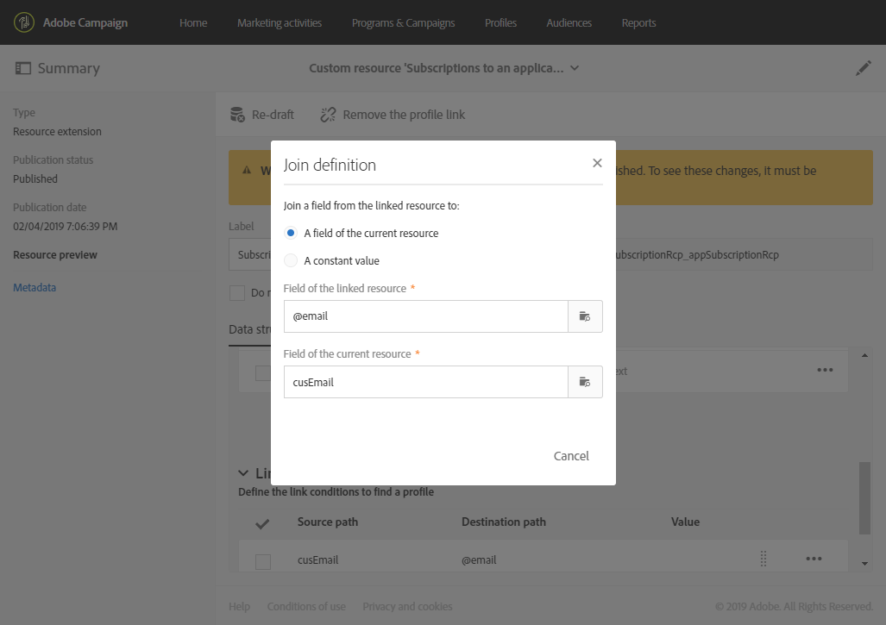

# 将订阅扩展到应用程序资源{#extending-the-subscriptions-to-an-application-resource}

在Adobe Campaign中，由移动设备发出的移动配置文件属性数据存储在 **[!UICONTROL Subscriptions to an application (appSubscriptionRcp)]** 资源，用于定义要从应用程序的订阅者那里收集的数据。 有关自定义资源的更多信息，请参阅 [此页面](../../developing/using/key-steps-to-add-a-resource.md).

可以扩展此资源来收集您打算从移动设备发送到Adobe Campaign的数据。

1. 从高级菜单中，通过 Adobe Campaign 徽标，选择 **[!UICONTROL Administration]** > **[!UICONTROL Development]**，然后选择 **[!UICONTROL Custom resources]**。
1. 单击 **[!UICONTROL Create]** 并选择 **[!UICONTROL Extend an existing resource]** 选项。
1. 选择 **[!UICONTROL Subscriptions to an application (appSubscriptionRcp)]** 资源并单击 **[!UICONTROL Create]**.

   

1. 在 **[!UICONTROL Fields]** 的类别 **[!UICONTROL Data structure]** 选项卡，通过单击 **[!UICONTROL Add field]** 按钮。

   >[!NOTE]
   >
   >如果您正在管理多个移动设备应用程序，则必须列出所有应用程序使用的所有字段。 iOS或Android收集PII调用定义每个应用程序捕获的字段。

   

1. 添加 **[!UICONTROL Label]** 和 **[!UICONTROL ID]** 到你的新领域。 选择您的字段的 **[!UICONTROL Type]**.

   

1. 在 **[!UICONTROL Link to profiles]** 类别，配置用于将Adobe Campaign数据库中的用户档案链接到应用程序的订阅者的协调键，如电子邮件。

   请注意，对于应用程序内消息，您只能为所有移动应用程序定义一个合并关键项。

   

1. **[!UICONTROL Save]** 并发布自定义资源。 有关自定义资源发布的更多信息，请参阅此 [页面](../../developing/using/updating-the-database-structure.md#publishing-a-custom-resource).
