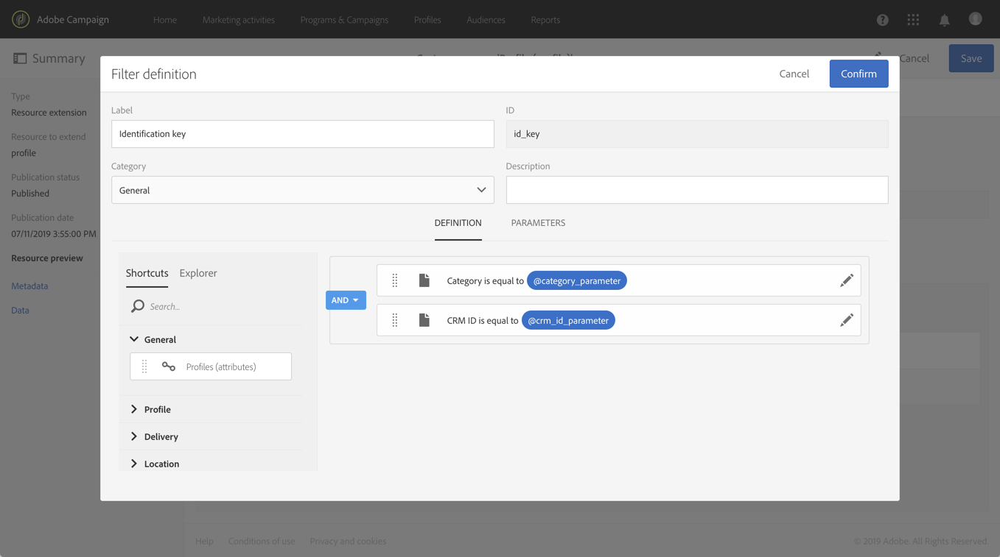

# 使用复合标识密钥调用资源{#calling-a-resource-using-a-composite-identification-key}

在某些情况下，您可能需要为资源定义由两个字段组成的标识密钥。 配置标识密钥后，您需要配置过滤器定义，以便能够从Campaign standard界面或API中使用该标识密钥调用资源。

在此用例中， **Profile** resource has been extended with custom **" CRM ID** " and **"category" field** . 我们将为配置文件资源创建一个标识密钥，该标识密钥将由这两个字段组成。 然后，我们将配置过滤器定义，以便我们能够使用标识密钥访问配置文件资源。

此用例的主要步骤是：

1. 根据两个字段配置配置文件资源的标识密钥。
1. 配置过滤器定义，以便能够使用其标识密钥调用配置文件资源。
1. 从界面或AP调用配置文件资源。

相关主题：

* [创建或扩展资源](../../developing/using/creating-or-extending-the-resource.md)
* [定义标识键](../../developing/using/configuring-the-resource-s-data-structure.md#defining-identification-keys)
* [Campaign Standard REST API](https://docs.campaign.adobe.com/doc/standard/en/api/ACS_API.html)

## 第1步：配置标识密钥{#step-1-configure-the-identification-key}

>[!NOTE]
> 配置标识密钥时的全局概念在本节中 [有详细介绍](../../developing/using/configuring-the-resource-s-data-structure.md#defining-identification-keys)。

1. 在配置标识密钥之前，请确保资源已扩展到所需字段，并且已发布。 For more on this, refer to [this section](../../developing/using/creating-or-extending-the-resource.md).

1. 转到/ **[!UICONTROL Administration]****[!UICONTROL Developement]** /菜 **[!UICONTROL Custom resources]** 单，然后打开资 **[!UICONTROL Profile]** 源。

   

1. 在部分 **[!UICONTROL Identification keys]** 中，单击该按 **[!UICONTROL Create element]** 钮。

   

1. 添加两个自定义“CRM ID”和“类别”字段，然后单击 **[!UICONTROL Confirm]**。

   

   >[!NOTE]
   > 如果要在配置文件的界面中显示两个自定义字段，请配置选 **[!UICONTROL Screen definition]** 项卡。 For more on this, refer to [this section](../../developing/using/configuring-the-screen-definition.md).

1. 您现在可以将过滤器定义配置为能够使用其标识密钥调用资源。

## 第2步：配置过滤器定义{#step-2-configure-the-filter-definition}

>[!NOTE]
> 配置过滤器定义时的全局概念将在本节中 [详细介绍](../../developing/using/configuring-filter-definition.md)。

1. 在选 **[!UICONTROL Filter definition]** 项卡中，单 **[!UICONTROL Add an element]**&#x200B;击，然后输入过滤器定义的标签和ID。

1. 编辑过滤器定义的属性以配置其规则。

   

1. 将包含标识键中使用的字段的表拖放到工作区中。

   

1. 选择标识密钥(“CRM ID”)中使用的第一个字段，然后激活该选 **[!UICONTROL Switch to parameters]** 项。

   

1. 在部 **[!UICONTROL Filter conditions]** 分中，保留运 **[!UICONTROL Equal]** 算符，然后定义参数的名称并单击加号以创建它。

   

   >[!NOTE]
   > 单击加号按钮后，将自动生成参数的名称。 请注意此信息，因为您需要它才能使用API中的过滤器。

1. 对构成标识键的所有字段（“类别”）重复上述步骤，然后保存更改。

   

1. 现在已配置过滤器定义。 您可以发布资源，以便过滤器可用。

## 第3步：根据资源的标识密钥调用资源{#step-3-call-the-resource-based-on-its-identification-key}

一旦配置了标识密钥及其过滤器定义，您就可以使用它们从Campaign标准界面或REST API调用资源。

要从界面中使用过滤器定义，请在工 **[!UICONTROL Query]** 作流中使用活动(请参 [阅本节](../../automating/using/query.md))。 然后，该过滤器在左侧窗格中可用。


要使用Campaign Standard REST API中的过滤器定义，请使用以下语法：

```
GET /profileAndServicesExt/<resourceName>/by<filterName>?<param1_parameter>=<value>&<param2_parameter>=<value>
```

>[!NOTE]
>要调用客户过滤器，请使用“by”前缀，后跟在步骤2中配置过滤器定义时定义的过 [滤器名称](../../developing/using/uc-calling-resource-id-key.md#step-2-configure-the-filter-definition)。

在本例中，用于从“spring”类别中检索配置文件的语法为：

```
GET https://mc.adobe.io/<ORGANIZATION>/campaign/profileAndServicesExt/profile/byidentification_key?category_parameter=spring&crm_id_parameter=123456
```

有关详细信息，请参 [阅Campaign Standard REST API文档](https://docs.campaign.adobe.com/doc/standard/en/api/ACS_API.html#filtering)。