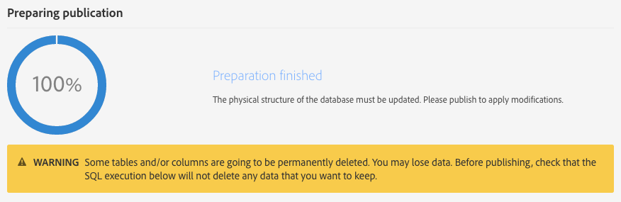

# 更新数据库结构{#updating-the-database-structure}

要让对数据模型的修改生效并能够使用，需要更新数据库结构。

>[!NOTE]
>
>Adobe 执行自动更新期间，会自动刷新自定义资源。

## 发布自定义资源 {#publishing-a-custom-resource}

要应用对资源执行的更改，必须执行数据库更新。

>[!NOTE]
>
>如果修改或删除了用于事件的自定义资源字段，将自动取消发布对应的事件。请参阅 [取消发布事务型事件](../../channels/using/publishing-transactional-event.md#unpublishing-an-event).

1. 从高级菜单中，通过 Adobe Campaign 徽标，选择 **[!UICONTROL Administration]** > **[!UICONTROL Development]**，然后选择 **[!UICONTROL Publishing]**。
1. 默认勾选 **[!UICONTROL Determine modifications since the last publication]** 选项，这意味着仅应用自上次更新以来执行的更改。

   >[!NOTE]
   >
   >如果在完成之前发布失败，则 **[!UICONTROL Repair database structure]** 可重新建立正确的配置。直接在数据库中进行的、不使用自定义资源的任何修改都将被删除。

   

1. 单击 **[!UICONTROL Prepare publication]** 按钮以开始分析。请注意，大型表格更新应在实例不太忙时，通过工作流进行。

   有关在 Profiles &amp; Services API 上执行操作的更多信息，请参阅[使用 API 扩展发布资源](#publishing-a-resource-with-api-extension)。

   

   >[!NOTE]
   >
   >由于重复的索引导致发布失败，准备步骤会检查为资源定义的索引是否已经存在，并且其名称与另一个资源的名称相同。 如果发生此情况，将显示一条错误消息，要求您重命名索引。 请参阅 [定义索引](configuring-the-resource-s-data-structure.md#defining-indexes).

1. 执行发布后，单击 **[!UICONTROL Publish]** 按钮以应用新配置。
1. 发布后，每个资源的 **[!UICONTROL Summary]** 窗格此时都会显示 **[!UICONTROL Published]** 状态，并标注上次发布的日期。

   >[!NOTE]
   >
   >如果对资源进行了新更改，则必须对要应用的更改重复此操作。

   如果资源在发布之前处于 **[!UICONTROL Pending re-draft]** 状态，则将显示另一条消息，提示您检查自己的操作，因为发布后将不能再更改（删除列、表格…）。为了帮助您执行此类最终更改，可使用 **[!UICONTROL SQL Script]** 选项卡。其中提供了可在发布期间执行的 SQL 命令。

   

   >[!NOTE]
   >
   >单击 **[!UICONTROL Cancel re-draft]** 按钮可停止“重新起草”流程。此操作可将资源的状态还原到原始状态。

1. 如果发布失败，您可随时通过单击 **[!UICONTROL Back to latest successful publication]** 返回到上次发布。

   请注意，如果让发布一直处于失败状态，那么一旦您登录到实例，就会打开一个弹出窗口，提醒您修复此发布。在修复发布之前，不会将您的实例升级为新产品版本。

   

## 使用 API 扩展发布资源 {#publishing-a-resource-with-api-extension}

在以下案例中，您可以创建用户档案和服务 API：

* 扩展自定义资源 **[!UICONTROL Profiles]** 或 **[!UICONTROL Services]** 时，您可以对 Profiles 和 Services API 执行更新，以集成在自定义资源扩展中声明的字段。
* 定义自定义资源并在资源 **[!UICONTROL Profiles]** 或 **[!UICONTROL Services]** 与自定义资源之间创建链接时，可以执行更新以将新资源纳入到 API 中。

您可以在发布屏幕中选择此选项。

* 如果 API 尚未发布（即是说，如果您从未扩展过该资源，或者您尚未为此资源或其他资源选中此选项），则可以选择是否创建。

   

* 如果 API 已发布（即是说，如果您已扩展资源并选中了此选项），则将强制进行 API 更新。

   事实上，一旦创建，API 就会在您每次再发布时自动更新。这是为了避免破坏此 API 的用户档案或服务资源并避免损害您的实例。

请注意，自定义资源是默认集成的，但是，对于特定行为，如果您不想发布此资源，则可以选择 **[!UICONTROL Resource Properties]** 中提供的 **[!UICONTROL Hide this resource from APIs]** 选项。

在 **[!UICONTROL Prepare Publication]** 步骤之后，Adobe Campaign 将在选项卡中显示当前版本的 API 与在 **[!UICONTROL Profiles & Services API Preview]** 选项卡中发布之后的未来版本 API 之间的差别。如果您是第一次扩展 API，则将比较现成自定义资源定义与扩展后的差别。

选项卡中显示的信息分为三个部分：已添加、已删除和已修改的元素。

差别分析是强制步骤，因为发布步骤将修改 API 行为，并且极有可能影响周边开发，产生多米诺效应。

>[!NOTE]
>
>此发布会更新 **[!UICONTROL profilesAndServicesExt]** API。**[!UICONTROL profilesAndServices]** API 未更新。

有关 Adobe Campaign API 的更多信息，请参阅 [Adobe IO](https://docs.campaign.adobe.com/doc/standard/en/adobeio.html) 上的 Adobe Campaign 专述文档。
