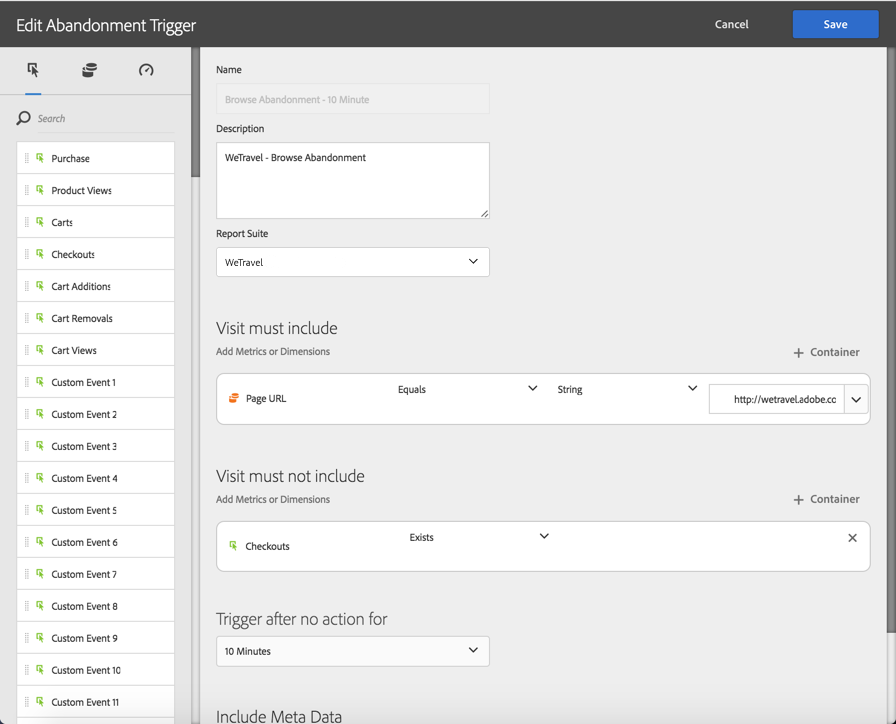
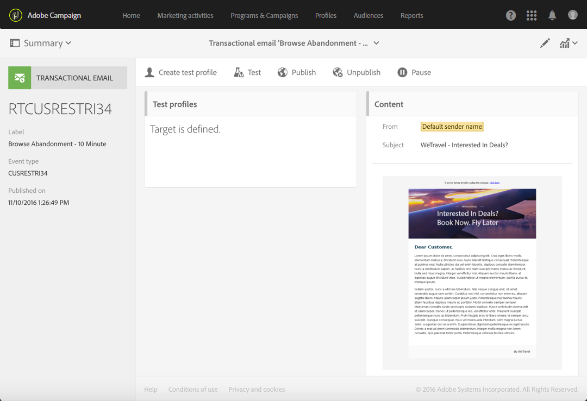
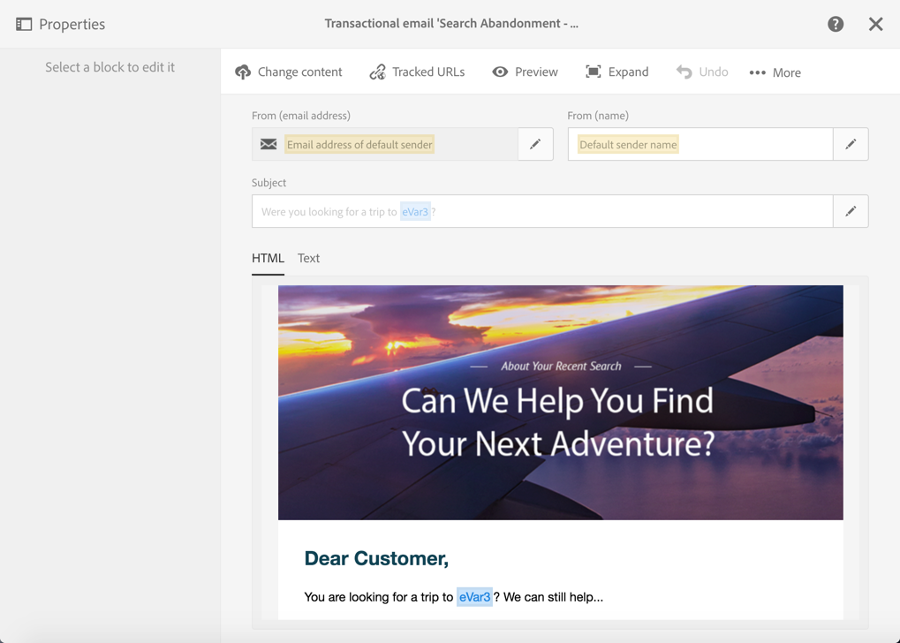

# 放弃触发器用例{#abandonment-triggers-use-cases}

本节介绍可通过 Adobe Campaign 与 Experience Cloud Triggers 的集成实施的不同使用案例。本文包含两个使用案例示例：

* [浏览放弃触发器](#browse-abandonment-trigger)：向放弃访问您网站的客户发送通信。
* [搜索放弃触发器](#search-abandonment-trigger)：重新吸引在您的网站上进行了搜索但未购买的访客。

>[!NOTE]
>
>本节介绍的使用案例取决于 Experience Cloud Visitor ID。还可以使用 Experience Cloud Declared ID 实施这些使用案例。另外还支持哈希化和加密的声明 ID。您可以通过直接解密已加密的电子邮件地址/移动号码，将电子邮件/短信发送给 Campaign 中不存在的用户档案。但在这种情况下，无法使用用户档案数据进行个性化。

## 先决条件 {#pre-requisites}

为了实施这些使用案例，您必须有权访问以下解决方案/核心服务：

* Adobe Campaign
* Adobe Analytics Ultimate、Premium、Foundation、OD、Select、Prime、Mobile Apps、Select 或 Standard。
* Experience Cloud Triggers Core Service
* Experience Cloud DTM Core Service
* Experience Cloud Visitor ID 和 Experience Cloud People Core Service

您还需要拥有可用的网站。

有关更多信息，请参阅[配置解决方案和服务](../../integrating/using/configuring-triggers-in-experience-cloud.md#configuring-solutions-and-services)。

## 浏览放弃触发器 {#browse-abandonment-trigger}

在此使用案例中，我们将创建一个简单的触发器，每次客户放弃访问网站时都会触发该触发器。此示例假定您拥有 DTM 用于收集数据并将数据推送到 Adobe Analytics，且已创建了所有事件。

### 创建 Experience Cloud Trigger {#creating-an-experience-cloud-trigger}

1. 从 Experience Cloud Activation Core Service 菜单选择 **[!UICONTROL Manage Triggers]**。

   

1. 选择触发器类型（在我们的使用案例中为 **[!UICONTROL Abandonment]**）。

   

1. 对于此使用案例，我们需要一个简单的放弃触发器。其业务目的是标识浏览我们的旅行预订网站、查看了“Deals”页面但不预订任何旅行的访客。我们希望一旦标识了此受众，就马上与他们联系。在本例中，我们选择在 10 分钟后发送触发信号。

   

### 在 Adobe Campaign 中使用触发器 {#using-the-trigger-in-adobe-campaign}

现在，我们已经创建了 Experience Cloud Trigger，接下来让我们将其用于 Adobe Campaign。

在 Adobe Campaign 中，您需要创建一个触发器，使其链接到在 Experience Cloud 中创建的触发器。

1. 要在Adobe Campaign中创建触发器，请单击左上角的&#x200B;**Adobe**&#x200B;徽标，然后选择&#x200B;**[!UICONTROL Marketing plans]** > **[!UICONTROL Transactional messages]** > **[!UICONTROL Experience Cloud triggers]**。

   

1. 单击 **[!UICONTROL Create]**。
1. 选择您之前创建的触发器，然后单击 **[!UICONTROL Next]**。

   

1. 选择 **[!UICONTROL Email]** 渠道和 **[!UICONTROL Real-time event]** 定向维度并单击 **[!UICONTROL Create]**。

   

1. 在 Adobe Campaign 中发布触发器。此过程将自动创建事务型消息模板。

   

1. 要显示消息模板，请单击右上方的 **[!UICONTROL More]** 按钮，然后单击 **[!UICONTROL Trigger Transactional Template]**。

1. 将其内容和发件人详细信息个性化。

   

1. 发布消息模板。现在，触发器已上线并正常运行。

   

### 运行场景 {#running-the-scenario}

1. 此使用案例首先会通过 Adobe Campaign 向受众发送初始电子邮件。

   

1. 收件人打开电子邮件。

   

1. 收件人点击指向您网站的链接。在本例中，横幅会将收件人导向旅行预订网站的主页。

   

1. 收件人来到了“Deals”页面，但突然停止了访问。10 分钟后，Adobe Campaign 触发事务型消息的发送。

   

1. 您可以随时检查 Experience Cloud 的日志，查看触发器的触发次数。

   

1. 您还可以显示 Adobe Campaign 触发器报告。

   

## 搜索放弃触发器 {#search-abandonment-trigger}

在此使用案例中，我们将创建触发器以重新吸引那些访问我们的旅行预订网站、搜索了目的地、未成功找到结果、且没有预订任何内容的访客。一般过程与上一个使用案例中的过程相同（请参阅[浏览放弃触发器](#browse-abandonment-trigger)）。我们将重点介绍如何将再营销电子邮件个性化。

### 创建 Experience Cloud Trigger {#creating-an-experience-cloud-trigger-1}

按照上一个使用案例中所述的步骤，创建 Experience Cloud Trigger。请参阅[创建 Experience Cloud Trigger](#creating-an-experience-cloud-trigger)。其主要区别在于触发器定义。

利用 **[!UICONTROL Include Meta Data]** 部分，可将从 Analytics 收集的任何数据传递到触发器有效载荷。在本例中，我们创建了一个自定义 eVar（例如，eVar 3）来收集访客输入的搜索词。此搜索词随后将用在发送至同一访客的事务型电子邮件中。

### 在 Adobe Campaign 中使用触发器 {#using-the-trigger-in-adobe-campaign-1}

1. 按照上一个使用案例中所述的步骤，在 Adobe Campaign 中创建触发器。请参阅[在 Adobe Campaign 中使用触发器](#using-the-trigger-in-adobe-campaign)。主要区别在于我们如何在 Adobe Campaign 中访问和使用在触发器有效载荷中推送的元数据。
1. 在 Adobe Campaign 中，进入您创建的搜索放弃触发器，单击 **[!UICONTROL Event content and enrichment]** 图标以查看推送到 Adobe Campaign 的有效载荷。

   

1. 如您所见，自定义 eVar 在触发器有效载荷中传递并映射到 **Event context** 表格 (ctx)。我们现在可以对其进行访问以个性化事务型消息。

   

1. 在本例中，我们选择在主题行和电子邮件正文中包含目的地搜索词。

   

1. 选择个性化字段时，请先在 **Transactional event** (rtEvent) 表格中查找有效载荷元数据，然后在 **Event context** (ctx) 子表格中查找。

   

### 运行场景 {#running-the-scenario-1}

1. 访客进入旅行预订网站并搜索目的地。在本例中，访客正在寻找日本游旅程，但没有找到任何结果。这时，我们应抓住机会联系此访客并推荐其他旅行计划。

   

   >[!NOTE]
   >
   >在本使用案例中，我们假定访客/收件人已打开并单击了来自同一网站的电子邮件。这样，我们即可使用和收集 VisitorID 并将其映射到收件人。我们只需执行一次此操作。

1. 几分钟后，同一访客/收件人会收到再营销消息。该消息中包含最近搜索过的目的地。

   
