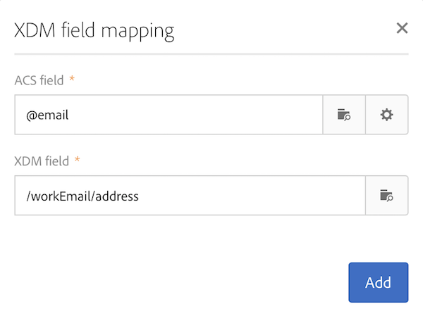

# 映射定义 {#mapping-definition}

>[!IMPORTANT]
>
>Adobe Experience Platform Data Connector目前处于测试阶段，可能会频繁更新，恕不另行通知。 需要在Azure上托管客户（目前仅适用于北美地区的测试版）才能访问这些功能。 如果您希望访问，请联系Adobe客户关怀团队。

在此部分中，您将了解如何将Campaign Standard字段映射到体验数据模型(XDM)字段。

要执行此任务，先决条件包括：

* 通过界面或使用与XDM关联的REST API来定义XDM模式
* 基于XDM架构定义的数据集创建

1. 转到 **[!UICONTROL Administration]** > **[!UICONTROL Development]** > **[!UICONTROL Platform]** 然后选择 **[!UICONTROL Data mappings]** 中。

1. 单击 **[!UICONTROL Create]** 以开始新的XDM映射。

   

1. 填写必填字段并选择：

   * a **定位维度**:这是要映射的Campaign Standard架构
   * a **数据集**:这是与Adobe Experience Platform中的XDM架构关联的数据包。

>[!NOTE]
>
>要将批量数据集摄取到“实时客户资料”或“身份服务”中，必须 [为实时客户用户档案启用](https://experienceleague.adobe.com/docs/experience-platform/rtcdp/intro/get-started.html).
>
>如果您选择的数据集已在现有数据映射中使用，则会显示一条警告，通知您的数据可能会在Adobe Experience Platform上被覆盖。 当使用同一数据集的数据映射中存在一些常见的收件人时，可能会发生这种情况。

以下屏幕显示 **[!UICONTROL Field mappings]** 部分，您可以在其中为Campaign Standard架构中的每个字段创建新映射。

的 **[!UICONTROL Create new field mapping]** 按钮可用于选择XDM架构中的Campaign Standard字段和相应的字段路径表达式。

如果找不到Adobe Campaign Standard字段，则可以使用搜索字段搜索该字段。 目前，搜索仅适用于在层次结构中打开的字段。

Campaign Standard中定义的扩展资源被映射为所有本机字段。 它们在XDM中定义为_customer/default扩展。

您可以通过API自定义XDM扩展，并定义您自己的扩展，以便更好地控制映射。

请参阅 [模式注册表API教程](https://experienceleague.adobe.com/docs/experience-platform/xdm/api/getting-started.html) 有关XDM API的更多详细信息。

要映射枚举字段，您需要使用表达式编辑器来定义与XDM值对应的每个枚举值。 例如，后发地址字段需要定义为：

如果XDM值被定义为XDM架构中的枚举，则可以使用本机EXDM函数，该函数将自动替换 **lif** 语法。

要编辑XDM映射，请将其打开，修改所需信息，然后保存该映射。

>[!IMPORTANT]
>
>目前，如果您在 **[!UICONTROL Field mappings]** 部分，然后单击字段外部，则在单击 **[!UICONTROL Save]** 按钮。 此行为仅在 **[!UICONTROL Field Mappings]** 是页面上的首次编辑。
