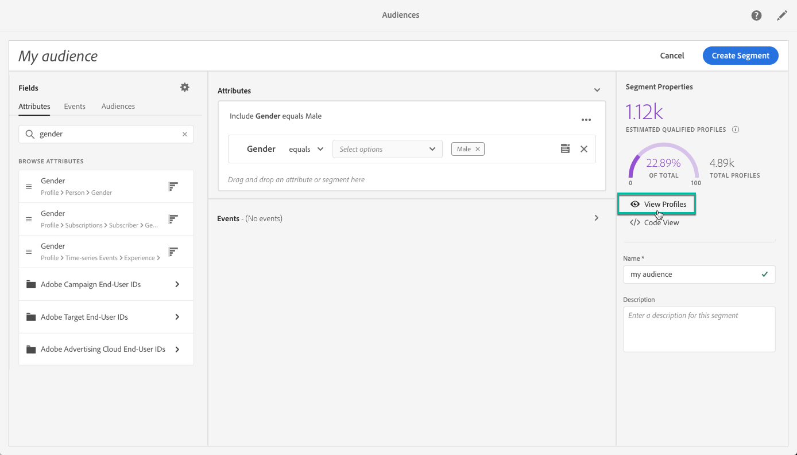

# 使用 Segment Builder {#using-the-segment-builder}

>[!IMPORTANT]
>
>Audience Destinations服务当前为测试版，可能会频繁更新，恕不另行通知。 客户需要在Azure上托管（目前为仅北美测试版）才能访问这些功能。 如果您希望获得访问权限，请联系Adobe客户关怀团队。

区段生成器允许您通过基于来自[实时客户个人资料](https://experienceleague.adobe.com/docs/experience-platform/profile/home.html)的数据定义规则来构建受众。

本节介绍构建区段时的全局概念。 有关区段生成器本身的详细信息，请参阅[区段生成器用户指南](https://experienceleague.adobe.com/docs/experience-platform/segmentation/ui/overview.html)。

区段生成器界面由以下部分组成：

* 左侧窗格提供所有可用于通过将所需字段拖放到区段生成器工作区中来构建区段的属性、事件和受众。
* 中心区域提供了一个工作区，用于通过定义和组合可用字段中的规则来构建区段。
* 标题和右侧窗格显示区段的属性（即区段的名称、描述和预计的合格配置文件）。

## 构建区段

要构建区段，请执行以下步骤：

区段生成器现在应会显示在您的工作区中。 它允许您使用Adobe Experience Platform中的数据构建区段，这些数据最终将用于创建受众。

1. 命名区段，然后输入说明（可选）。

   

1. 确保在设置窗格中选择所需的合并策略。

   有关合并策略的更多信息，请参阅[区段生成器用户指南](https://experienceleague.adobe.com/docs/experience-platform/segmentation/ui/overview.html)中的专用部分。

   

1. 在左窗格中查找所需的字段，并将其拖到中心工作区中。

   

1. 配置与拖动字段对应的规则。

   

1. 单击 **[!UICONTROL Create segment]** 按钮。

## 为区段查找正确的字段

左侧窗格列出了可用于构建规则的所有属性、事件和受众。

列出的字段是您的公司捕获的属性，已通过[体验数据模型(XDM)系统](https://experienceleague.adobe.com/docs/experience-platform/xdm/home.html)提供。

字段被组织为选项卡：

* **[!UICONTROL Attributes]**：可以源自Adobe Campaign数据库和/或Adobe Experience Platform的现有配置文件属性。 它们是指附加到用户档案的静态信息（例如，电子邮件地址、居住国家/地区、忠诚度计划状态等）。

  

* **[!UICONTROL Events]**：用于标识与您公司的客户接触点进行了互动的消费者的活动，例如“两周内订购了两次的任何人”。 这些内容可以从Adobe Analytics流式传输，也可以使用第三方ETL工具直接引入Adobe Experience Platform。

  

>[!NOTE]
>
>**多实体分段**&#x200B;允许您使用基于产品、商店或其他非配置文件类的附加数据来扩展配置文件数据。 连接后，其他类中的数据将变得可用，就好像它们是配置文件架构的原生数据一样。
>
>有关更多信息，请参阅[专用文档](https://experienceleague.adobe.com/docs/experience-platform/segmentation/multi-entity-segmentation.html)。

默认情况下，区段生成器会显示数据已存在的字段。 要显示完整的架构，包括数据不存在的字段，请从设置中启用&#x200B;**[!UICONTROL Show full XDM schema]**&#x200B;选项。

每个字段末尾的符号提供有关属性及其使用方法的更多信息。

## 定义区段的规则

>[!NOTE]
>
>以下部分提供了有关规则定义的全局信息。 有关详细信息，请参阅[区段生成器用户指南](https://experienceleague.adobe.com/docs/experience-platform/segmentation/ui/overview.html)。

要构建规则，请执行以下步骤：

1. 从左窗格中查找反映规则所基于的属性或事件的字段。

1. 将该字段拖动到中心工作区，然后根据所需的区段定义对其进行配置。 为此，可使用多个字符串和日期/时间函数。

   在以下示例中，该规则将定向性别等于“男性”的所有用户档案。

   

   与区段对应的预计群体会在&#x200B;**[!UICONTROL Segment Properties]**&#x200B;部分中自动重新计算。

1. “**[!UICONTROL View Profiles]**”按钮提供了与规则对应的前20条记录的预览，使您能够快速验证区段。

   

   您可以根据需要添加任意数量的其他规则，以定向正确的用户档案。

   将规则添加到容器时，该规则将附加到具有AND逻辑运算符的任何现有规则中。 如果需要，请单击逻辑运算符以对其进行修改。

   

将两个规则链接在一起后，即可形成一个容器。

## 比较字段

通过区段生成器，您可以比较两个字段以定义规则。 例如，家庭地址与工作地址位于不同的邮政编码中的女性。

为此，请执行以下步骤：

1. 将您要比较的第一个字段（例如家庭地址邮政编码）拖动到中心工作区。

   

1. 选择要与第一个字段比较的第二个字段（例如，工作地址邮政编码）。

   将其拖动到中心工作区，该工作区与&#x200B;**[!UICONTROL Drop here to compare operands]**&#x200B;框中的第一个字段位于同一容器中。

   

1. 根据需要配置两个字段之间的运算符。 在本例中，我们希望区段定向家庭地址与工作地址不同的用户档案。

   

规则现已配置完毕，可随时作为受众激活。
