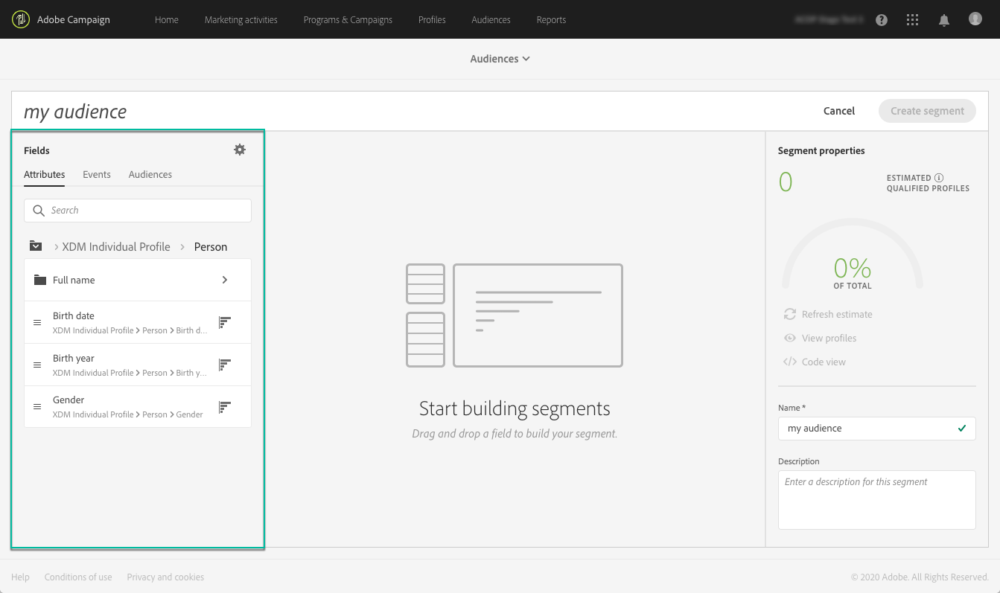
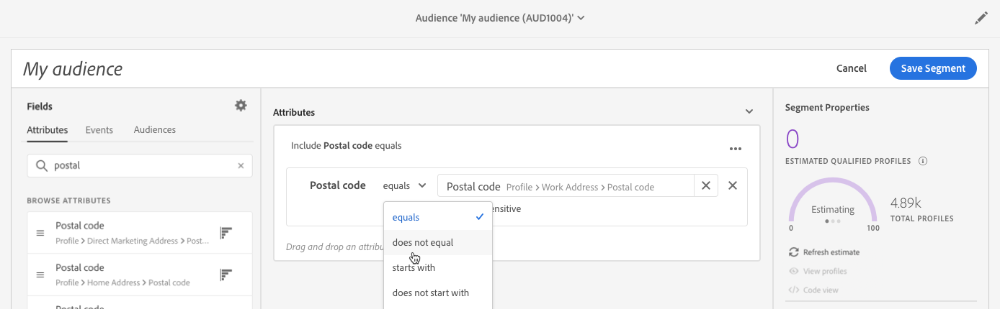

# 使用 Segment Builder {#using-the-segment-builder}

>[!IMPORTANT]
>
>受众目标服务目前处于测试阶段，可能会在不通知的情况下频繁进行更新。 客户需要托管在Azure上（目前仅针对北美）才能访问这些功能。 如果您希望访问，请联系Adobe客户关怀团队。

区段生成器允许您根据来自[实时客户用户档案](https://docs.adobe.com/content/help/zh-Hans/experience-platform/profile/home.html)的数据定义规则，从而构建受众。

本节介绍在构建区段时的全局概念。 有关区段生成器本身的详细信息，请参阅[区段生成器用户指南](https://docs.adobe.com/content/help/en/experience-platform/segmentation/ui/overview.html)。

区段生成器界面由以下部分组成：

* 左侧窗格提供所有可用的属性、事件和受众，可通过将所需字段拖放到区段生成器工作区中来构建区段。
* 中心区域提供一个工作区，通过定义和组合可用字段中的规则来构建区段。
* 标题和右侧窗格显示区段的属性(例如，区段的名称、说明和估计的限定用户档案)。

## 构建区段

要构建区段，请执行以下步骤：

区段生成器现在应显示在您的工作区中。 它允许您使用Adobe Experience Platform中的数据构建区段，最终将用于创建受众。

1. 为区段命名，然后输入说明（可选）。

   

1. 确保在设置窗格中选择了所需的合并策略。

   有关合并策略的详细信息，请参阅[区段生成器用户指南](https://docs.adobe.com/content/help/en/experience-platform/segmentation/ui/overview.html)中的专用部分。

   

1. 在左侧窗格中查找所需的字段，并将其拖入中心工作区。

   

1. 配置与拖动字段对应的规则。

   

1. 单击 **[!UICONTROL Create segment]** 按钮。

## 查找区段的正确字段

左侧窗格列表所有可用于构建规则的属性、事件和受众。

列出的字段是公司捕获的属性，已通过[体验数据模型(XDM)系统](https://docs.adobe.com/content/help/zh-Hans/experience-platform/xdm/home.html)提供。

字段按选项卡进行组织：

* **[!UICONTROL Attributes]**:现有的用户档案属性可能源自您的Adobe Campaign数据库和/或Adobe Experience Platform。它们指附加到用户档案的静态信息(例如，电子邮件地址、居住国家/地区、忠诚度项目状态等)。

   

* **[!UICONTROL Events]**:活动，用于识别与公司的客户接触点进行过某种互动的消费者，例如“两周内订购两次的任何人”。这可以从Adobe Analytics进行流传输，或使用第三方ETL工具直接引入Adobe Experience Platform。

   

>[!NOTE]
>
>**多实体细** 分允许您根据产品、商店或其他非用户档案类使用其他数据扩展用户档案数据。连接后，来自其他类的数据就变得像它们是用户档案模式的本机数据一样可用。
>
>有关更多信息，请参阅[专用文档](https://docs.adobe.com/content/help/en/experience-platform/segmentation/multi-entity-segmentation.html)。

默认情况下，区段生成器显示已存在数据的字段。 要显示完整模式（包括没有数据的字段），请从设置中启用&#x200B;**[!UICONTROL Show full XDM schema]**&#x200B;选项。

每个字段末尾的符号提供了有关属性及其使用方法的附加信息。

## 定义区段规则

>[!NOTE]
>
>以下部分提供有关规则定义的全局信息。 有关详细信息，请参阅[区段生成器用户指南](https://docs.adobe.com/content/help/en/experience-platform/segmentation/ui/overview.html)。

要构建规则，请执行以下步骤：

1. 从左侧窗格中查找反映规则所基于的属性或事件的字段。

1. 将字段拖动到中心工作区上，然后根据所需的区段定义对其进行配置。 为此，可使用多个字符串和日期/时间函数。

   在以下示例中，规则将目标所有性别等于“Male”的用户档案。

   

   在&#x200B;**[!UICONTROL Segment Properties]**&#x200B;节中自动重新计算与区段对应的估计人口。

1. **[!UICONTROL View Profiles]**&#x200B;按钮可预览前20条与规则对应的记录，使您能够快速验证区段。

   

   您可以根据需要添加任意数量的附加规则，以便目标正确的用户档案。

   向容器添加规则时，它将附加到任何现有规则中的AND逻辑运算符。 如果需要，单击逻辑运算符以对其进行修改。

   

一旦链接在一起，这两条规则就形成了容器。

## 比较字段

区段生成器允许您比较两个字段以定义规则。 例如，其家乡地址与工作地址的邮政编码不同的女性。

为此，请执行以下步骤：

1. 将要比较的第一个字段（例如，家庭地址邮政编码）拖到中心工作区上。

   

1. 选择将与第一个字段进行比较的第二个字段（例如，工作地址邮政编码）。

   将其拖动到&#x200B;**[!UICONTROL Drop here to compare operands]**&#x200B;框中与第一个字段容器相同的中心工作区上。

   

1. 根据需要在两个字段之间配置运算符。 在此示例中，我们希望我们的区段能够将主地址与工作地址不同的目标用户档案。

   

规则现已配置好，可作为受众激活。
