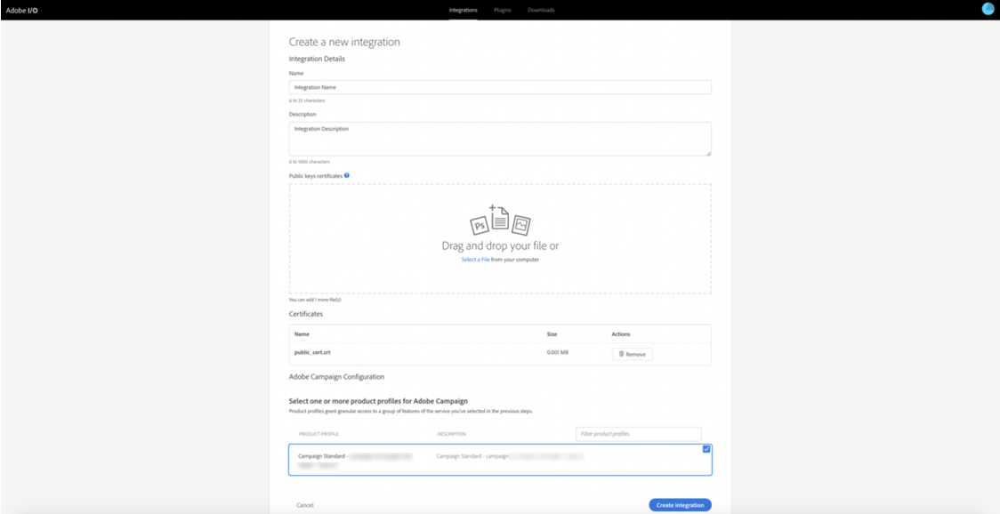

# 为Microsoft Dynamics 365集成配置Adobe IO

激活跨渠道通信的CRM数据：了解在后置备过程中需要执行的步骤，以创建Microsoft Dynamics 365的新集成。

## 概述

Adobe Campaign标准- Microsoft Dynamics 365集成在本页中有 [介绍](../../integrating/using/working-with-campaign-standard-and-microsoft-dynamics-365.md)。

在执行本文中的置备后步骤之前，假定您已经进行了置备，并且拥有对贵组织的Campaign Standard实例的管理员访问权限。  如果尚未发生这种情况，您需要与Adobe客户服务部门联系以完成活动配置。

>[!CAUTION]
>
>以下步骤需要由管理员执行。

## 配置

您需要设置API访问并为Unifi配置新集成。

配置在Adobe IO中完成：您需要为Unifi创建新集成，如此视频中所示：

>[!VIDEO](https://video.tv.adobe.com/v/27308)

### 创建新集成

为此，请按照以下步骤操作：

1. 导航到 [Adobe IO控制台](https://console.adobe.io/home#) ，然后从左上角的下拉菜单（请参阅下面的内容）中选择您的Adobe IMS组织ID。

然后，单 **[!UICONTROL New Integration]** 击右上方的。

>[!NOTE]
>
>如果这是贵组织的首次集成，则页 **[!UICONTROL New Integration]** 面的按钮可能位于中心。

1. 选择 **[!UICONTROL Access an API]** 并单击 **[!UICONTROL Continue]**。

1. 从部 _分中选择_ “Adobe Campaign **[!UICONTROL Experience Cloud]** ”，然后单击 **[!UICONTROL Continue]**。

1. 生成证书和密钥。

**对于MacOs和Linux平台**

打开终端应用程序并执行以下命令：

```
openssl req -x509 -sha256 -nodes -days 365 -newkey rsa:2048 -keyout private.key -out certificate_pub.crt
```

**对于Windows平台**

* 下载openssl客户端以生成公共证书(例如， [Openssl windows客户端](https://bintray.com/vszakats/generic/download_file?file_path=openssl-1.1.1-win64-mingw.zip))

* 从zip文件解压缩文件夹

* 打开命令行提示并执行以下命令。

将以 `<containing folder path>` 下内容替换为解压文件夹的路径(例如，C:\Users\labuser\Downloads\openssl-1.1.1-win64-mingw\openssl-1.1.1-win64-mingw):

```
set OPENSSL_CONF=<containing folder path>/openssl.cnf
 
cd <containing folder path>/
 
openssl req -x509 -sha256 -nodes -days 365 -newkey rsa:2048 -keyout private.key -out certificate_pub.crt
```

**适用于所有平台**

按照提示完成证书请求：

```
Generating a 2048 bit RSA private key
 
.................+++
 
.......................................+++
 
writing new private key to 'private.key'
 
-----
 
You are about to be asked to enter information that will be incorporated
 
into your certificate request.
 
What you are about to enter is what is called a Distinguished Name or a DN.
 
There are quite a few fields but you can leave some blank
 
For some fields there will be a default value,
 
If you enter '.', the field will be left blank.
 
-----
```

输入信息后，将生成两个文件： **[!UICONTROL certificate_pub.crt]** 和 **[!UICONTROL private.key]**。

* **[!UICONTROL certificate_pub.crt]** 将于365天后过期。 您可以通过更改上述openssl命令中的天数值来修改过期时间，但定期旋转凭据是一个不错的安全实践。

* **[!UICONTROL certificate_pub.crt]** 将用在下一个屏幕中，以完成Adobe I/O控制台中的集成。

>[!NOTE]
>
> **[!UICONTROL private.key]** 将在Unifi的后置备步骤中稍后使用。

1. 返回Adobe I/O控制台，然后输入集成的名称和说明。

1. 上传 **[!UICONTROL certificate_pub.crt]**

1. 选择标题中包含的产品用户档案:

* 您的活动实例的组织ID
* **[!UICONTROL Administrators]**

示例： Campaign Standard-您的活动-组织ID —— 管理员

单击 **[!UICONTROL Create Integration]**。



### 设置集成详细信息

1. Select **[!UICONTROL Continue to Integration Details]**

查看集成详细信息。  在运行Unifi后置备步骤时，您需要返回给他们。


1. 单击选项卡 **[!UICONTROL Services]** 并添加和 **[!UICONTROL I/O Events]** 服 **[!UICONTROL I/O Management API]** 务。  要添加服务，请单击单选按钮，然后单击 **[!UICONTROL Add service]**。  您将为每项服务单独执行此操作。

完成后，您的服务应像下图所示显示在最上方。 您无需在生成JWT和访问令牌时完成章节a-on。


活动中的帖子配置现已完成。  继续完成Microsoft [Dynamics 365的发布设置步骤](../../integrating/using/configure-microsoft-dynamics-365-for-campaign-integration.md)。

**相关主题**

* [Adobe IO —— 服务帐户集成](https://www.adobe.io/authentication/auth-methods.html#!AdobeDocs/adobeio-auth/master/AuthenticationOverview/ServiceAccountIntegration.md)
* [Campaign Standard- API访问设置](https://docs.campaign.adobe.com/doc/standard/en/api/ACS_API.html#setting-up-api-access)
* [Campaign Standard- Dynamics 365集成](../../integrating/using/configure-microsoft-dynamics-365-for-campaign-integration.md)
