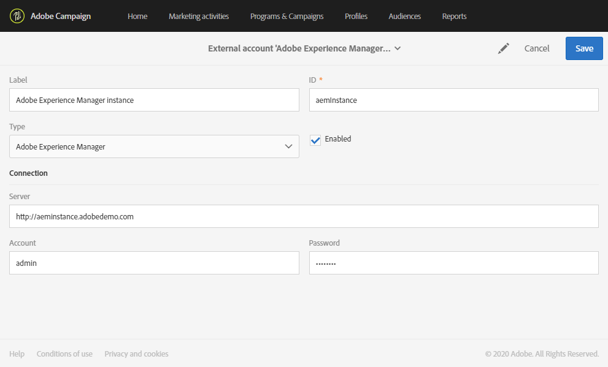

# 配置Campaign-Experience manager集成 {#configuration-aem}

Adobe Campaign standard与Adobe Experience manager之间的这一集成允许您在Adobe Campaign电子邮件中使用Adobe Experience manager中创建的内容。

通过此用例，您将学习如何在Adobe Experience Manager中创建和管理电子邮件内容，然后将这些内容导入Adobe Campaign Standard中，以将其用于您的营销活动。

## 先决条件 {#prerequisites}

您应该事先确保具有以下元素：

* Adobe Experience Manager创作实 **例**
* Adobe Experience Manager发布实 **例**
* Adobe Campaign实例

## Adobe Campaign standard中的配置 {#config-acs}

要同时使用这两个解决方案，您必须将它们配置为彼此连接。
要配置Adobe Campaign，请执行以下操作：

1. 您首先需要在> **[!UICONTROL Adobe Experience Manager instance]** >下配置外部帐户 **[!UICONTROL Administration]****[!UICONTROL Application settings]****[!UICONTROL External accounts menu]**。

1. 使用您的 **[!UICONTROL Server]** URL配置Adobe Experience Manager类型外部帐 **[!UICONTROL Account]** 户 **[!UICONTROL Password]**。

   

1. 检查选 **[!UICONTROL AEMResourceTypeFilter]** 项是否已正确配置。 访问> **[!UICONTROL Options]** >菜单 **[!UICONTROL Administration]** 下 **[!UICONTROL Application settings]** 的菜 **[!UICONTROL Options]** 单。

1. 在字段 **[!UICONTROL Value (text)]** 中，检查以下语法是否正确：

   ```
   mcm/campaign/components/newsletter,mcm/campaign/components/campaign_newsletterpage,mcm/neolane/components/newsletter
   ```

   

1. 然后，在> **[!UICONTROL Resources]** >下的高级菜单 **[!UICONTROL Templates]****[!UICONTROL Delivery templates]**&#x200B;中，复制一个现有模板以创建特定于Adobe Experience Manager的电子邮件模板。

   

1. 单击该 **[!UICONTROL Edit properties]** 图标。

   

1. 在下拉 **[!UICONTROL Content]** 框中，选择字 **[!UICONTROL Adobe Experience Manager]** 段，然 **[!UICONTROL Content source]** 后在中选择之前创建的外部帐户 **[!UICONTROL Adobe Experience Manager account]**。

您现在需要在Adobe Experience manager中配置集成。

## Adobe Experience Manager中的配置 {#config-aem}

要使用Adobe Campaign Standard配置Adobe Experience Manager，您必须执行以下步骤：

1. 您首先需要在Adobe Experience manager创作和发布实例之间配置复制。 请参阅此 [部分](https://docs.adobe.com/content/help/en/experience-manager-65/administering/integration/campaignstandard.html#configuring-adobe-experience-manager)。

1. 然后，通过配置专用的Adobe Experience manager与Adobe Campaign连接 **[!UICONTROL Cloud Service]**。 请参阅此 [部分](https://docs.adobe.com/content/help/en/experience-manager-65/administering/integration/campaignstandard.html#connecting-aem-to-adobe-campaign)。

1. 现在，您需要在创作实例的Adobe Experience manager中配置externalizer。 请参阅此 [部分](https://docs.adobe.com/content/help/en/experience-manager-65/administering/integration/campaignstandard.html#configuring-the-externalizer)。

