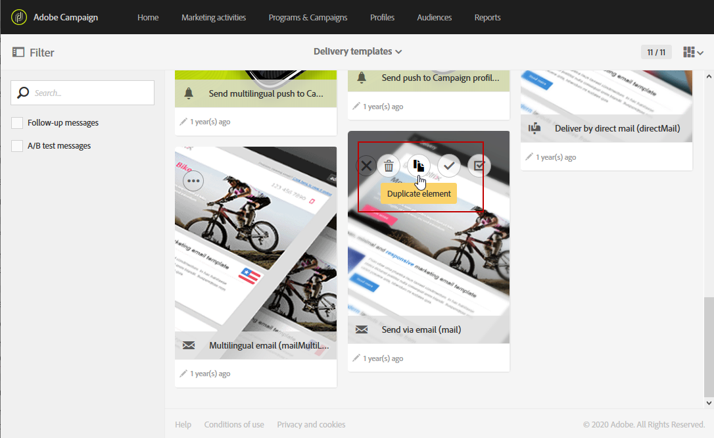

# 配置 Campaign-Experience Manager 集成 {#configuration-aem}

Adobe Campaign Standard与Adobe Experience Manager之间的这种集成允许您在Adobe Campaign电子邮件中使用在Adobe Experience Manager中创建的内容。

通过此用例，您将了解如何在Adobe Experience Manager中创建和管理电子邮件内容，然后通过将内容导入到Adobe Campaign Standard中，将其用于营销活动。

## 先决条件 {#prerequisites}

您应确保预先具备以下元素：

* Adobe Experience Manager **创作**&#x200B;实例
* Adobe Experience Manager **发布**&#x200B;实例
* Adobe Campaign实例

## Adobe Campaign Standard中的配置 {#config-acs}

要同时使用这两种解决方案，必须将其配置为相互连接。
要配置Adobe Campaign，请执行以下操作：

1. 您首先需要在&#x200B;**[!UICONTROL Administration]** > **[!UICONTROL Application settings]** > **[!UICONTROL External accounts menu]**&#x200B;下配置&#x200B;**[!UICONTROL Adobe Experience Manager instance]**&#x200B;外部帐户。

1. 使用您的&#x200B;**[!UICONTROL Server]** URL **[!UICONTROL Account]**&#x200B;和&#x200B;**[!UICONTROL Password]**&#x200B;配置Adobe Experience Manager类型外部帐户。

   

1. 检查是否已正确配置&#x200B;**[!UICONTROL AEMResourceTypeFilter]**&#x200B;选项。 访问&#x200B;**[!UICONTROL Administration]** > **[!UICONTROL Application settings]** > **[!UICONTROL Options]**&#x200B;菜单下的&#x200B;**[!UICONTROL Options]**&#x200B;菜单。

1. 在&#x200B;**[!UICONTROL Value (text)]**&#x200B;字段中，检查以下语法是否正确：

   ```
   mcm/campaign/components/newsletter,mcm/campaign/components/campaign_newsletterpage,mcm/neolane/components/newsletter
   ```

   

1. 然后，在&#x200B;**[!UICONTROL Resources]** > **[!UICONTROL Templates]** > **[!UICONTROL Delivery templates]**&#x200B;下的高级菜单中，复制其中一个现有模板以创建特定于Adobe Experience Manager的电子邮件模板。

   

1. 单击&#x200B;**[!UICONTROL Edit properties]**&#x200B;图标。

   

1. 在&#x200B;**[!UICONTROL Content]**&#x200B;下拉列表的&#x200B;**[!UICONTROL Content source]**&#x200B;字段中选择&#x200B;**[!UICONTROL Adobe Experience Manager]**，然后在&#x200B;**[!UICONTROL Adobe Experience Manager account]**&#x200B;中选择您之前创建的外部帐户。

您现在需要在Adobe Experience Manager中配置集成。

## Adobe Experience Manager中的配置 {#config-aem}

要使用Adobe Campaign Standard配置Adobe Experience Manager，您必须执行以下步骤：

1. 您首先需要配置Adobe Experience Manager创作实例和发布实例之间的复制。 请参阅此[章节](https://experienceleague.adobe.com/docs/experience-manager-65/administering/integration/campaignstandard.html?lang=zh-Hans#configuring-adobe-experience-manager)。

1. 然后，通过配置专用的&#x200B;**[!UICONTROL Cloud Service]**&#x200B;将Adobe Experience Manager连接到Adobe Campaign。 请参阅此[章节](https://experienceleague.adobe.com/docs/experience-manager-65/administering/integration/campaignstandard.html?lang=zh-Hans#connecting-aem-to-adobe-campaign)。

1. 您现在需要在创作实例上配置Adobe Experience Manager中的外部化器。 请参阅此[章节](https://experienceleague.adobe.com/docs/experience-manager-65/administering/integration/campaignstandard.html?lang=zh-Hans#configuring-the-externalizer)。
