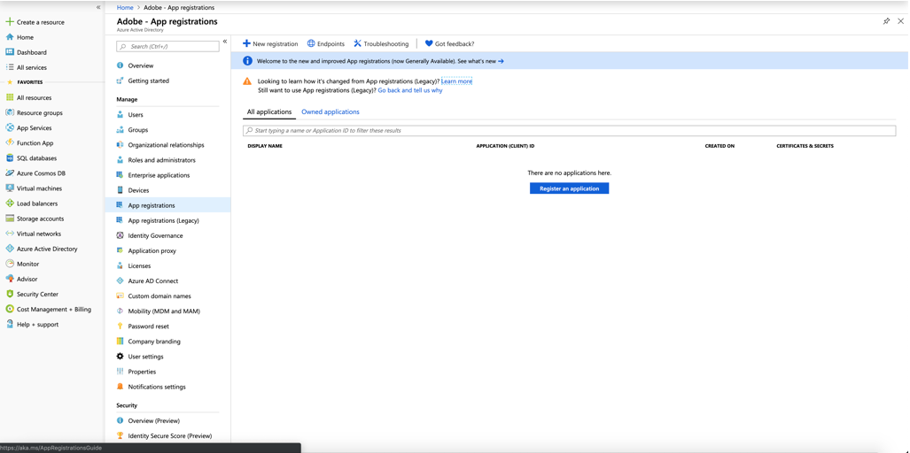

# 配置Microsoft Dynamics 365以实现活动集成

了解如何配置Microsoft Dynamics 365集成，并激活与Adobe Campaign标准进行跨渠道通信的CRM数据。

## 概述

Adobe Campaign标准- Microsoft Dynamics 365集成在本页中有 [介绍](../../integrating/using/working-with-campaign-standard-and-microsoft-dynamics-365.md)。

需要为此集成配置三个系统：

1. Adobe Campaign标准版——了 [解更多](../../integrating/using/configure-adobe-io-for-ms-dynamic.md)
1. Microsoft Dynamics 365 for Sales —— 描述如下
1. Unifi —— 了解 [更多信息](../../integrating/using/configure-unifi-for-microsoft-dynamics-365-integration.md)

配置后，这些系统需要由管理员进行配置。

本文重点介绍在Microsoft Dynamics 365端，在后置备过程中需要执行的步骤，以使客户能够使用Adobe Campaign标准- Microsoft Dynamics 365集成。

## 先决条件

在执行本文档中的置备后步骤之前，假定您已经配置并有权访问贵组织的Microsoft Dynamics 365实例。  如果尚未发生这种情况，您需要与Microsoft客户支持联系以完成Dynamics 365配置。

## 设置应用程序和权限

OAuth访问令牌允许Unifi通过Web API与您的Microsoft Dynamics 365实例进行身份验证，以便将Campaign Standard体验事件发布到Microsoft Dynamics 365界面的时间轴视图。

以下视频概述了主要步骤：

>[!VIDEO](https://video.tv.adobe.com/v/27637)

要生成OAuth访问令牌，请按照以下步骤操作。

### 注册新应用程序

1. 在管理员登录下，登录portal.azure.com。

1. 单击左 **[!UICONTROL Azure Active Directory]** 侧菜单中的图标；然后，单 **[!UICONTROL App registrations]** 击显示的子菜单。

1. 单 **[!UICONTROL New registration]** 击屏幕顶部。

   

1. 填写应用程序注册屏幕：

   * 名称：adobe活动
   * 支持的帐户类型： **[!UICONTROL Accounts in this organizational directory only]** （默认值）

有关创建新应用程序的详细信息，请参阅 [本节](https://docs.microsoft.com/en-us/azure/active-directory/develop/quickstart-register-app)。

>[!NOTE]
>
>Azure AD会为您的应用程序分配唯一的应用程序（客户端）ID。 以后在配置Dynamics 365时以及执行Unifi Post Provisioning步骤时，您需要此ID。

### 生成客户端机密

1. 在应用程序概述屏幕左侧的子菜单中，单击 **[!UICONTROL Certificates and Secrets > New client secret]**

   

1. 输入说明，设置持续时间并单击 **[!UICONTROL OK]**。

您的客户机密现已创建。  保留完成Unifi后置备步骤的值。

>[!CAUTION]
>
>根据需要保留此值以完成Unifi后置备步骤。 之后无法检索它。

有关生成客户端机密的详细信息，请参阅此部分。

### 设置权限

1. 在此屏幕或应用程序概述屏幕中，单 **[!UICONTROL API permissions]** 击左侧子菜单中的。  单击 **[!UICONTROL Add a permission]**&#x200B;后，您需要在菜 **[!UICONTROL Dynamics CRM]** 单中进行选择。

   

1. 然后，选中该框 **[!UICONTROL user_impersonation]**&#x200B;并单击按 **[!UICONTROL Add permissions]** 钮。

   

有关权限设置的详细信息，请参阅 [此部分](https://docs.microsoft.com/en-us/azure/active-directory/develop/quickstart-configure-app-access-web-apis#add-permissions-to-access-web-apis)。

### 创建应用程序用户

此新用户是通用用户。 应用程序将使用它：使用API对Microsoft Dynamics 365进行的任何更改将由此用户完成。 要创建它，请按照以下步骤操作：

1. 导航到您的Dynamics 365实例，然后以管理员身份登录。

1. 单击右上角的齿轮图标，然后单击 **[!UICONTROL Advanced Settings]**。 在顶部横幅中，单击旁边的下拉 **[!UICONTROL Settings]**&#x200B;框，单击 **[!UICONTROL Security > Users]**。

1. 单击下拉菜单转到 **[!UICONTROL Application Users]**。 单击 **[!UICONTROL New]**.

1. 确保用户图标旁边的下拉菜单 **[!UICONTROL USER:APPLICATION USER]**。

   为新用户填写屏幕。  参数建议：

   * **[!UICONTROL User Name]** （电子邮件）:adobeapi@`<hostname>`，其中 `<hostname>` 是Dynamics 365实例的主机名
   * **[!UICONTROL Application ID]**:您在Azure AD中注册的应用程序的ID（此为必需）
   * 您可以留空并且 **[!UICONTROL Application ID URI]****[!UICONTROL Azure AD Object ID]**
   * **[!UICONTROL Full Name]**:Adobe API
   * **[!UICONTROL Email]**:与(或管 **[!UICONTROL User Name]** 理员的电子邮件（如果您愿意）相同
   有关应用程序用户创建的详细信息，请参阅 [此部分](https://docs.microsoft.com/en-gb/power-platform/admin/create-users-assign-online-security-roles#create-an-application-user)。

1. 单击用户图标并上传Adobe Campaign图标；这是当Dynamics 365中显示新的Adobe视图时，将在时间轴事件中显示的图标。

<!-- ***getfile*** adobe campaign logo-->

1. 单击顶部功能区，打开用 **[!UICONTROL MANAGE ROLES]** 户角色列表。

1. 向下滚动并选择 **[!UICONTROL System administrator]** 此用户的访问权限。

1. 单击 **[!UICONTROL OK]**.

### 获取租户ID

按照以下链接中的说明查找您的租户ID。  在Unifi中进行后置备期间，您将需要此ID: [https://docs.microsoft.com/en-us/onedrive/find-your-office-365-tenant-id](https://docs.microsoft.com/en-us/onedrive/find-your-office-365-tenant-id)。

## 安装Microsoft Dynamics 365的Campaign Standard

要将Dynamics 365应用程序集成到您的Campaign Standard环境，请执行以下步骤：

1. 导航到以下链接：https://appsource.microsoft.com/en-us/marketplace/apps  在搜索 _栏中搜索Dynamics 365_ 的Adobe Campaign。
或者，您也可以导航到此链 [接](https://appsource.microsoft.com/en-us/product/dynamics-365/adobecampaign.re4snj-a4n7-5t6y-a14br-d5d1b?flightCodes=adobesignhide&tab=Overview)。
1. 按照说明为Dynamics 365实例安装应用程序。
1. 安装后，导航到Dynamics 365实例，以管理员身份登录。
1. 单击右上角的齿轮图标，然后单击 **[!UICONTROL Advanced Settings]**。 在顶部横幅中，单击旁边的下拉框 **[!UICONTROL Settings]**，单击下 **[!UICONTROL Processes]** 面的 **[!UICONTROL Process Center]**。
1. 搜索 **[!UICONTROL Adobe Campaign Email Bounce]** 任务并单击它。
1. 在选项 **[!UICONTROL Administration]** 卡上，将所有者更改为之前创建的Adobe API应用程序用户，方法是从顶部功能区中单击，然后选择 **[!UICONTROL Actions]** 选项，从下拉列 **[!UICONTROL Assign to another User]****[!UICONTROL Adobe API application user]** 表中选择以分配。
1. 重新激活该过程。
1. 为任务做同样的事情。 **[!UICONTROL Adobe Campaign Email Click]**

>[!NOTE]
>
>如果您希望随时取消激活这些进程，可以在此屏幕中取消激 **[!UICONTROL Processes]** 活。

完成此配置后，您可以设置Unifi配置。 For more on this, refer to this [page](../../integrating/using/working-with-campaign-standard-and-microsoft-dynamics-365.md).

**相关主题**

* [Campaign Standard- Microsoft Dynamics 365集成](../../integrating/using/working-with-campaign-standard-and-microsoft-dynamics-365.md)
* [为Microsoft Dynamics 365集成配置Adobe IO](../../integrating/using/configure-adobe-io-for-ms-dynamic.md)
* [为活动配置Unifi - Microsoft Dynamics 365集成](../../integrating/using/configure-unifi-for-microsoft-dynamics-365-integration.md)
