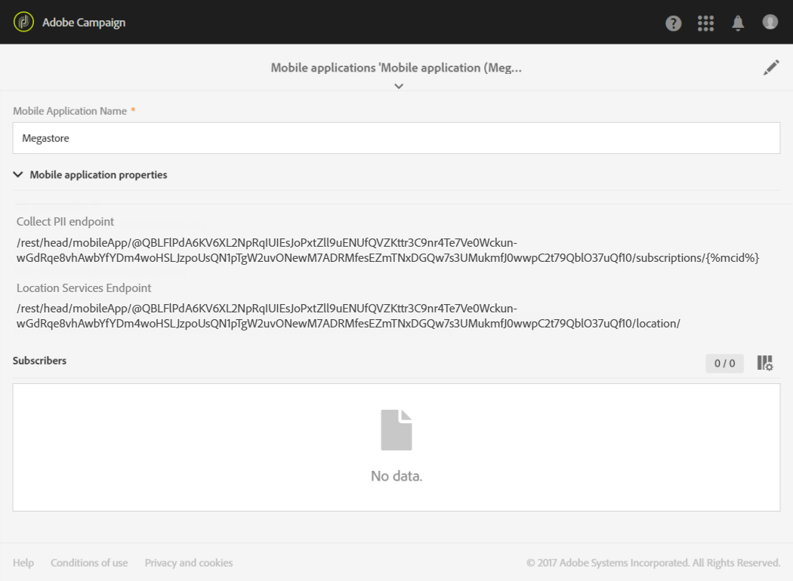

# 配置 Campaign-兴趣点数据集成{#configuring-campaign-points-of-interest-data-integration}

## 配置Campaign — 兴趣点数据与Adobe Experience Platform SDK的集成 {#configuring-campaign-poi-aep-sdk}

>[!NOTE]
>
>您的移动应用程序应已使用Adobe Experience Platform SDK在Adobe Campaign Standard中进行配置。 有关详细步骤，请参阅此[页面](https://helpx.adobe.com/cn/campaign/kb/configuring-app-sdk.html)。

用于收集位置数据的移动设备应用程序必须由&#x200B;**管理员**&#x200B;在Adobe Campaign界面中配置。

要将Adobe Experience Platform位置服务与配置了Adobe Experience Platform SDK的移动应用程序结合使用，您需要：

1. 在数据收集UI中将&#x200B;**[!UICONTROL Places]**&#x200B;扩展添加到您的移动应用程序配置中。 在Adobe Campaign中设置您的移动应用程序。 请参阅[安装Places扩展](https://developer.adobe.com/client-sdks/solution/places)。

1. 设置扩展后，在数据收集UI中创建数据元素，以从这些扩展检索数据。 请参阅此[页面](https://helpx.adobe.com/campaign/kb/config-app-in-launch.html#Step1Createdataelements)以创建您的数据元素。

1. 然后，在数据收集UI中，您需要创建规则以支持兴趣点和Adobe Campaign之间的移动用例。\
   此规则将在用户输入受地理围栏的&#x200B;**[!UICONTROL Point of Interest]**&#x200B;时触发。 请参阅此[页面](https://helpx.adobe.com/campaign/kb/config-app-in-launch.html#Locationpostback)以创建您的规则。

1. 在地标中定义您的&#x200B;**[!UICONTROL Points of Interest]**。 请参阅[创建目标点](https://experienceleague.adobe.com/docs/places/using/poi-mgmt-ui/create-a-poi-ui.html?lang=zh-Hans)。

1. 确保在Adobe Campaign中访问移动设备应用程序和收集的位置数据。 请参阅[访问用于收集位置数据的移动应用](#accessing-mobile-apps-used-to-collect-location-data)和[访问收集的位置数据](#accessing-collected-location-data)。

## 使用SDK V4配置Campaign — 兴趣点数据集成 {#configuring-campaign-poi-sdkv4}

用于收集位置数据的移动设备应用程序必须由&#x200B;**管理员**&#x200B;在Adobe Campaign界面中配置。

要在配置了SDK V4的移动应用程序中使用Point of Interest数据功能，您需要：

1. 有权访问适用于移动设备的Adobe Analytics。 有关更多信息，请查看您的许可协议或联系您的Adobe客户经理。
1. 在Adobe Campaign中设置您的移动应用程序。 请参阅[在Campaign](#setting-up-a-mobile-app-in-campaign)中设置移动应用。
1. 在Adobe Mobile Services界面中设置您的移动应用程序。 这样，您就可以确保Adobe Mobile Services收集的数据被发送到Adobe Campaign。 请参阅[在Adobe Mobile Services中配置移动应用程序](#configuring-a-mobile-app-in-adobe-mobile-services)。
1. 执行移动设备应用程序的特定设置：

   * 将从Adobe Mobile Services界面下载的配置文件打包到Mobile应用程序。
   * 将Experience Cloud Mobile SDK集成到您的移动应用程序中。 请参阅[将SDK集成到移动应用程序](#integrating-the-sdk-into-a-mobile-application)。

1. 在Adobe Mobile Services界面中定义目标点。 请参阅[在Adobe Mobile Services中定义目标点](#defining-points-of-interest-in-adobe-mobile-services)。
1. 定义要从移动应用程序的订阅者那里收集的数据。 请参阅[收集订阅者的兴趣点数据](#collecting-subscribers--points-of-interest-data)。
1. 确保在Adobe Campaign中访问移动设备应用程序和收集的位置数据。 请参阅[访问用于收集位置数据的移动应用](#accessing-mobile-apps-used-to-collect-location-data)和[访问收集的位置数据](#accessing-collected-location-data)。

### 使用SDK V4在Adobe Campaign中设置移动应用程序 {#setting-up-a-mobile-app-in-campaign}

要使用Adobe Campaign收集兴趣点数据，您必须配置Adobe Campaign将从中接收数据的移动应用程序。

1. 单击左上角的&#x200B;**Adobe**&#x200B;徽标，然后选择&#x200B;**[!UICONTROL Administration]** > **[!UICONTROL Channels]** > **[!UICONTROL Mobile app]**。
1. 单击&#x200B;**[!UICONTROL Create]**&#x200B;设置应用程序。
1. 在&#x200B;**[!UICONTROL Application name]**&#x200B;字段中输入名称，然后单击&#x200B;**[!UICONTROL Create]**。

   请勿填写&#x200B;**[!UICONTROL Device-specific settings]**&#x200B;部分。 这仅适用于配置接收推送通知的应用程序。

在&#x200B;**[!UICONTROL Mobile application properties]**&#x200B;部分中列出了两个URL： **[!UICONTROL Collect PII endpoint]**&#x200B;和&#x200B;**[!UICONTROL Location Services endpoint]**。 它们将在Adobe Mobile Services界面中使用。 请参阅[在Adobe Mobile Services中配置移动应用程序](#configuring-a-mobile-app-in-adobe-mobile-services)。

* **[!UICONTROL Collect PII endpoint]** URL用于在启动时从移动应用程序中收集用户的Experience Cloud ID和注册令牌。 当用户使用电子邮件、名字、姓氏等凭据登录应用程序时，也将收集此数据，并将其用于协调用户的注册令牌与Adobe Campaign配置文件。
* **[!UICONTROL Location Services endpoint]** URL用于收集位置数据，例如用户与目标点的纬度、经度和半径。

您现在可以在Adobe Mobile Services中使用这些值完成配置，如[在Adobe Mobile Services中配置移动应用程序](#configuring-a-mobile-app-in-adobe-mobile-services)部分中所述。



### 在Adobe Mobile Services中配置V4移动应用程序 {#configuring-a-mobile-app-in-adobe-mobile-services}

要将Adobe Mobile Services收集的数据发送到Adobe Campaign，您必须在Mobile Services界面中配置回发。

您将需要可以在Adobe Campaign中设置的移动应用程序参数中找到的特定信息（请参阅[在Campaign中设置移动应用程序](#setting-up-a-mobile-app-in-campaign)）：

* **[!UICONTROL IMS Organization ID]**
* **[!UICONTROL Collect PII Endpoint]**
* **[!UICONTROL Location Services endpoint]**

您必须拥有Adobe Analytics的访问权限才能进行以下配置。 如果您不是Adobe Analytics用户，请联系Adobe Campaign管理员。

1. 登录[mobilemarketing.adobe.com](https://mobilemarketing.adobe.com/)。
1. 创建应用程序或选择现有应用程序。
1. 转到&#x200B;**[!UICONTROL Manage App Settings]**&#x200B;页面。
1. 在&#x200B;**访客ID服务**&#x200B;部分中，选中&#x200B;**启用**&#x200B;并从下拉列表中选择您的组织。 单击&#x200B;**保存**。

   >[!CAUTION]
   >
   >此组织必须与您在Adobe Campaign实例中使用的组织相同。

1. 单击 **[!UICONTROL Manage Postbacks]**。
1. 创建回发。

   * 选择&#x200B;**[!UICONTROL PII]**&#x200B;作为&#x200B;**[!UICONTROL Postback Type]**。
   * 在&#x200B;**[!UICONTROL URL]**&#x200B;字段中，从您在Adobe Campaign界面中配置的移动应用程序中复制&#x200B;**[!UICONTROL Collect PII Endpoint]** URL，该URL前面带有服务器名称。 请参阅[在Campaign](#setting-up-a-mobile-app-in-campaign)中设置移动应用。
   * 按如下方式填写&#x200B;**[!UICONTROL Post Body]**&#x200B;字段：

     对于iOS：

     ```
     {
     "userKey": "{userKey}",
     "pushPlatform":"apns",
     "marketingCloudId":"",
     "cusEmail":"{email}",
     "cusFirstName":"{firstName}",
     "cusLastName":"{lastName}"
     }
     ```

     对于Android：

     ```
     {
     "userKey": "{userKey}",
     "pushPlatform":"gcm",
     "marketingCloudId":"",
     "cusEmail":"{email}",
     "cusFirstName":"{firstName}",
     "cusLastName":"{lastName}"
     }
     ```

   * 将&#x200B;**内容类型**&#x200B;设置为&#x200B;**[!UICONTROL application/json]**。
   * 在&#x200B;**中，哪些数据标记会触发回发？**，选择任何事件，通常为&#x200B;**[!UICONTROL Launched]**&#x200B;和&#x200B;**[!UICONTROL exists]**。
   * 单击 **[!UICONTROL Save & Activate]**。

1. 创建第二个回发。

   * 选择&#x200B;**[!UICONTROL Postback]**&#x200B;作为&#x200B;**[!UICONTROL Postback Type]**。
   * 在&#x200B;**[!UICONTROL URL]**&#x200B;字段中，从您在Adobe Campaign界面中配置的移动应用程序中复制&#x200B;**[!UICONTROL Location Services Endpoint]** URL，该URL前面带有服务器名称。 请参阅[在Campaign](#setting-up-a-mobile-app-in-campaign)中设置移动应用。
   * 按如下方式填写&#x200B;**[!UICONTROL Post Body]**&#x200B;字段：

     ```
     {
     "locationData":{
     "distances":"{a.loc.dist}",
     "poiLabel":"{a.loc.poi}",
     "latitude.a":"{a.loc.lat.a}",
     "latitude.b":"{a.loc.lat.b}",
     "latitude.c":"{a.loc.lat.c}",
     "longitude.a":"{a.loc.lon.a}",
     "longitude.b":"{a.loc.lon.b}",
     "longitude.c":"{a.loc.lon.c}",
     "appId":"{a.appid}",
     "marketingCloudId":"{mid}"
     }
     }
     ```

   * 将&#x200B;**内容类型**&#x200B;设置为&#x200B;**[!UICONTROL application/json]**。
   * 在&#x200B;**中，哪些数据标记会触发回发？**，选择&#x200B;**[!UICONTROL campaign.test]**&#x200B;和&#x200B;**[!UICONTROL exists]**。
   * 单击 **[!UICONTROL Save & Activate]**。

>[!NOTE]
>
>有关配置回发的详细信息，请参阅[Adobe Mobile Services文档](https://experienceleague.adobe.com/docs/mobile-services/using/manage-app-settings-ug/configuring-app/signals.html?lang=zh-Hans)。

### 将SDK集成到移动应用程序中 {#integrating-the-sdk-into-a-mobile-application}

移动核心服务的软件开发工具包(SDK)有助于将移动应用程序集成到Adobe Campaign中。

此[页](https://helpx.adobe.com/cn/campaign/kb/configuring-app-sdkv4.html)中介绍了此步骤。

### 在Adobe Mobile Services中定义目标点 {#defining-points-of-interest-in-adobe-mobile-services}

要定义用于收集位置数据的目标点，请执行以下操作：

1. 转到Adobe Mobile Services界面。
1. 添加您的应用程序。

   有关在Mobile Services中管理应用程序的更多信息，请参阅[Adobe Mobile Services文档](https://experienceleague.adobe.com/docs/mobile-services/using/manage-apps-ug/t-new-app.html?lang=zh-Hans)。

1. 定义目标点。

   有关管理目标点的详细信息，请参阅[Adobe Mobile Services文档](https://experienceleague.adobe.com/docs/mobile-services/using/location-ug/t-manage-points.html?lang=zh-Hans)。

### 收集订阅者的兴趣点数据 {#collecting-subscribers--points-of-interest-data}

使用特定的自定义资源，您可以定义要从应用程序的订阅者那里收集的数据。

使用SDK V4[配置移动应用程序页面中的](https://helpx.adobe.com/cn/campaign/kb/configuring-app-sdkv4.html)介绍了此步骤。

## 访问用于收集位置数据的移动应用程序 {#accessing-mobile-apps-used-to-collect-location-data}

要在Adobe Campaign中访问已成功创建的应用程序，请执行以下操作：

1. 单击左上角的&#x200B;**Adobe**&#x200B;徽标。
1. 根据SDK选择&#x200B;**[!UICONTROL Administration]** > **[!UICONTROL Channels]** > **[!UICONTROL Mobile app (SDK v4)]**&#x200B;或&#x200B;**[!UICONTROL Mobile app (AEP SDK)]**。
1. 从列表中选择移动应用程序以显示其属性。

   

应用程序订阅者的列表也会显示在&#x200B;**[!UICONTROL Mobile application subscribers]**&#x200B;选项卡中。 订阅者是指在其移动设备上安装了应用程序的所有用户。 Adobe Campaign数据库用户档案使用注册令牌进行标识。

## 访问收集的位置数据 {#accessing-collected-location-data}

完成设置后，收集的目标点数据将列在每个配置文件的&#x200B;**[!UICONTROL Places]**&#x200B;选项卡中。 要访问列表，请执行以下操作：

1. 选择配置文件。
1. 单击右侧的&#x200B;**[!UICONTROL Edit profile properties]**&#x200B;按钮。
1. 选择 **[!UICONTROL Places]** 选项卡。

   

将列出为当前配置文件收集的目标点数据。 位置数据会在Adobe Campaign数据库中存储六个月。

有关访问和编辑用户档案的详细信息，请参阅[用户档案](../../audiences/using/about-profiles.md)。
