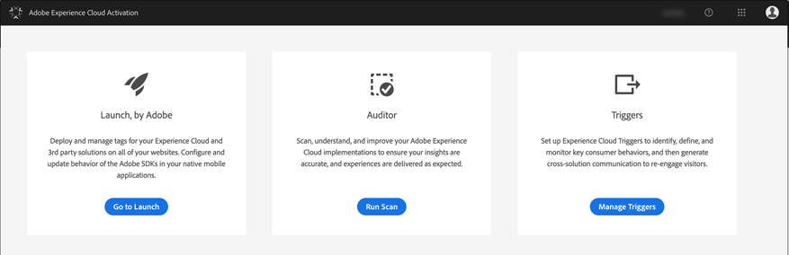
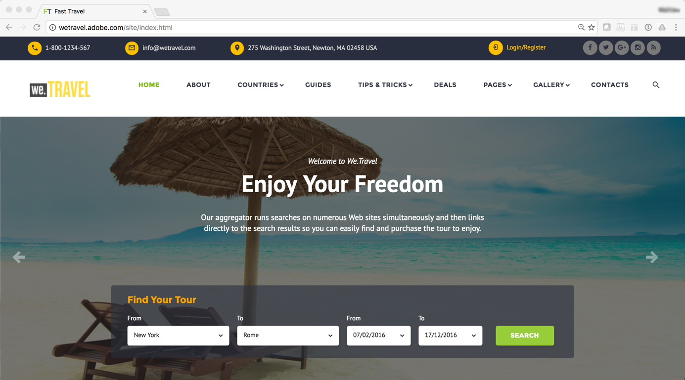

# 在 Experience Cloud 中配置触发器{#configuring-triggers-in-experience-cloud}

## 激活功能 {#activating-the-functionality}

必须在Adobe Campaign中通过Adobe激活该功能。 请联系您的Adobe客户经理或专业服务合作伙伴。

Adobe团队需要以下信息才能激活触发器：

* Marketing Cloud公司名称
* 组织 ID
* Analytics登录公司(可以与Marketing Cloud公司名称相同)

## 配置解决方案和服务 {#configuring-solutions-and-services}

要使用此功能，您需要有权访问以下解决方案/核心服务：

* Adobe Campaign
* Adobe Analytics Ultimate、Premium、Foundation、OD、Select、Prime、Mobile Apps、Select 或 Standard。
* Experience Cloud Triggers Core Service

   

* Experience Cloud DTM Core Service

   

* Experience Cloud Visitor ID 和 Experience Cloud People Core Service

   

您还需要拥有可用的网站。

>[!CAUTION]
>
>子域配置是一个可投放性关键元素。 确保Adobe Campaign电子邮件是从与网站使用的域相同的域发送的。

您需要配置 [Experience CloudDTM核心服务](#configuring-experience-cloud-dtm-core-service)， [Experience Cloud人员核心服务](#configuring-experience-cloud-people-core-service) 和 [Campaign](#configuring-triggers-and-aliases-in-campaign) 以运行这些用例。

### 配置Experience CloudDTM核心服务 {#configuring-experience-cloud-dtm-core-service}

1. 在Experience CloudDTM核心服务(Dynamic Tag Management)中，激活网站页面的Experience CloudID和Adobe Analytics。

   

1. 网站、Adobe Analytics和Adobe Campaign之间的ID协调需要使用别名。 创建别名，例如“visitorid”。

   

### 配置Experience Cloud人员核心服务 {#configuring-experience-cloud-people-core-service}

以前在DTM中引用的别名需要通过客户属性在Experience Cloud人员核心服务中创建。 确保创建新别名，并在集成代码（例如“visitorid”）中引用相同的DTM别名。

>[!NOTE]
>
>我们将在Adobe Campaign的数据源中使用此客户属性（下一步）。

### 在Campaign中配置触发器和别名 {#configuring-triggers-and-aliases-in-campaign}

1. 确保您拥有 **[!UICONTROL Experience Cloud triggers]** 在您的Adobe Campaign Standard实例上可见。 如果不能，请联系Adobe Campaign管理员。

   

1. 别名使Analytics中的联系人能够与Campaign中的用户档案进行协调。 您需要将Experience CloudID服务中定义的别名与Campaign中的共享数据源匹配。 Adobe Campaign您需要通过数据源( **[!UICONTROL Administration]** > **[!UICONTROL Application Settings]** > **[!UICONTROL Shared Data Sources]** )。 确保在 **[!UICONTROL Data Source/Alias]** 下拉菜单，该菜单与在上一步中创建的同一客户属性数据源映射。

   

   >[!NOTE]
   >
   >您可以协调匿名用户和登录用户的触发器。 对于匿名用户，该用户档案应存在于Adobe Campaign中，并且以前曾向用户发送过电子邮件。 为此，只需配置访客ID即可。 但是，如果要协调登录用户的触发器，则需要设置声明的ID数据源。 有关更多信息，请参阅 [数据源配置](../../integrating/using/integration-with-audience-manager-or-people-core-service.md#step-2--configure-the-data-sources).

## 在Experience Cloud界面中创建触发器 {#creating-a-trigger-in-the-experience-cloud-interface}

需要创建一个Adobe Experience Cloud触发器，以便您可以在Campaign中使用它。

在Experience Cloud中创建一个新触发器，并确保选择您网站上使用的报表包。 确保选择正确的维度，以便触发程序。

请参阅 [Adobe Experience Cloud文档](https://experienceleague.adobe.com/docs/core-services/interface/activation/triggers.html) 看这个 [视频](https://helpx.adobe.com/cn/marketing-cloud/how-to/email-marketing.html#step-two).

## 触发器最佳实践和限制 {#triggers-best-practices-and-limitations}

以下是使用Campaign — 触发器集成的最佳实践和限制列表：

* 如果您有多个Campaign Standard实例，则所有实例都可以接收触发器，只要它们位于同一个组织中。 Analytics还需要位于同一组织中。
* 您无法使用两个不同报表包中的事件在“触发器核心服务”中创建触发器。
* 触发器基于事务性消息。 事务型消息用于必须快速发送消息的任何时候。 您不能先将事务性消息排入队列，然后再批量循环这些消息。
* 触发器的本质不是确定性的。 触发器生成后，它会发送与Cookie关联的所有别名，因此如果存在零售亭、图书馆、网吧或家庭共享设备（夫妻从同一设备登录）中的共享浏览器，则无法映射到正确的ID。 所有用于通过浏览器登录的ID都会发送到Campaign，后者根据首次协调发送消息。 如果有多个“电子邮件ID”符合协调条件，则Campaign不会发送电子邮件。 除非Analytics捕获并发送电子邮件ID，否则Campaign无法知道什么是正确的电子邮件ID。
* 您不能在Campaign中存储有效负载的内容。 触发器不能用于更新用户档案的数据。
* 触发器不支持客户属性（这意味着，只有报表包数据才能用于定义触发器业务规则）。
* Campaign不支持收藏集集合。

>[!CAUTION]
>
>您的网站必须运行在与Adobe Campaign服务器相同的域上。 如果不能，则无法使用访客ID协调并联系匿名访问网站的用户。
