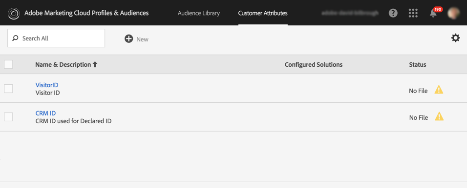

# 在 Experience Cloud 中配置触发器{#configuring-triggers-in-experience-cloud}

## 激活功能{#activating-the-functionality}

该功能必须通过Adobe CampaignAdobe激活。 请联系您的Adobe客户经理或专业服务合作伙伴。

Adobe团队需要以下信息才能激活触发器：

* Marketing Cloud公司名称
* IMS 组织 ID
* Analytics登录公司(可以与Marketing Cloud公司名称相同)

## 配置解决方案和服务{#configuring-solutions-and-services}

要使用此功能，您需要访问以下解决方案／核心服务：

* Adobe Campaign
* Adobe Analytics Ultimate、Premium、Foundation、OD、Select、Prime、Mobile Apps、Select 或 Standard。
* Experience Cloud Triggers Core Service

   

* Experience Cloud DTM Core Service

   

* Experience Cloud Visitor ID 和 Experience Cloud People Core Service

   

您还需要拥有可用的网站。

>[!CAUTION]
>
>子域配置是可交付的关键元素。 确保Adobe Campaign电子邮件与网站使用的域来自同一个域。

您需要配置[Experience CloudDTM核心服务](#configuring-experience-cloud-dtm-core-service)、[Experience Cloud人核心服务](#configuring-experience-cloud-people-core-service)和[活动](#configuring-triggers-and-aliases-in-campaign)以运行这些用例。

### 配置Experience CloudDTM核心服务{#configuring-experience-cloud-dtm-core-service}

1. 在Experience CloudDTM核心服务（动态标签管理）中，为您的网站页面激活Experience CloudID和Adobe Analytics。

   

1. 网站、Adobe Analytics和Adobe Campaign之间的ID协调需要使用别名。 创建别名，例如“visitorid”。

   

### 配置Experience Cloud人核心服务{#configuring-experience-cloud-people-core-service}

以前在DTM中引用的别名需要通过Experience Cloud属性在客户核心服务中创建。 确保新建一个并引用集成代码中的同一DTM别名（例如“visitorid”）。

>[!NOTE]
>
>我们将在Adobe Campaign中的数据源中使用此客户属性（下一步）。

### 在活动{#configuring-triggers-and-aliases-in-campaign}中配置触发器和别名

1. 确保在Adobe Campaign Standard实例上显示&#x200B;**[!UICONTROL Experience Cloud triggers]**。 如果您没有，请与Adobe Campaign管理员联系。

   

1. 别名使Analytics中的联系人能够与活动中的用户档案对帐。 您需要将Experience CloudID服务中定义的别名与活动中的共享数据源匹配。 您需要通过Adobe Campaign源(**[!UICONTROL Administration]** > **[!UICONTROL Application Settings]** > **[!UICONTROL Shared Data Sources]**)配置别名解析。 确保在&#x200B;**[!UICONTROL Data Source/Alias]**&#x200B;下拉菜单中选择正确的数据源，该下拉菜单映射为在上一步中创建的同一客户属性数据源。

   

   >[!NOTE]
   >
   >您可以为匿名用户和登录用户协调触发器。 对于匿名用户，用户档案应存在于Adobe Campaign中，并且以前已向用户发送电子邮件。 对于此，访客ID配置已足够。 但是，如果要协调已登录用户的触发器，则需要设置Declared ID数据源。 有关详细信息，请参阅[数据源配置](../../integrating/using/provisioning-and-configuring-integration-with-audience-manager-or-people-core-service.md#step-2--configure-the-data-sources)。

## 在Experience Cloud接口{#creating-a-trigger-in-the-experience-cloud-interface}中创建触发器

需要创建Adobe Experience Cloud触发器，以便在活动中使用它。

在Experience Cloud中创建新触发器，并确保选择在网站上使用的报表包。 确保选择正确的尺寸，以便触发器。

请参阅[Adobe Experience Cloud文档](https://docs.adobe.com/content/help/zh-Hans/core-services/interface/activation/triggers.html)并观看此[视频](https://helpx.adobe.com/cn/marketing-cloud/how-to/email-marketing.html#step-two)。

## 触发最佳实践和限制{#triggers-best-practices-and-limitations}

以下是使用活动的最佳实践和限制列表-触发器集成：

* 如果您有多个Campaign Standard实例，则只要触发器位于同一IMS组织ID中，所有实例都可以接收它们。 分析还需要使用相同的IMS组织ID。
* 不能使用来自两个不同报表包的事件在触发器核心服务中创建触发器。
* 触发器基于事务性消息。 只要您必须非常快速地发送消息，就会使用事务性消息。 您不能排队事务性消息，然后批量循环。
* 触发器在本质上并非确定性。 当触发器生成时，它会发送与Cookie关联的所有别名，因此，如果在家中的共享浏览器(如零售亭、图书馆、网吧或共享设备（夫妻从同一设备登录），则无法映射到正确的ID。 用于使用浏览器登录的所有ID都发送到活动，该ID根据第一次对帐发送消息。 如果有多个“电子邮件ID”符合对帐条件，则活动不会发送电子邮件。 除非Analytics捕获并发送正确的电子邮件ID，否则活动无法了解该ID是什么。
* 不能在活动中存储有效负荷的内容。 触发器不能用于更新用户档案的数据。
* 触发器中不支持客户属性（这意味着，只能使用报表包数据来定义触发器业务规则）。
* 集合在活动中不受支持。

>[!CAUTION]
>
>您的网站必须与Adobe Campaign服务器在同一域中运行。 否则，您无法使用访客id协调并联系匿名访问网站的用户。

