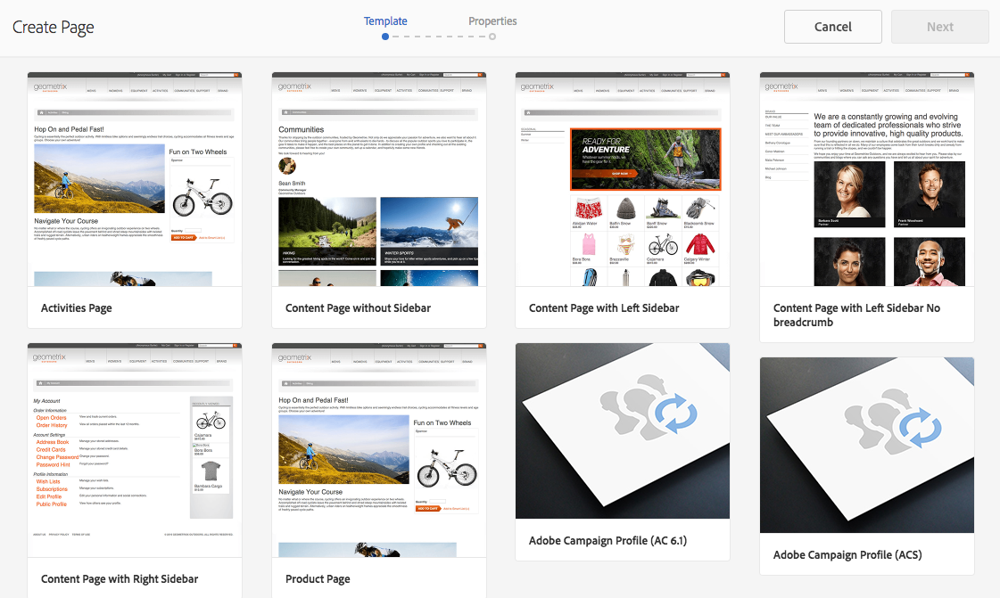

# Creating a Campaign form in Experience Manager {#creating-a-campaign-form-in-experience-manager}

您可以在AEM站点上创建“表单”，并将表单中的字段映射到Adobe Campaign数据库中的字段。这允许您创建和更新配置文件，或管理服务订阅。

要在AEM站点上创建Adobe Campaign表单，请执行以下操作：

1. In your AEM site, create a new page based on the **Adobe Campaign Profile** template.

   

1. In the page properties, select the **[!UICONTROL Cloud Service]** corresponding to your Adobe Campaign instance.

   

1. Select the form type from the **[!UICONTROL Form Start]** component:

   * **Adobe Campaign：保存配置文件**
   * **Adobe Campaign：订阅服务**
   * **Adobe Campaign：取消订阅服务**

1. 通过添加可映射到Adobe Campaign数据库字段的不同字段和组件，编辑表单内容。
1. 测试并发布表单，使其可在AEM站点上访问。

For more information, refer to the [detailed documentation](https://docs.adobe.com/docs/en/aem/6-2/author/personalization/adobe-campaign/adobe-campaign-forms.html).
