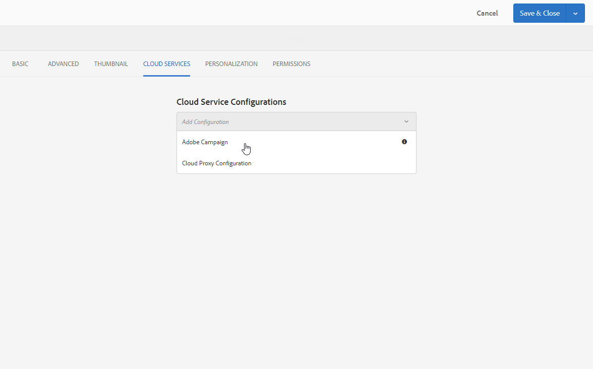

# 在 Experience Manager 中创建 Campaign 表单 {#creating-a-campaign-form-in-experience-manager}

您可以在AEM网站上创建“表单”，并将表单中的字段映射到Adobe Campaign数据库中的字段。 这允许您创建和更新用户档案或管理服务订阅。

要在AEM网站上创建Adobe Campaign表单，请执行以下操作：

1. 在您的AEM站点中，根据&#x200B;**Adobe Campaign配置文件**&#x200B;模板创建一个新页面。

   

1. 在页面属性中，选择与您的Adobe Campaign实例对应的&#x200B;**[!UICONTROL Cloud Service]**。

   

1. 从&#x200B;**[!UICONTROL Form Start]**&#x200B;组件中选择表单类型：

   * **Adobe Campaign：保存配置文件**
   * **Adobe Campaign：订阅服务**
   * **Adobe Campaign：取消订阅服务**

1. 通过添加可映射到Adobe Campaign数据库字段的各种字段和组件来编辑表单的内容。
1. 测试并发布表单，以使其可在AEM网站上访问。

有关更多信息，请参阅[详细文档](https://experienceleague.adobe.com/docs/experience-manager-65/authoring/aem-adobe-campaign/adobe-campaign-forms.html)。
