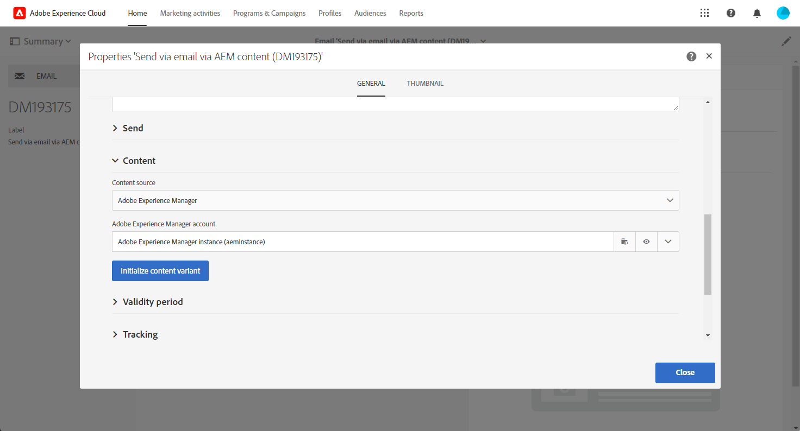

# 将Adobe Experience Manager内容导入Adobe Campaign电子邮件 {#creating-email-aem}

使用本文档，您将了解如何在Adobe Experience Manager中创建和管理电子邮件内容，然后通过将内容导入到Adobe Campaign Standard中，将其用于营销活动。

先决条件包括：

* 访问为集成配置的AEM实例。
* 访问为集成配置的Adobe Campaign实例。
* 配置为接收AEM内容的Adobe Campaign电子邮件模板。

## 在Adobe Experience Manager中访问电子邮件 {#email-content-aem}

登录到Adobe Experience Manager创作实例，并浏览网站以访问包含电子邮件内容的文件夹。

>[!VIDEO](https://video.tv.adobe.com/v/29996)

## 在Adobe Experience Manager中创建新电子邮件内容 {#creating-email-content-aem}

提供了多个特定于Adobe Campaign的模板。 您必须使用其中一个模板，因为它们包含Adobe Campaign支持的预定义组件。

默认情况下，您可以使用两个预定义模板为Adobe Campaign创建电子邮件内容。

* **[!UICONTROL Adobe Campaign Email]**：此模板包含您可以个性化的标准内容。 您可以在Adobe Campaign电子邮件(AC6.1)和Adobe Campaign电子邮件(ACS)之间进行选择。
* **[!UICONTROL Importer Page]**：利用此模板，可导入包含内容的HTML文件的ZIP文件，之后可对其进行个性化。

1. 在Adobe Experience Manager中，新建 **[!UICONTROL Page]**.

1. 选择 **[!UICONTROL Adobe Campaign Email]** 模板。 有关详细步骤，请参阅以下视频。

   >[!VIDEO](https://video.tv.adobe.com/v/29997)

1. 打开您的新电子邮件内容。

1. 在 **[!UICONTROL Page properties]**，设置 **[!UICONTROL Adobe Campaign]** 作为 **[!UICONTROL Cloud Service Configuration]**. 这可以在您的内容与Adobe Campaign实例之间实现通信。

   有关详细信息，请观看以下视频：

   >[!VIDEO](https://video.tv.adobe.com/v/29999)

## 编辑和发送电子邮件 {#editing-email-aem}

您可以通过添加组件和资产来编辑电子邮件内容。 个性化字段可用于根据Adobe Campaign中收件人的数据传递更相关的消息。

要在Adobe Experience Manager中创建电子邮件内容，请执行以下操作：

1. 编辑主题以及 **[!UICONTROL Plain text]** 访问您的电子邮件版本 **[!UICONTROL Page properties]** > **[!UICONTROL Email]** 从副手手手里跳下去。

1. 添加 **[!UICONTROL Personalization fields]** 通过 **[!UICONTROL Text & Personalization]** 组件。 每个组件对应于特定的用法：插入图像、添加个性化设置等。

   有关详细信息，请观看以下视频：

   >[!VIDEO](https://video.tv.adobe.com/v/29998)

1. 从 **[!UICONTROL Workflow]** 选项卡，选择 **[!UICONTROL Approve for Adobe Campaign]** 验证工作流。 如果电子邮件使用的内容未获得批准，则无法在Adobe Campaign中发送该电子邮件。

要在Adobe Campaign Standard中发送电子邮件，请执行以下操作：

1. 定义内容和发送参数后，在Adobe Campaign Standard中基于AEM特定的电子邮件模板创建电子邮件。

+++ 了解有关特定于AEM的模板的更多信息。

   1. 从高级菜单中，访问 **[!UICONTROL Resources]** `>` **[!UICONTROL Templates]** `>` **[!UICONTROL Delivery templates]**.

      

   1. 复制或选择其中一个投放模板。

   1. 从 **[!UICONTROL Properties]** 模板的，在 **[!UICONTROL Content]** 下拉列表，选择 **[!UICONTROL Adobe Experience Manager as Content mode]** 然后是您的Adobe Experience Manager帐户。

      

+++

   

1. 填写电子邮件的属性并单击 **[!UICONTROL Create]** 才能选择您的AEM内容。

1. 访问 **[!UICONTROL Content]** 封锁。

   

1. 从 **[!UICONTROL Use Adobe Experience Manager content]** 菜单，单击 **[!UICONTROL Link AEM content]**.

   然后，选择要用在电子邮件中的内容。

   

1. 通过仪表板指定其他参数（如目标受众和执行计划），进一步自定义电子邮件。 配置完毕后，您现在即可发送电子邮件投放。 [了解详情](../../sending/using/confirming-the-send.md)

