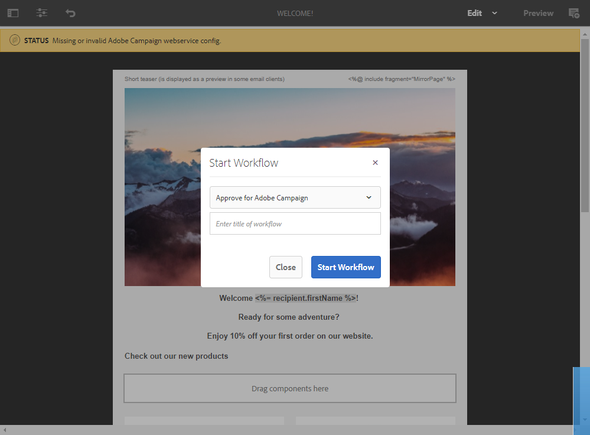
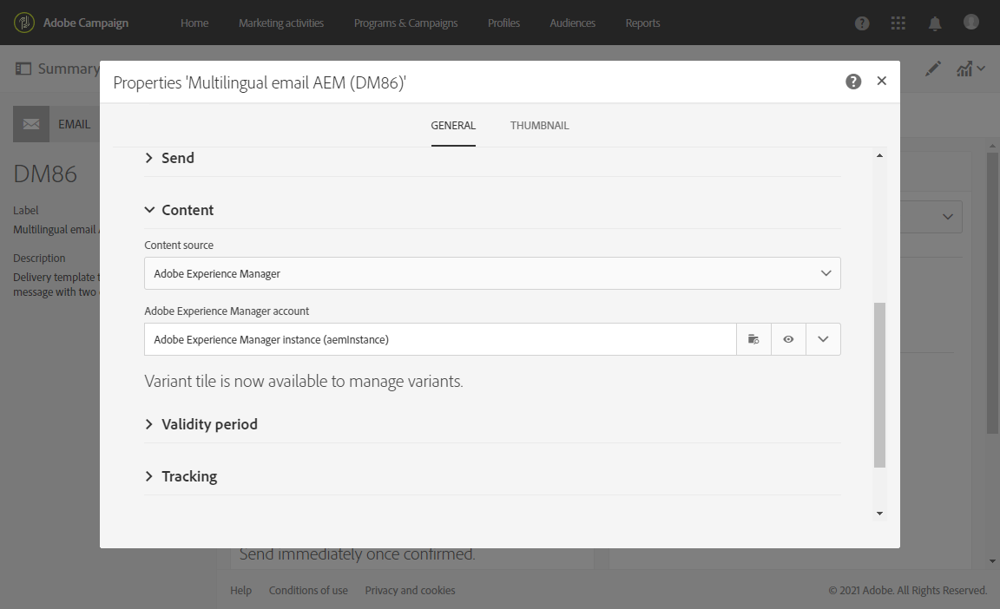

# 通过 Adobe Experience Manager 集成创建多语言电子邮件 {#creating-multilingual-email-aem}

通过本文档，您将了解如何使用Adobe Experience Manager内容和语言副本创建多语言电子邮件。

先决条件包括：

* 访问为集成配置的AEM实例。
* 访问为集成配置的Adobe Campaign实例。
* Adobe Campaign配置为接收AEM内容的多语言电子邮件模板。

## 在Adobe Experience Manager中创建新电子邮件内容 {#creating-email-content-aem}

1. 从Adobe Experience Manager主页中，选择&#x200B;**[!UICONTROL Site]**。

   

1. 选择要创建页面的文件夹，然后单击&#x200B;**[!UICONTROL Create]**，然后单击&#x200B;**[!UICONTROL Page]**。 在此，我们在en_us文件夹中创建页面，该文件夹将是我们的默认语言。

   

1. 选择&#x200B;**[!UICONTROL Adobe Campaign Email (ACS)]**&#x200B;模板。

1. 填写电子邮件的属性并单击&#x200B;**[!UICONTROL Create]**。

   

1. 打开您的新电子邮件内容，并根据需要进行个性化设置。 有关详细信息，请参见此 [ 页面](../../integrating/using/creating-email-experience-manager.md#editing-email-aem)。

   

1. 从&#x200B;**[!UICONTROL Workflow]**&#x200B;选项卡中，选择&#x200B;**[!UICONTROL Approve for Adobe Campaign]**&#x200B;验证工作流。 如果电子邮件使用的内容未获得批准，则无法在Adobe Campaign中发送该电子邮件。

   

1. 从&#x200B;**[!UICONTROL Complete work item]**&#x200B;窗口中单击&#x200B;**[!UICONTROL Complete]**，然后单击&#x200B;**[!UICONTROL Newsletter review]**。

1. 单击&#x200B;**[!UICONTROL Complete]**，然后单击&#x200B;**[!UICONTROL Newsletter approval]**。 定义内容和发送参数后，您可以在Adobe Campaign Standard中继续批准、准备和发送电子邮件。

   

## 创建语言副本 {#creating-language-copies}

设计电子邮件内容后，您现在需要创建语言副本，以便作为变体与Adobe Campaign Standard同步。

1. 选择您之前创建的页面，单击&#x200B;**[!UICONTROL Create]**，然后单击&#x200B;**[!UICONTROL Language Copy]**。

   

1. 选择您之前创建的将以所选语言翻译的电子邮件内容，然后单击&#x200B;**[!UICONTROL Next]**。

   

1. 在&#x200B;**[!UICONTROL Target language(s)]**&#x200B;下拉列表中，选择要翻译内容的语言，然后单击&#x200B;**[!UICONTROL Next]**。

   

1. 单击 **[!UICONTROL Create]**。

您的语言副本现已创建，您现在可以根据所选语言编辑内容。

>[!CAUTION]
>
>每个语言副本都需要通过&#x200B;**[!UICONTROL Approve for Adobe Campaign]**&#x200B;验证工作流进行审批。 如果电子邮件使用的内容未获得批准，则无法在Adobe Campaign中发送该电子邮件。

## 在Adobe Campaign Standard中创建多语言内容 {#multilingual-acs}

1. 在Adobe Campaign Standard主页中，单击&#x200B;**[!UICONTROL Create an email]**。

   

1. 选择配置为接收Adobe Experience Manager内容的Adobe Campaign多语言电子邮件模板。 有关如何创建链接到Adobe Experience Manager实例的模板的更多信息，请参阅此[页面](../../integrating/using/configure-experience-manager.md#config-acs)。

   >[!NOTE]
   >
   >在这种情况下，您需要复制内置模板&#x200B;**[!UICONTROL Multilingual email (mailMultiLang)]**&#x200B;才能发送多语言电子邮件。

   

1. 填写电子邮件的&#x200B;**[!UICONTROL Properties]**&#x200B;和&#x200B;**[!UICONTROL Audience]**，然后单击&#x200B;**[!UICONTROL Create]**。

1. 在&#x200B;**[!UICONTROL Edit properties]**&#x200B;中，确保在&#x200B;**[!UICONTROL Content]**&#x200B;下拉列表中正确设置了您的Adobe Experience Manager帐户。

   

1. 单击 **[!UICONTROL Language copy creation]**。

   

1. 选择您之前创建的Adobe Experience Manager内容，然后单击&#x200B;**[!UICONTROL Confirm]**。 此处显示的Adobe Experience Manager内容只是已验证的内容，可以根据其&#x200B;**[!UICONTROL Label]**&#x200B;和&#x200B;**[!UICONTROL Path]**&#x200B;进行筛选。

   >[!NOTE]
   >
   >所选的语言副本将被设置为默认值，您以后可以在&#x200B;**[!UICONTROL Content variant]**&#x200B;块中更改它。

   

1. 单击&#x200B;**[!UICONTROL Create variants]**&#x200B;以链接您的多语言内容。 然后，Adobe Campaign Standard将自动将其他语言副本链接到此内容。 创建的变体将具有与Adobe Experience Manager中选择的变体相同的标签和代码语言。

   

1. 单击&#x200B;**[!UICONTROL Content variant]**&#x200B;块以根据需要更改您的默认变体，然后单击&#x200B;**[!UICONTROL Confirm]**。

   

1. 如果在Adobe Experience Manager中更新了您的内容或变体，则可以使用&#x200B;**[!UICONTROL Refresh AEM contents]**&#x200B;按钮直接在Adobe Campaign Standard中同步它们。

1. 您的电子邮件现已准备就绪，可供发送。 有关此内容的详细信息，请参阅此[页面](../../sending/using/get-started-sending-messages.md)。

   >[!NOTE]
   >
   >如果电子邮件使用Adobe Campaign中尚未批准的AEM内容，您将无法在中发送该电子邮件。

您的受众将收到您的电子邮件，具体取决于其&#x200B;**[!UICONTROL Profiles]**&#x200B;中设置的&#x200B;**[!UICONTROL Preferred languages]**。 有关如何编辑用户档案和首选语言的更多信息，请参阅此[页面](../../audiences/using/editing-profiles.md)。
