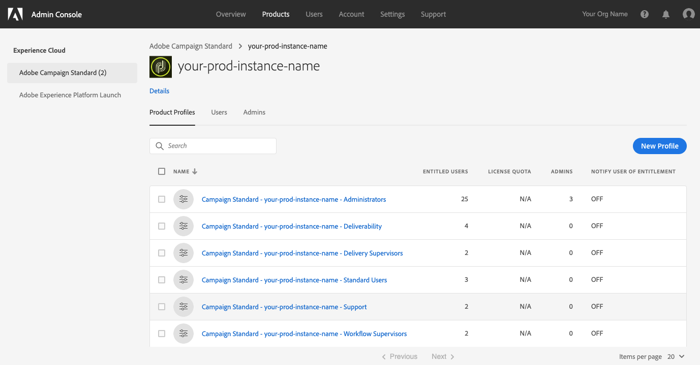

# 访问Adobe Campaign Standard与Microsoft Dynamics 365自助式应用程序的集成

此配置要求您与组织的Experience Cloud(EC)管理员合作。 这些是授予您访问自助服务集成应用程序界面所需的初始步骤。 在您可以访问该工具后，您将设置与数据的连接并配置Adobe Campaign和Microsoft Dynamics 365之间的数据流。

>[!NOTE]
>
>您需要联系Adobe代表并提供Adobe Campaign Standard组织和实例名称。 将记录一个票证，以请求为您的组织启用集成应用程序。

## 添加产品配置文件

在此部分中，您将了解如何授予对Adobe Campaign Standard与Microsoft Dynamics 365自助服务应用程序集成的访问权限。 在Adobe Experience Cloud中有权访问您组织的用户无权访问集成自助应用程序，除非您按照以下步骤授予他们访问权限。

>[!IMPORTANT]
>
> 这些步骤需要 **管理员** 在您组织的Experience Cloud中的角色。
>

1. 浏览https://experience.adobe.com/并登录Adobe Experience Cloud。
1. 访问 **Admin Console**.

   

1. 单击 **[!UICONTROL Products]** 以访问您的Experience Cloud解决方案。

   

   >[!IMPORTANT]
   >
   >此部分中的其余步骤将为您的每个Campaign实例（开发、文本、生产）执行。
   >

1. 单击要配置的第一个实例。

   

   实例页面应如下所示：

   

1. 单击 **[!UICONTROL New Profile]** 按钮并添加名为的新条目： **Campaign Standard- your-prod-instance-name - D365/ACS集成**

   * 如果您在列表中看到此条目，则无需继续。 单击 **Adobe Campaign Standard** 并检查其他Campaign实例。

   * 请确保将“your-prod-instance-name”替换为您的实例的实际名称。

1. 您可以离开 **[!UICONTROL Permission Group]** 下拉列表的默认值。

1. 如果您的输入内容与以下内容类似，请单击 **[!UICONTROL Done]** 按钮。

   

   已添加新的产品配置文件。

   

## 授予用户访问权限 {#add-users-to-profile}

从 **[!UICONTROL Products]**  页面上，选择您的Campaign实例，然后执行以下步骤：

1. 单击您之前创建的新配置文件：  **Campaign Standard- your-prod-instance-name - D365/ACS集成**

   

1. 单击 **[!UICONTROL Developers]** 选项卡。

   

1. 单击 **[!UICONTROL Add Developer]** 按钮

1. 输入要添加的用户的名称或电子邮件地址。  选择与用户匹配的结果。

   如果这是用户第一次添加到组织，请输入详细信息。

1. 单击 **[!UICONTROL Save]** 确认。
