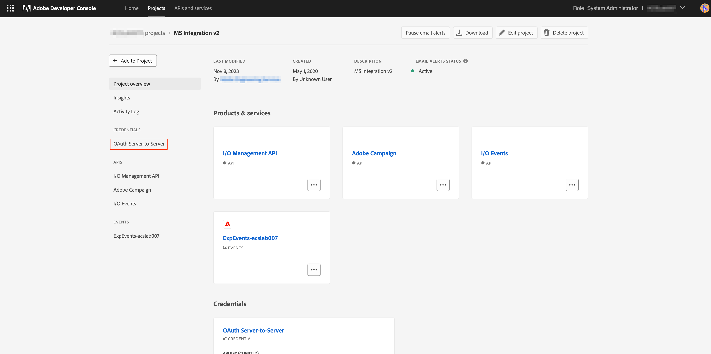

# 将凭据从 JWT 机制迁移到 OAuth 服务器到服务器机制

服务帐户(JWT)凭据已弃用，支持新的OAuth服务器到服务器凭据。 新的凭据使您能够更轻松地维护Adobe应用程序。 它还消除定期轮换证书的需要，并使用标准OAuth2库开箱即用。

虽然服务帐户(JWT)凭据已标记为已弃用，但在2025年1月1日之前它们将继续工作。 因此，您必须在2025年1月1日之前迁移集成以使用新的OAuth服务器到服务器凭据。 有关详细信息，请查看[弃用时间表](https://developer.adobe.com/developer-console/docs/guides/authentication/ServerToServerAuthentication/migration/#deperecation-timelines)

## 将凭据从JWT迁移到OAuth服务器到服务器的步骤

迁移到OAuth服务器到服务器凭据是一个简单的过程，可为您的应用程序实现零停机时间迁移。 您可以按照以下步骤迁移凭据。

1. 登录到[Adobe Developer Console](https://developer.adobe.com/console)
2. 从左侧的筛选菜单中，选择具有服务帐户(JWT)凭据选项。 这样可显示具有服务帐户(JWT)凭据的所有项目。 从项目列表中，单击要迁移的项目。

   

3. 从左侧导航栏中打开服务帐户(JWT)凭据选项卡，并查看迁移卡。 在迁移卡上，单击按钮&#x200B;**添加新凭据**以添加等效的OAuth服务器到服务器凭据。 将OAuth服务器到服务器凭据添加到您的项目将开始迁移。
   
4. 新凭据&#x200B;**OAuth服务器到服务器**&#x200B;将添加到左侧导航中。
   * 如果要取消迁移，请单击取消迁移。
   * 在验证新凭据OAuth服务器到服务器是否正常工作之前，请勿单击“查看并删除”按钮。
     

5. 将Microsoft Dynamics 365中的凭据更新到Adobe Campaign Standard应用程序
   * 登录到集成应用程序并导航到设置页面。
   * 选择OAuth作为身份验证类型。
   * 由于新的OAuth服务器到服务器凭据使用与旧服务帐户(JWT)凭据相同的凭据，因此大多数字段都将已填充。
   * 输入客户端ID和客户端密码。 可以在Adobe Developer Console的项目中找到这些内容。
   * 单击保存以保存设置。
     

6. 验证新凭据是否正常工作
   * 登录到集成应用程序并导航到工作流页面。
   * 停止活动工作流。 等待工作流停止。
   * 启动工作流。 请等待工作流处于运行状态。
   * 请监控工作流几分钟，以确保工作流正常工作。 您还可以检查Adobe Campaign Standard和Microsoft Dynamics 365中的数据，以确保正确同步数据。

7. 删除JWT凭据以完成迁移
   * 登录到[Adobe Developer Console](https://developer.adobe.com/console)
   * 单击这些项目并选择您迁移的项目。
   * 单击左侧导航栏中的“服务帐户(JWT)”凭据选项卡。
   * 单击“查看并删除”按钮。
     
   * 查看上次访问或上次使用菜单的时间戳，以验证集成应用程序是使用新的OAuth凭据生成访问令牌，还是仍使用旧的JWT凭据。
     
   * 在验证集成应用程序正在使用新的OAuth凭据并且不再使用JWT凭据后，单击&#x200B;**确认并继续**按钮继续删除旧凭据，从而完成迁移。
     
