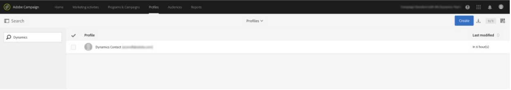
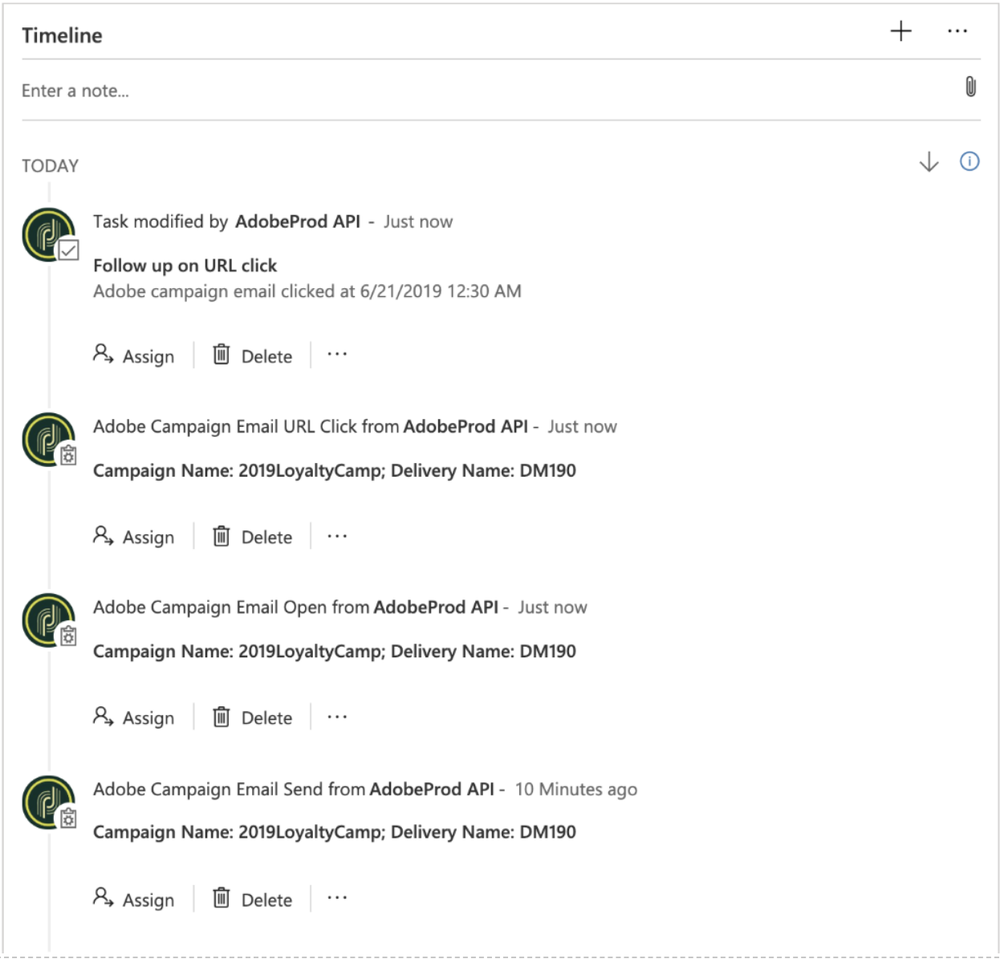

# 使用Microsoft Dynamics 365集成

Adobe Campaign Standard与Microsoft Dynamics 365集成可执行多个数据流。 有关这些流程的详情，请参见 [此页面](../../integrating/using/d365-acs-self-service-app-workflows.md).

有关数据流的更多详细信息，请参阅本文档中下面的 [数据流](#data-flows)  部分。

## Adobe Campaign Standard用户体验

在Microsoft Dynamics 365中创建、修改或删除（如果已启用删除）联系人时，该联系人将被发送到Campaign Standard。 这些联系人将显示在Campaign的“用户档案”屏幕中，并可在营销活动中定位。 请参阅下面的“配置文件”屏幕。

在Campaign中修改选择退出属性后，如果您已选择 **单向(Campaign到Microsoft Dynamics 365)** 或 **双向** 选择退出配置，并且已正确映射该特定属性的情况下。

## Microsoft Dynamics 365用户体验

对于出口，以下电子邮件营销事件将从Campaign发送到Dynamics 365，并在Microsoft Dynamics 365时间线视图中显示为自定义活动：

* Adobe Campaign电子邮件发送

* Adobe Campaign电子邮件打开

* Adobe Campaign电子邮件URL单击

* Adobe Campaign电子邮件退回

要查看联系人的时间线，请单击Dynamics 365下拉菜单中的Sales Hub以导航到联系人列表。 然后单击左侧菜单栏上的“联系人”并选择联系人。

>[!NOTE]
>
>此 **Adobe Campaign for Microsoft Dynamics 365** 需要在Microsoft Dynamics 365实例中安装AppSource中的应用程序才能查看这些事件。 [了解详情](../../integrating/using/d365-acs-configure-d365.md#install-appsource-app)。

在下方，您可以看到“动态用户”的“联系人”屏幕快照。 在“时间线”视图中，您会注意到已向Dynamics用户发送一封电子邮件，该电子邮件与营销活动名称“2019LoyaltyCamp”和投放名称“DM190”相关联。 Dynamics用户打开了电子邮件，也单击了电子邮件中的URL；这两个操作都会创建事件，这些事件也会显示如下。 如果查看右角，您会看到“关系助手(RA)”卡；当前，该卡包含要跟进所单击URL的任务。

有关Dynamics用户的时间线视图的特写，请参阅下文。

以下是关系助理(RA)卡的特写。 AppSource应用程序包含一个工作流，用于监视Adobe电子邮件URL点击事件。 发生此事件时，会创建一个任务并设置截止日期。 这样，任务会显示在RA卡中，从而增加了任务的可见性。 Adobe电子邮件退回事件也存在类似的工作流程，可添加一项任务来协调无效的电子邮件地址。 可以在解决方案中关闭这些工作流。

如果单击发送事件的主题，您将看到一个类似于下面的表单。 打开和退回事件的表单相似。

电子邮件URL点击事件的表单会为被点击的URL添加一个附加属性：

以下是属性的列表和说明：

* **主题**：事件主题；由电子邮件投放的营销活动ID和投放ID组成

* **所有者**：在预配后步骤中创建的应用程序用户

* **相关**：联系人的姓名

* **营销活动名称**：Campaign Standard中的促销活动ID

* **投放名称**：Campaign Standard中的投放ID

* **发送/打开/单击/退回日期**：事件的创建日期/时间

* **跟踪URL**：已单击的URL

* **镜像页面URL**：已发送/打开/单击/退回的电子邮件的镜像页面的URL。 可以在相应Campaign电子邮件渠道活动的配置屏幕中修改电子邮件镜像页面的过期期限。 [了解详情](../../administration/using/configuring-email-channel.md#validity-period-parameters)。

>[!NOTE]
>
>对于选择退出，在Microsoft Dynamics 365中修改选择退出属性时，如果您选择 **单向(Campaign到Microsoft Dynamics 365)** 或 **双向** 选择退出配置，并且已正确映射该特定属性的情况下。

## 数据流 {#data-flows}

### 联系人和自定义实体入口

新的、更新的和删除的记录（注意：必须启用已删除的记录）会从Microsoft Dynamics 365联系人表发送到Campaign配置文件表。

可以在集成应用程序UI中配置表映射，以将Microsoft Dynamics 365表属性映射到Campaign表属性。 可以根据需要修改表映射以添加/删除属性。

数据流的初始运行旨在传输所有映射的记录，包括标记为“不活动”的记录；随后，集成将仅处理增量更新。 但重放数据或配置过滤器除外；可以配置基于属性的基本过滤规则以确定要同步到Campaign的记录。

可在集成应用程序UI中配置基本替换规则，以使用不同的值替换属性值(例如，“绿色”表示“#00FF00”，“F”表示1等)。

根据记录数量，可能需要使用Campaign SFTP存储进行初始数据传输。 [了解详情](#initial-data-transfer)。

必须使用Dynamics 365联系人属性contactId填充Campaign配置文件表属性externalId，以便联系人入口正常工作。 Campaign自定义实体也必须使用Dynamics 365唯一ID属性进行填充；但是，此属性可以存储在任何Campaign自定义实体属性中（即，不必是externalId）。

>[!NOTE]
>
>对于自定义实体入口，必须在Dynamics 365中为同步的自定义实体启用更改跟踪。

#### 自定义实体

此 [Microsoft Dynamics 365-Adobe Campaign Standard集成](../../integrating/using/d365-acs-get-started.md) 支持自定义实体，从而能够将Dynamics 365中的自定义实体同步到Campaign中相应的自定义资源。

自定义资源中的新数据可用于多种目的，包括分段和个性化。

该集成支持链接表和非链接表。 最多支持三个级别（即level1->level2->level3）的链接。

>[!IMPORTANT]
>
>如果任何Campaign自定义资源记录包含个人信息，则应用特定推荐。 了解详情 [在此部分中](../../integrating/using/d365-acs-notices-and-recommendations.md#acs-msdyn-manage-data).
>

配置自定义实体数据流时，请务必注意以下事项：

* 创建和修改Campaign自定义资源是敏感操作，只能由专家用户执行。
* 对于自定义实体数据流，必须在Dynamics 365中为同步的自定义实体启用更改跟踪。
* 如果在Dynamics 365中几乎同时创建父记录和链接的子记录，则由于并行处理集成，将新子记录写入其父记录之前的Campaign的几率很小。

* 如果使用链接了Campaign端的父项和子项，则 **1基数简单链接** 选项，在父记录到达Campaign之前，子记录将保持隐藏状态并且无法访问（通过UI或API）。

* (假设 **1基数简单链接** 在Campaign中)如果在Dynamics 365中更新或删除了子记录，并且更改在父记录出现在Campaign中之前写入Campaign（不太可能，但极有可能出现），则不会在Campaign中处理该更新或删除，并且会引发错误。 如果更新，则需要在Dynamics 365中再次更新相关记录才能同步更新的记录。 在删除的情况下，相关记录将需要在Campaign端单独进行处理，因为Dynamics 365中不再有要删除或更新的记录。

* 如果您遇到您认为已隐藏子记录且无法访问这些记录的情况，则可以临时将基数链接类型更改为 **0或1基数简单链接** 来访问这些记录。

可以找到对Campaign自定义资源的更全面概述 [在此部分中](../../developing/using/key-steps-to-add-a-resource.md).

### 电子邮件营销事件流{#email-marketing-event-flow}

电子邮件营销事件从Campaign发送到Microsoft Dynamics 365，以显示在时间轴视图中。

支持的营销事件类型：
* 发送 — 发送给收件人的电子邮件
* 打开 — 收件人打开的电子邮件
* Click — 收件人点击的电子邮件中的URL
* 跳出 — 发送给收件人的电子邮件出现硬跳出

以下事件属性显示在Dynamics 365中：
* 营销活动名称
* 电子邮件投放名称
* 时间戳
* 电子邮件镜像页面URL
* 已单击URL（仅限单击事件）

电子邮件营销事件可以按类型（发送、打开、单击、退回）启用/禁用，以便只有您选择的事件类型才会传递到Dynamics 365。

### 选择退出流程 {#opt-out-flow}

选择退出(例如，阻止列表)值在系统之间同步；您可以在载入时从以下选项中进行选择：

* **单向(Microsoft Dynamics 365到Campaign)**：Dynamics 365是选择退出的真实来源。 “选择退出属性将从Dynamics 365同步到Campaign Standard”的一个方向
* **单向(Campaign到Microsoft Dynamics 365)**：Campaign Standard是选择退出的真实来源。 选择退出属性将在从Campaign Standard到Dynamics 365的一个方向上同步
* **双向**：Dynamics 365和Campaign Standard都是事实来源。 选择退出属性将在Campaign Standard和Dynamics 365之间双向同步

或者，如果您有单独的流程来管理系统之间的选择退出同步，则可以禁用该集成的选择退出数据流。

>[!NOTE]
>
>在集成应用程序UI中， **单向(Microsoft Dynamics 365到Campaign)** 和 **双向** 选择退出用例是在单独的选择退出工作流中配置的。 [了解详情](../../integrating/using/d365-acs-self-service-app-data-sync.md#opt-in-out-wf)。
>
>此 **单向(Campaign到Microsoft Dynamics 365)** 选择退出用例是一个例外；它在入口（联系人到用户档案）工作流中配置。
>

选择退出流程映射将由客户指定，因为业务要求可能因公司而异。 在Campaign端，只有OOTB选择退出属性可用于选择退出映射：

* 阻止列表
* denyListEmail
* denyListFax
* denyListMobile
* denyListPhone
* denyListPostalMail
* denyListPushnotification
* ccpapoptout

在Dynamics 365中，大多数选择退出字段都有“donot”前缀；但是，如果数据类型兼容，您还可以利用其他属性来实现选择退出目的。

### 初始数据传输 {#initial-data-transfer}

初始数据传输可能需要一段时间，具体取决于您从Microsoft Dynamics 365中摄取的记录数。 初始数据传输后，集成将选取增量更新。
