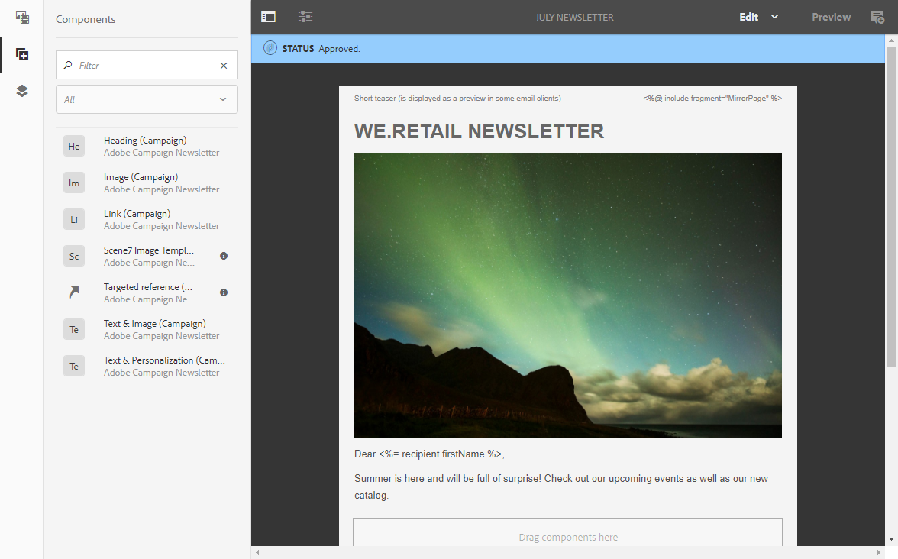

# 与 Experience Manager 集成{#integrating-with-experience-manager}

Adobe Campaign standard与Adobe Experience manager之间的这一集成允许您在Adobe Campaign电子邮件中使用Adobe Experience manager中创建的内容。

因此，您可以充分利用Adobe Experience manager内容编辑功能以及Adobe Campaign的交付和数据管理功能。

>[!NOTE]
>
>不能对从Adobe Experience Manager导入的内容执行A/B测试。

Adobe Campaign Standard与Adobe Experience Manager 6.1、6.2、6.3和6.4兼容。以下各节概述了您可以执行的操作。 有关详细信息，请参阅专门用于配 [置](https://helpx.adobe.com/experience-manager/6-4/sites/administering/using/campaignstandard.html)[和集](https://helpx.adobe.com/experience-manager/6-4/sites/authoring/using/campaign.html) 成的使用。

## 先决条件 {#prerequisites}

您应该事先确保具有以下元素：

* Adobe Experience Manager创作实 **例**
* Adobe Experience Manager发布实 **例**
* Adobe Campaign实例

## 用例 {#use-case}

要在Adobe Experience manager中创建电子邮件内容，请执行以下操作：

1. 使用为Adobe Campaign专门创建的模板创建电子邮件内容。
1. 在内容属性中，选择与 **[!UICONTROL Cloud Service]** 您的Adobe Campaign实例对应的。
1. 通过插入文本、图像、个性化等编辑内容。
1. 验证内容。

有关详细信息，请参阅详 [细文档](https://docs.adobe.com/docs/en/aem/6-2/author/personalization/adobe-campaign/campaign.html)。

要在Adobe Campaign中检索内容，请执行以下操作：

1. 根据Adobe Experience Manager类型内容模板创建电子邮件。
1. 使用Adobe Campaign电子邮件内容定义屏幕链接使用Adobe Experience manager创建的内容。

## 配置 {#configuration}

要同时使用这两个解决方案，您必须将它们配置为彼此连接。

1. 配置Adobe Campaign。 操作步骤：

   * 配置Adobe Experience Manager类型外部帐户。
   * 配置 **AEMResourceTypeFilter** 选项，此选项可识别在Adobe Experience Manager for Adobe Campaign中创建的内容类型。
   * 创建电子邮件模板，指定其为Adobe Experience Manager内容，并将之前创建的外部帐户链接到此模板。

1. 配置Adobe Experience Manager。 操作步骤：

   * 在Adobe Experience manager创作和发布实例之间配置复制。
   * 通过配置专用的Adobe Experience manager与Adobe Campaign连接 **[!UICONTROL Cloud Service]**。

