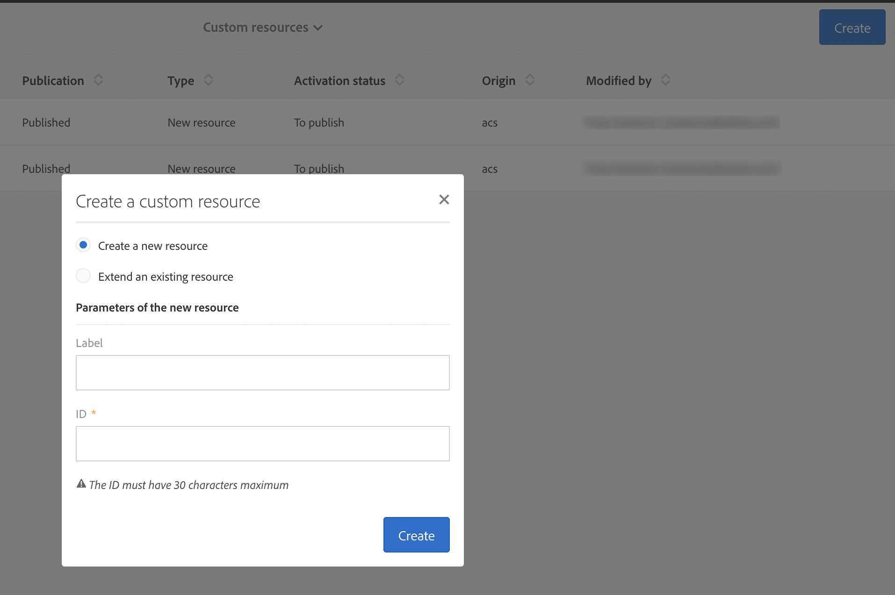
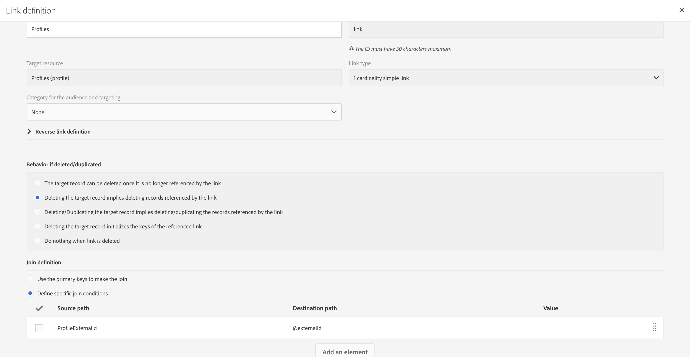

# 映射活动自定义资源和Dynamics 365自定义实体

了解如何在Adobe Campaign标准版与Microsoft Dynamics 365之间的集成环境中映射自定义资源和自定义实体。

## 先决条件

新版 [Microsoft Dynamics 365Adobe Campaign标准版集成为自定义实体提供支持](../../integrating/using/working-with-campaign-standard-and-microsoft-dynamics-365.md) 。  这允许将Dynamics 365中的自定义实体复制到活动中的相应自定义资源。

复制后，自定义资源中的新数据可用于多种用途，包括细分和个性化。

>[!CAUTION]
>
>如果任何活动自定义资源记录包含适用于客户使用活动的个人信息，则此类记录应与相应的活动用户档案记录（直接或通过其他自定义资源）链接，以便与用户档案记录相关的隐私删除也可以删除包含个人信息的链接的自定义资源记录；必须配置实体之间的链接和删除选项才能启用链接记录的类层叠删除。 个人信息不应输入到未链接到用户档案的自定义资源中。

可在此链接找到活动自定义资源的更 [全面的概述](../../developing/using/key-steps-to-add-a-resource.md)。

要为自定义实体设置集成，请访问adobe-support@unifisoftware.com  ，请求完成此操作。  Unifi将要求两个系统中自定义实体表的名称以及所需的属性映射。  Unifi随后将创建相应的作业和计划。

自定义实体支持的示例用例可在“用例”部分 [中查看](../../integrating/using/map-campaign-custom-resources-and-dynamics-365-custom-entities.md#UC)。

>[!CAUTION]
>
>* 在Campaign Standard19.4版本之前发布的自定义 **资源需要重新发布** ，才能与集成一起使用。
>* 创建和修改Campaign Standard自定义资源是敏感操作，必须由专家用户执行。

## 用例

### 开始状态

客户在Dynamics 365中预定义了自定义实体车辆，在Campaign Standard中预定义了相应的自定义资源车辆。  客户已向Unifi提供自定义实体映射详细信息，Unifi已在Unifi中为Vehicle自定义资源设置作业和计划。

|   | Microsoft Dynamics 365 | Adobe Campaign标准 | 注意事项 |
|---|---|---|---|
| 顶级实体 | 联系人 | 用户档案 | 标准、开箱即用的实体 |
| 链接的实体 | 车辆——新的自定义实体 | 车辆——新的自定义资源 | 新的自定义实体 |
| 链接类型 | 与N:1联系的家长链接 | 与Dynamics 365相似——有关详细信息，请参阅下面的活动部分 |   |

### Dynamics中的配置365

单击Dynamics 365旁边的下拉框，即可在销售仪表板中查看该客户在Dynamics 365中的自定义实体。  此客户的自定义实体在下组合在一起 **[!UICONTROL Extensions]**。

可通过单击自定义实体来查看车 **[!UICONTROL vehicle]** 辆数据。  请参阅下面的车辆列表。

实体与实 **[!UICONTROL vehicle]** 体的关系 **[!UICONTROL Contact]** 见下文。 **[!UICONTROL Parental]** 已经被选中了 **[!UICONTROL Type of Behavior]**。

### Campaign Standard配置

在活动中，可通过单击左上角的，然后选择 **[!UICONTROL Adobe Campaign]** 来查看客户的自定义资源 **[!UICONTROL Client data]**。

### 映射自定义资源和自定义实体

自定 **[!UICONTROL vehicle]** 义资源应该由客户先前预定义，并应显示在客户端数据中；但是，我们将逐步介绍创建此自定义资 **[!UICONTROL vehicle]** 源的步骤。

单击左 **[!UICONTROL Adobe Campaign]** 上角的鼠标按钮，然后单击鼠标 **[!UICONTROL Administration > Development > Custom Resources]**。

1. 单击 **[!UICONTROL Custom Resources]**。
1. Click the **[!UICONTROL Create]** button.  这将打开一个弹出窗口。
1. 选 **[!UICONTROL Create a new resource]** 择并输 **[!UICONTROL Vehicle]** 入标签和ID。
1. 单击 **[!UICONTROL Create]**.

活动随后将显示数据结构和链接页面。  您可以看到已添加多个字段。

* 车辆ID是实体的唯一标识 **[!UICONTROL Vehicle]** 符；它的ID必须完全 **[!UICONTROL externalId]**&#x200B;如下，集成才能正常工作。
* 关联用户档案是车辆记录所链接的用户档案的ID;链接后，它将链接到用户档案 **[!UICONTROL externalId]** 表的字段。
* VIN和车辆名称是用于捕获车辆信息的字段。

>[!CAUTION]
>
>每个自定义资源都必须有一个唯一字段，其ID为externalId（完全）。  此字段将映射到Dynamics 365中自定义资源的ID字段（请参阅下文）。

### 定义标识键

下一步是定义标识键。  首先，创建标识密钥，如下所示。

在“键定义”屏幕中，确保选择字 **[!UICONTROL externalId]** 段。

>[!CAUTION]
>
>每个自定义资源都必须有一个标识密钥，路径为“externalId”（精确）。

### 定义过滤器

下一步是指定过滤器定义。

在下 **[!UICONTROL Filter Definition]**&#x200B;面，单击 **[!UICONTROL Add an element]**。\
为标签和ID指定名称 **[!UICONTROL ExternalId]**。
单击 **[!UICONTROL Add]**.

现在，单击新添加的过滤器元素上的编辑，并根据下面的图像配置过滤器。  如果您在字 **[!UICONTROL externalId]** 段中输 **[!UICONTROL Parameters]** 入并单击加号，则将 **[!UICONTROL externalId_parameter]** 显示。  选择此参数作为参数。

### 定义链接

接下来，我们将指定自定义资源的链接。  在这种情况下，我们选择使用 **[!UICONTROL Vehicles]** 自定义实体（源）链接到用户档案实体(目标) **[!UICONTROL 1 cardinality simple link]**。

(../assets/DefineTheLink.png)

1. 在屏幕 **[!UICONTROL Link definitions]** 中，选择删除选项： **[!UICONTROL Deleting the target record implies deleting records referenced by the link]**. 我们选择此选项，以便删除用户档案时，链接到该 **[!UICONTROL Vehicle]** 用户档案的所有记录也会被删除。
1. 在中 **[!UICONTROL Join Definitions]**，选择 **[!UICONTROL Define specific join conditions]**。
1. 然后单击 **[!UICONTROL Add an element]**。

对于连接定义，我们输入以下值。

请注意， **[!UICONTROL @externalId]** 该条目是用户档案表的externalId字段，该条目 **[!UICONTROL ProfileExternalId]** 是车辆自定义资源中相应字段的ID。  当将用户档案记录的externalId值输入到车辆记 **[!UICONTROL ProfileExternalId]** 录的字段中时，这两个记录将链接在一起。

确认更改并保存自定义实体。

### 发布并检查更新

最后一步是发布自定义资源。

1. 单击 **[!UICONTROL Adobe Campaign]** 左上角的，单击 **[!UICONTROL Administration > Development > Publishing]**。
1. 保留默认选项： **[!UICONTROL Determine modifications since the last publication]**.
1. 单 **[!UICONTROL Prepare Publication]** 击并等待完成。

然后单 **[!UICONTROL Publish]** 击并等待完成。

### 唯一入口计划

假设客户已在Dynamics 365中填充车辆定制实体，且Unifi已设置其车辆定制实体作业和计划，则客户应能够启动车辆实体的入口计划。

在完成入口作业后，车辆数据现在可在活动中新填充的自定 **[!UICONTROL Vehicle]** 义资源中看到。

**相关主题**

* 使用Adobe Campaign标准版- Microsoft Dynamics 365
* 在活动中添加自定义资源的关键步骤
