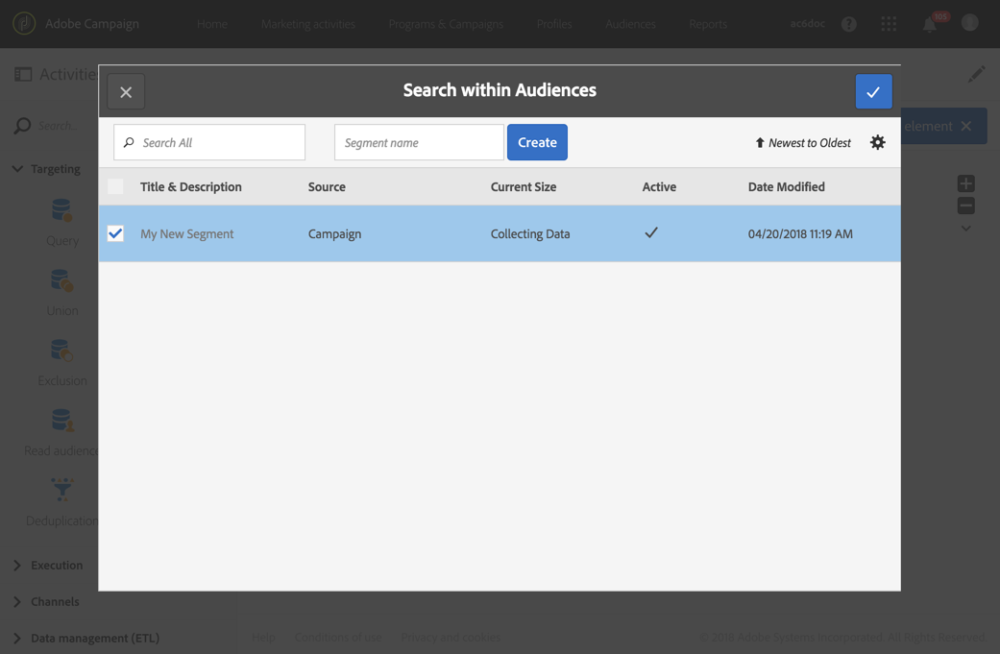

# 使用 Audience Manager 或 People 核心服务共享受众{#sharing-audiences-with-audience-manager-or-people-core-service}

## 导入受众 {#importing-an-audience}

People核心服务集成允许通过技术工作流将受众直接导入Adobe Campaign，以丰富您的数据库。 有关在“人员”核心服务中共享受众的更多信息，请参阅此 [文档](https://experienceleague.adobe.com/docs/analytics/components/segmentation/segmentation-workflow/seg-publish.html).

从Adobe Campaign的People核心服务导入受众/区段，可以从 **[!UICONTROL Audiences]** 菜单。

1. 转到 **[!UICONTROL Audiences]** 菜单。
1. 在操作栏中，选择 **[!UICONTROL Create]** 以创建受众。
1. 指定新受众的标签。
1. 设置受众 **[!UICONTROL Type]** to **[!UICONTROL Experience Cloud]** 用于指示所创建的受众是从People核心服务导入的受众。
1. 从 **[!UICONTROL Name of the shared audience]** 字段中，选择要导入的受众。 只能导入区段。 不支持粒度数据，包括键值对、特征和规则。

   

1. 选择相应的 **[!UICONTROL Shared Data Source]**.

   如果选定的数据源配置为使用加密算法，则附加选项可让您能够 **[!UICONTROL Force reconciliation with a profile]**. 如果 **[!UICONTROL Channel]** 数据源的字段设置为“电子邮件”或“移动设备（短信）”，并且您想要利用用户档案数据。

   如果未选择 **[!UICONTROL Force reconciliation with a profile]** 如果 **[!UICONTROL Channel]** 在AMC数据源中将设置为“电子邮件”或“移动设备”(SMS)，然后所有加密的声明ID都将解密。 类型的受众 **文件** 创建/更新所有电子邮件地址/手机号码的列表。 这样，通过此集成导入共享受众时，即使该用户档案在Campaign中不存在，也不会丢失电子邮件地址/手机号码。 请注意，此类受众无法直接使用，因为需要使用工作流手动协调它们。

1. 确认创建受众。

   随后，将通过技术工作流导入受众。 它由ID（“访客ID”或“声明的ID”）能够与用户档案维度协调的记录组成。 不会导入未被Adobe Campaign识别的“人员”核心服务区段中的ID。

您的受众现在已导入Adobe Campaign数据库。 当区段直接从People核心服务或Audience Manager导入时，导入过程需要24-36小时才能同步。 在此期间后，您将能够在Adobe Campaign中查找和使用新受众。

>[!NOTE]
>
>如果您要将受众从Adobe Analytics导入Adobe Campaign，则需要先在“人员”核心服务或Audience Manager中共享这些受众。 此过程需要12-24小时，而且必须将其添加到与Campaign的24-36小时同步中。 在这种情况下，受众共享的时间范围最长为60小时。 有关在People Core Service和Audience Manager中共享Adobe Analytics受众的更多信息，请参阅此 [文档](https://experienceleague.adobe.com/docs/analytics/components/segmentation/segmentation-workflow/seg-publish.html).

## 导出受众 {#exporting-an-audience}

可以使用工作流和 **[!UICONTROL Save audience]** 活动。

它只能由通过IMS(通过Adobe ID进行身份验证)连接的用户在新工作流中执行。

1. 从项目、营销策划或营销活动列表创建新工作流。
1. 使用可用的不同活动定位一组用户档案。
1. 定位后，拖放 **[!UICONTROL Save audience]** 活动放入工作流中，然后将其打开。
1. 选择 **[!UICONTROL Share in Adobe Experience Cloud]**。

   

1. 使用指定受众 **[!UICONTROL Shared audience]** 字段。 在打开的窗口中，您可以选择现有受众或创建新受众：

   * 如果您选择了现有受众，则只会向该受众添加新记录。
   * 要将配置文件列表导出到新受众，请完成 **[!UICONTROL Segment name]** 字段，然后单击 **[!UICONTROL Create]** 选择新创建的受众之前。

   

   要协调和交换，记录必须具有Adobe Experience Cloud ID（“访客ID”或“声明的ID”）。 导入和导出受众时，将忽略未协调的记录。

1. 要完成，请单击屏幕右上方的复选标记。
1. 选择相应的 **[!UICONTROL Shared Data Source]**.
1. 如果需要，请检查 **[!UICONTROL Generate an outbound transition]** 框来使用导出的用户档案。 只导出可协调的用户档案。
1. 确认活动的配置并保存工作流。
1. 启动导出受众的工作流。 Adobe Campaign与People核心服务之间的同步可能需要数小时

Adobe Campaign与People核心服务之间的同步需要24-36小时。 在此期间后，您将能够在“人员”核心服务中找到新受众，并在其他Adobe Experience Cloud解决方案中重复使用该受众。 有关在“Adobe人员”核心服务中使用Adobe Campaign共享受众的更多信息，请参阅此 [文档](https://experienceleague.adobe.com/docs/core-services/interface/audiences/t-audience-create.html).

**相关主题：**

* [工作流](../../automating/using/get-started-workflows.md)
* [受众](../../audiences/using/about-audiences.md)
