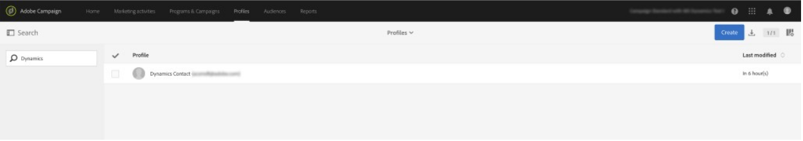

# 将Microsoft Dynamics 365与Campaign Standard集成

此集成可执行多个作业：

* **联系同步**:联系人从Dynamics 365发送到活动(注：单向同步)。
* **自定义实体同步**:自定义实体记录从Dynamics 365发送到活动（注意单向同步）。  有关详细信息，请参阅自定义实体的页面。
* **事件显示**:某些电子邮件营销事件会从活动发送到Dynamics 365。 请参阅下面的备注。
* **删除联系人**:活动用户档案在Dynamics 365中相应的联系人被删除时添加到隐私相关删除队列。
* **退出同步**:根据客户在入门过程中选择的配置(例如，Dynamics 365以活动同步、活动到Dynamics 365同步或双向同步)，选择退出将在Dynamics 365和活动之间进行同步。
* **单点登录(SSO)**:Unifi中的集成详细信息可以使用Adobe IMS身份验证直接从活动访问。

>[!NOTE]
>
>对于 **事件显示**，每次在Unifi中运行出口作业时，将检索最多10k个事件。

## Adobe Campaign标准用户体验

在Dynamics 365中新建或修改联系人后，该联系人将在联系人同步运行后同步到活动。  这些联系人将显示在活动的用户档案屏幕中，并可以定位在营销活动中。  查看下面的用户档案屏幕。

在Dynamics 365中删除联系人后，活动中的相应用户档案将添加到活动中“隐私请求”屏幕中的隐私服务删除队列。  有关根据活动中适用的数据隐私法要求执行数据主体删除请求的详细信息，请参阅《Adobe Campaign标准》中的“如何执行依法授权的删除请求”。

请注意，如果已在属性屏幕中激活了两步流程，则您需要手动确认删除隐私屏幕中的每条记录，然后才能最终将其删除。  请参阅下面的2步流程屏幕：

在活动中修改选择退出／黑名单属性后，如果您选择了“活动到Dynamics 365”或双向选择退出配置，并且您正确映射了该特定属性，则该属性将反映在Dynamics 365中。

要通过单一登录访问集成详细信息，请转到活动导航菜单，然后单击管理> Microsoft Dynamics 365集成。

本页包含有关集成的文档链接以及如何根据您的潜在法律义务使用这些功能的准则。 单击地球图标，该图标将自动将您路由并登录到Unifi实例中，您可以在该实例中管理集成详细信息。

您可以在以下视频中看到此功能的视频。

>[!VIDEO](https://video.tv.adobe.com/v/29254)

>[!NOTE]
>
>您需要向Adobe客户服务中心（直接或通过您的Adobe联系人）提交票证，以便在活动实例中启用单点登录功能标记。

>[!NOTE]
>
>现成的管理面板中不会显示Microsoft Dynamics 365集成图标。  您（或您的Adobe联系人）需要提交票证，以便为您的活动实例启用此功能标记。
>
>此外，Unifi需要启用用户的SSO访问权限，才能通过SSO从活动成功登录。

## Microsoft Dynamics 365用户体验

对于事件显示，以下电子邮件营销事件从活动发送到Dynamics 365，并在Dynamics 365时间轴视图中显示为自定义活动:

* Adobe Campaign电子邮件发送

* Adobe Campaign电子邮件打开

* Adobe Campaign电子邮件URL单击

* Adobe Campaign电子邮件弹出

要视图联系人的时间轴，请通过单击Dynamics 365下拉菜单中的Sales Hub，导航到您的联系人列表。  然后，单击左侧菜单栏上的“联系人”，然后选择联系人。

>[!NOTE]
>
>AppSource中的Dynamics 365应用程序Adobe Campaign需要安装在Dynamics 365实例中，才能视图这些事件。

在下面，您可以看到“Dynamics用户”的“联系人”屏幕快照。  在“时间轴”视图中，您将注意到Dynamics用户已发送一封与活动名称“2019LoyaltyCamp”和投放名称“DM190”关联的电子邮件。  Dynamics用户打开了电子邮件，并点击了电子邮件中的URL;这两个操作都创建了事件，如下所示。  如果您看到右角，您将看到“关系助手”(RA)卡；当前，它包含一个任务，用于跟踪单击的URL。

有关Dynamics用户的时间线视图的特写，请参阅以下内容。

以下是关系助理(RA)卡的特写。  AppSource应用程序包含一个监视Adobe电子邮件URL单击事件的工作流。  发生此事件时，它会创建任务并设置到期日。  这允许任务显示在RA卡中，从而使其具有额外的可见性。  Adobe电子邮件弹出事件也有一个类似的工作流，可添加任务以协调无效的电子邮件地址。  在解决方案中可以关闭这些工作流。

如果单击发送事件的主题，您将看到一个与下面类似的表单。  打开和弹出事件的表单类似。

电子邮件url单击事件的表单为单击的URL添加了其他属性：

以下是属性的列表和说明：

* 主题：事件;由电子邮件活动的投放ID和投放ID组成

* 所有者：在后置备步骤中创建的应用程序用户

* 关于：联系人的姓名

* 活动名称：Campaign Standard中的活动ID

* 投放名称：Campaign Standard中的投放ID

* 发送／打开／单击／退回日期：创建事件的日期／时间

* 跟踪URL:已点击的URL

* 镜像页面URL:发送／打开／单击／弹回的电子邮件镜像页面的URL

您可以在以下视频中看到一个镜像页面URL的视频。

>[!VIDEO](https://video.tv.adobe.com/v/29253)

>[!NOTE]
>
>对于选择退出，当选择退出属性在Dynamics 365中被修改时，如果您选择了Dynamics 365到活动或双向选择退出配置，并且您正确映射了该特定属性，则该属性将反映在活动中。

**相关主题**

* 为活动/Dynamics 365集成配置活动
* 为活动/Dynamics 365集成配置Dynamics
* 为活动/Dynamics 365集成配置Unifi
* 了解如何映射自定义资源和自定义实体