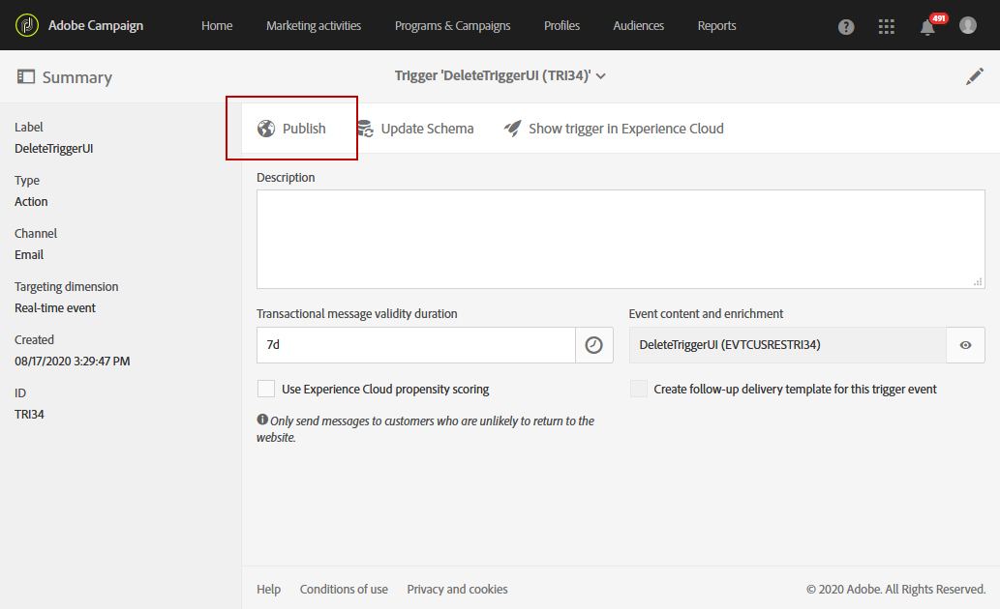
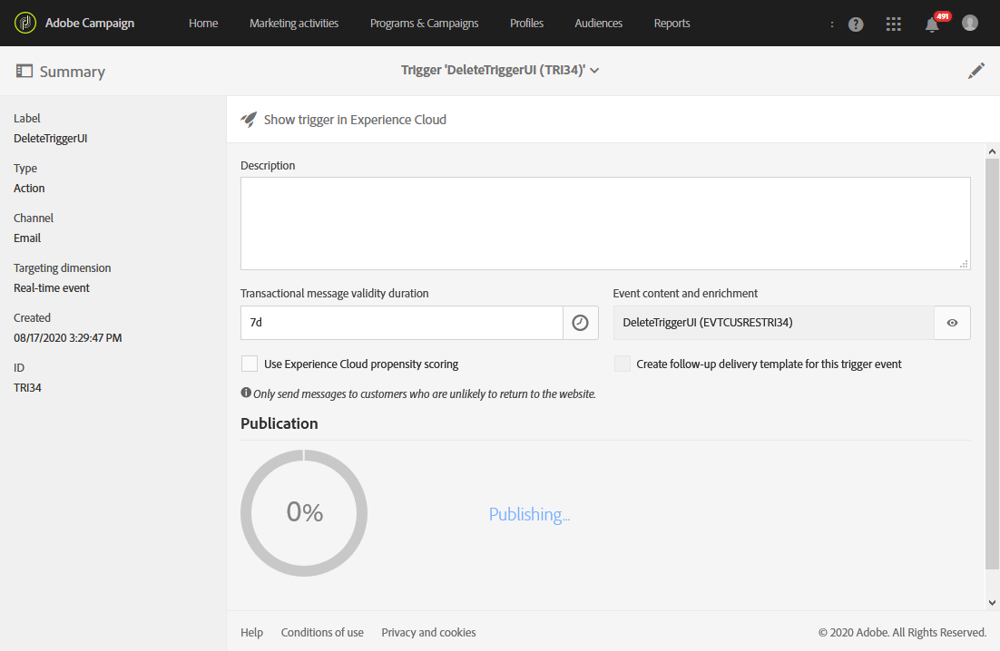

# 在 Campaign 中使用触发器{#using-triggers-in-campaign}

## 在 Campaign 中创建映射触发器 {#creating-a-mapped-trigger-in-campaign}

您应确保预先在 Adobe Experience Cloud（**[!UICONTROL Triggers]** 核心服务）中定义要监控的行为。有关更多信息，请参阅 [Adobe Experience Cloud 文档](https://docs.adobe.com/content/help/zh-Hans/core-services/interface/activation/triggers.html)。请注意，定义触发器时，需要启用别名。对于每种行为（浏览/表单放弃、添加/删除产品、会话过期等），都必须在 Adobe Experience Cloud 中添加新触发器。

您现在必须基于现有 Adobe Experience Cloud 触发器在 Adobe Campaign 中创建触发器事件。

您可以观看此[视频](https://helpx.adobe.com/cn/marketing-cloud/how-to/email-marketing.html#step-two)，以便了解如何在 Adobe Campaign 中设置触发器。

要实现此功能，需要完成以下步骤：

1. 单击左上角的 **[!UICONTROL Adobe Campaign]** 徽标，然后选择 **[!UICONTROL Marketing plans]** > **[!UICONTROL Transactional messages]** > **[!UICONTROL Experience Cloud Triggers]**。

   

1. 单击 **[!UICONTROL Create]** 按钮。此时会打开创建向导，显示 Adobe Experience Cloud 中定义的所有触发器的列表。**[!UICONTROL Fired by Analytics]** 列会显示由 Adobe Experience Cloud 触发器发送给 Campaign 的事件数量。这是在 Experience Cloud 界面创建的触发器映射。

   

1. 选择要使用的 Adobe Experience Cloud 触发器，然后单击 **[!UICONTROL Next]**。
1. 配置触发器的常规属性。在向导的此步骤中，还应指定用于触发器的渠道和定向维度（请参阅[定向维度和资源](../../automating/using/query.md#targeting-dimensions-and-resources)）。然后确认创建触发器。
1. 单击 **[!UICONTROL Event content and enrichment]** 字段右侧的按钮以查看有效载荷的内容。利用此屏幕，还可使用存储在 Adobe Campaign 数据库中的用户档案数据扩充事件数据。扩充的执行方式与标准事务型消息相同。

   

1. 在 **[!UICONTROL Transactional message validity duration]** 字段中，定义在 Analytics 发送事件后，消息保持有效的持续时间。如果将持续时间定义为 2 天，则该持续时间耗尽后将不再发送消息。如果将多条消息置于保留状态，则可确保在经过特定时间段后恢复这些消息时不会发送这些消息。

   

1. 您现在可以发布触发器。 有关详细信息，请参阅[以活动](../../integrating/using/using-triggers-in-campaign.md#publishing-trigger-in-campaign)发布触发器。

## 以活动{#publishing-trigger-in-campaign}发布触发器

在基于现有Adobe Experience Cloud触发器的Adobe Campaign中创建触发事件后，您现在需要发布它。

1. 从先前创建的触发器中，单击&#x200B;**[!UICONTROL Publish]**&#x200B;按钮以开始发布触发器事件。

   

1. 您可以在&#x200B;**[!UICONTROL Publication]**&#x200B;下检查触发器发布的进度。

   

1. 完成发布后，**[!UICONTROL Publication]**&#x200B;下将显示以下消息。

   

1. 如果在发布触发器事件后，您想要对触发器架构进行更改，请单击 **[!UICONTROL Update schema]** 按钮以检索最新更改。

   请注意，此操作将取消发布您的触发器和事务型消息，之后您将需要重新发布它们。

   

1. 单击&#x200B;**[!UICONTROL Show Trigger in Experience Cloud]**&#x200B;按钮可视图Adobe Experience Cloud的触发器定义。

发布事件后，将自动创建链接到新事件的事务型模板。然后，您必须修改并发布之前创建的模板。有关更多信息，请参阅[编辑模板](../../start/using/marketing-activity-templates.md)一节。

## 编辑事务型消息模板{#editing-the-transactional-message-template}

创建并发布触发器事件后，将自动创建对应的事务型模板。有关更多信息，请参阅[在 Campaign 中创建映射触发器](#creating-a-mapped-trigger-in-campaign)一节。

为了让事件触发“发送事务型消息”，您必须对模板进行个性化设置，然后对其进行测试和发布。这些步骤与标准事务型消息相同。有关详细信息，请参阅[编辑事务性消息](../../channels/using/editing-transactional-message.md)部分。

>[!NOTE]
>
>如果取消发布模板，则将自动取消发布触发器事件。

在编辑内容时，您可以根据 Analytics 触发器发送的信息添加个性化字段。如果您使用 Adobe Campaign 用户档案数据扩充了事件数据，则可以根据此信息将消息个性化。要个性化您的消息，请选择 **[!UICONTROL Transactional event]** > **[!UICONTROL Event context]** 并选择字段。

## 访问报告{#accessing-the-reports}

要在 Adobe Campaign 中查看专用触发器报告，请打开您之前创建的触发器事件，然后单击 **[!UICONTROL Show trigger report]**。

报告中会将已处理的事件数与 Analytics 已发送的事件数进行对比。其中还会显示所有最近触发的列表。

