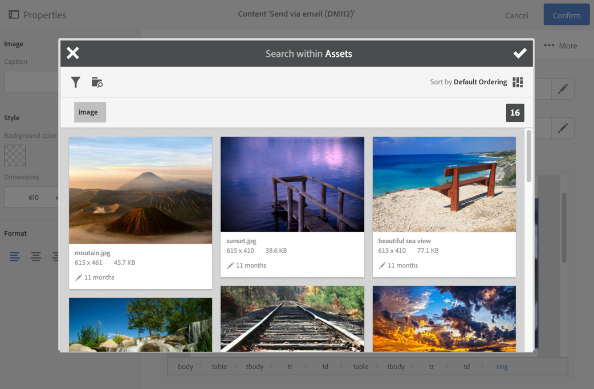

# 使用 Campaign 和 Assets 核心服务{#working-with-campaign-and-assets-core-service}

通过将Assets核心服务或Assets on Demand（取决于Adobe Experience Cloud环境的配置）与Adobe Campaign集成，您可以在Adobe Campaign电子邮件和登陆页面中使用在Adobe Experience Cloud中共享的任何资源。

与Assets核心服务的集成仅限于[功能管理员](../../administration/using/users-management.md#functional-administrators)。

从Adobe Experience Cloud共享的资源可用于您的电子邮件和登陆页，如下所示：

1. 编辑电子邮件或登陆页面的内容时，请转到图像块，然后通过上下文菜单选择&#x200B;**[!UICONTROL Image shared from Adobe Experience Cloud]**。

   

1. 在打开的选择窗口中，选择一个图像，然后进行确认。

   

然后插入图像。 现在可以根据需要个性化投放并发送。

**相关主题：**

* [Assets和共享](https://experienceleague.adobe.com/docs/core-services/interface/assets/experience-cloud-assets.html)
* [内容编辑器](../../designing/using/personalization.md#example-email-personalization)
