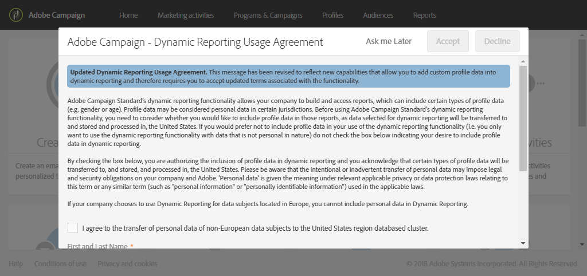

# About dynamic reports{#about-dynamic-reports}

>[!NOTE]
>
>Only users with administration rights or with organizational units set to **All** can create or save a new report. For more on this, refer to this [section](../../administration/using/users-management.md).

动态报告提供完全可自定义和实时报告。它增加了对个人资料数据的访问权限，通过性别、城市和年龄等配置文件维度实现人口统计分析，除了功能电子邮件营销活动数据，如打开和点击。通过拖放界面，您可以探索数据，确定针对最重要客户细分执行电子邮件营销活动的方式，并衡量其对收件人的影响。

凭借其拖放菜单和可自定义的可视化功能，动态报告功能允许您通过无限制的细分和比较组合维度、指标和时间范围。

**相关主题：**

* [报告列表](../../reporting/using/defining-the-report-period.md)
* [组织单位](../../administration/using/organizational-units.md)
* [动态报告](https://helpx.adobe.com/campaign/kt/acs/using/acs-creating-a-dynamic-report-feature-video-use.html) 视频

## Accessing dynamic reports {#accessing-dynamic-reports}

可以访问报告：

* From the home page by selecting **[!UICONTROL Reports]** tab in the top bar or the **[!UICONTROL Reports]** card to access reports for all deliveries.

   

* In each program, campaign, and message, from the **Reports** button by clicking **Dynamic Reports** to only view the reports specific to the delivery.

   

某些报告无法在交付后立即提供，具体取决于收集和处理信息所花费的时间。

动态报告分为两类：

* **模板**，可通过使用 **“另存为** ”选项(**“项目”&gt;“另存为”)复制这些模板。**) 。
* **自定义报告(** 以蓝色标识)，可通过单击“报告”主页上的 **“创建新项目** ”按钮直接 **创建该** 报告。

>[!NOTE]
>
>根据您的组织单位过滤数据。

## Dynamic reporting usage agreement {#dynamic-reporting-usage-agreement}

动态报告允许您根据配置文件维度筛选报表数据。

只有在接受动态报告使用协议后，才可在报表中显示和使用配置文件维度。默认情况下，该协议仅可见，并且仅由分配有管理权限的用户接受或拒绝。

本协议允许美国传输和存储以下资料数据：城市、国家/地区、州、性别和细分。

接受本协议后，所有欧洲和非欧洲数据将传输至美国。

有三个可用选项：

* **[!UICONTROL Ask me later]**：单击以后，该窗口将停止显示24小时。
* **[!UICONTROL Accept]**：接受本协议后，即授权Adobe Campaign收集客户的个人身份信息，并将其传输至美国。
* **[!UICONTROL Decline]**：通过拒绝协议，档案维度将不会显示在您的报表中，并且客户的个人识别信息将不会被收集或发送。

This choice is not final, you can always change it by selecting **[!UICONTROL Enable PII data to be transferred to US region to use reporting on Profile data]** in **[!UICONTROL Administration]** &gt; **[!UICONTROL Application Settings]** &gt; **[!UICONTROL Options]**.

可随时更改该值。The value -1 corresponds to **[!UICONTROL Ask me later]**, 1 **[!UICONTROL Accept]** and 0 **[!UICONTROL Decline]**.

