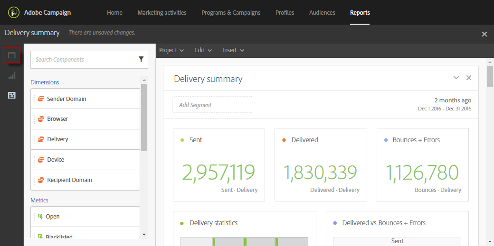
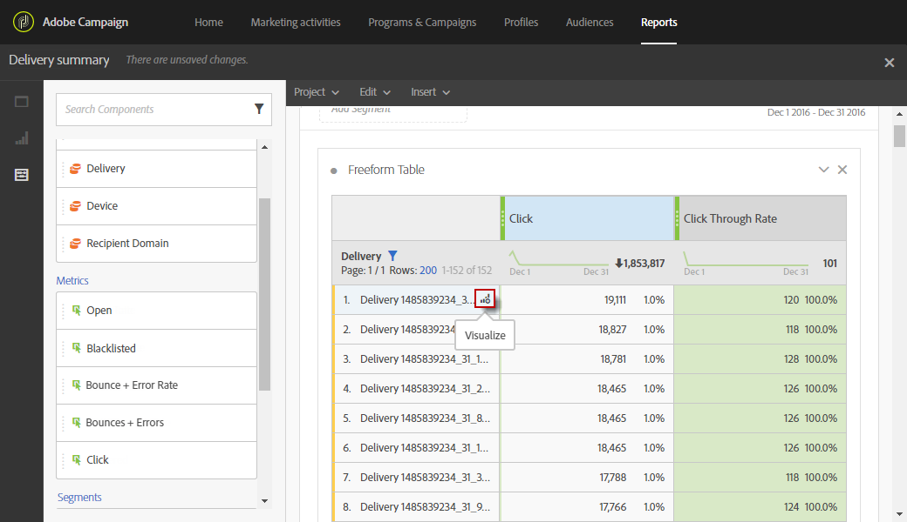

# 添加面板{#adding-panels}

## 添加空白面板 {#adding-a-blank-panel}

要启动报表，可将一组面板添加到开箱即用或自定义报表中。 每个面板包含不同的数据集，由自由格式表和可视化图表组成。

利用此面板，可根据需要构建报告。 您可以在报表中添加所需数量的面板，以按不同的时间段过滤数据。

1. 单击&#x200B;**面板**&#x200B;图标。 您还可以通过单击&#x200B;**插入选项卡**&#x200B;并选择&#x200B;**新建空白面板**&#x200B;来添加面板。

   

1. 将&#x200B;**空白面板**&#x200B;拖放到您的仪表板中。

   

您现在可以向面板中添加自由格式表以开始定位数据。

## 添加自由格式表 {#adding-a-freeform-table}

自由格式表允许您创建一个表，以使用&#x200B;**组件**&#x200B;表中提供的不同量度和维度来分析您的数据。

每个表和可视化图表均可调整大小，并且可以移动以更好地自定义您的报表。

1. 单击&#x200B;**[!UICONTROL Panels]**&#x200B;图标。

   

1. 将&#x200B;**[!UICONTROL Freeform]**&#x200B;项目拖放到您的仪表板中。

   您还可以通过单击&#x200B;**[!UICONTROL Insert]**&#x200B;选项卡并选择&#x200B;**[!UICONTROL New Freeform]**&#x200B;或在空面板中单击&#x200B;**[!UICONTROL Add a freeform table]**&#x200B;来添加表。

   

1. 在&#x200B;**[!UICONTROL Drop a segment here]**&#x200B;字段中，将&#x200B;**[!UICONTROL Components]**&#x200B;选项卡中的&#x200B;**[!UICONTROL Segment]**&#x200B;添加到顶部栏中。

   

1. 将项目从&#x200B;**[!UICONTROL Components]**&#x200B;选项卡拖放到列和行中来构建表。

   

1. 单击&#x200B;**[!UICONTROL Settings]**&#x200B;图标可更改数据在列中的显示方式。

   

   **[!UICONTROL Column settings]**&#x200B;由：

   * **[!UICONTROL Number]**：用于显示或隐藏列中的摘要数字。
   * **[!UICONTROL Percent]**：允许您显示或隐藏列中的百分比。
   * **[!UICONTROL Interpret zero as no value]**：允许您在值等于零时显示或隐藏。
   * **[!UICONTROL Background]**：允许您在单元格中显示或隐藏水平进度条。
   * **[!UICONTROL Include retries]**：允许您在结果中包含重试。 此项仅适用于&#x200B;**[!UICONTROL Sent]**&#x200B;和&#x200B;**[!UICONTROL Bounces + Errors]**。

1. 选择一个或多个行，然后单击&#x200B;**[!UICONTROL Visualize]**&#x200B;图标。 添加了一个可视化图表以反映您选择的行。

   

您现在可以根据需要添加任意数量的组件，还可以添加可视化图表以直观地表示您的数据。
