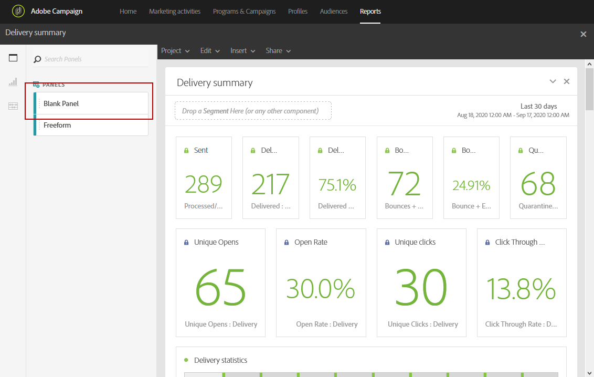

# 添加面板{#adding-panels}

## 添加空白面板 {#adding-a-blank-panel}

要开始报表，您可以向现成的或自定义报表添加一组面板。 每个面板包含不同的数据集，并由自由形式表和可视化组成。

此面板允许您根据需要构建报表。 您可以在报告中添加任意所需数量的面板，以便按不同的时间段过滤数据。

1. 单击“面 **板** ”图标。 您还可以通过单击“插入”选项卡并选 **择“新建** 空白 **面板”来添加面板**。

   

1. 将空白面板 **拖放到** 您的仪表板中。

   

您现在可以向面板中添加自由形式表以开始定位数据。

## 添加自由形式表 {#adding-a-freeform-table}

自由形式表允许您创建一个表，以使用“组件”表中提供的不同度量和维来分析 **您的** 数据。

每个表和可视化都可调整大小，并可以移动以更好地自定义您的报表。

1. 单击“面 **板** ”图标。

   

1. 将自由形式 **项** 拖放到仪表板中。

   还可以通过单击“插入”选项卡并选 **择“新建自由形式** ”(New Freeform)，或通过单击空面板中的“ **添加自由形式表”(Add a freeform table****** )来添加表。

   

1. 默认 **[!UICONTROL Exclude proof]** 情况下，区段已被选中。 如果需要，可以将选项卡中的一个拖放 **[!UICONTROL Segments]** 到顶 **[!UICONTROL Components]** 部栏中来更改它。

   

1. 将项目从“组件” **选项卡** 拖放到列和行中以构建表。

   

1. 单击 **设置** 图标以更改数据在列中的显示方式。

   

   其 **[!UICONTROL Column settings]** 组成有：

   * **[!UICONTROL Number]**:允许您在列中显示或隐藏摘要编号。
   * **[!UICONTROL Percent]**:允许您在列中显示或隐藏百分比。
   * **[!UICONTROL Interpret zero as no value]**:允许您在值等于零时显示或隐藏。
   * **[!UICONTROL Background]**:允许您在单元格中显示或隐藏水平进度栏。
   * **[!UICONTROL Include retries]**:允许您在结果中包含重试。 仅可用于 **[!UICONTROL Sent]** 和 **[!UICONTROL Bounces + Errors]**。

1. 选择一行或多行，然后单击“可 **视化** ”图标。 将添加一个可视化，以反映您选择的行。

   

您现在可以根据需要添加任意数量的组件，还可以添加可视化功能，为数据提供图形表示。
